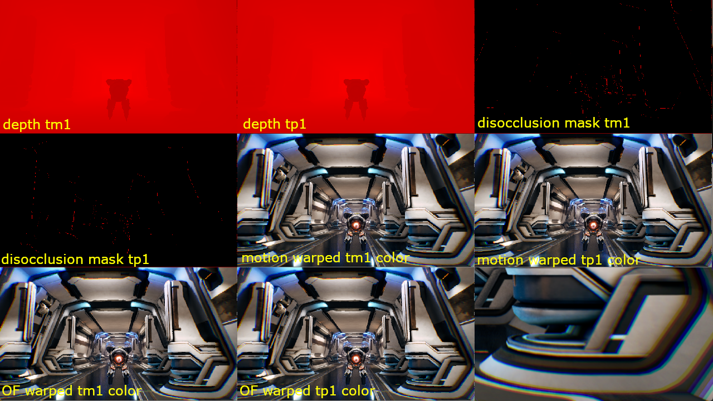

## Enable the debug view

To inspect intermediate buffers during frame generation, enter this command in the Unreal Engine console:

```console
r.NFRU.ShowDebugView 1
```

The debug view activates a grid that shows you depth, disocclusion, and warped color buffers.



## Understand the debug grid

The frame generation system displays a 3 × 3 grid of intermediate data. You can use this grid to validate motion estimation, identify disocclusion regions, and verify warping results.

Two time references appear in the grid:

- `tm1` – previous frame
- `tp1` – next frame

### Grid layout

The layout of the 3 × 3 grid is as follows:

| Row | Column 1 | Column 2 | Column 3 |
|-----|----------|----------|----------|
| 1 | depth tm1 | depth tp1 | disocclusion mask tm1 |
| 2 | disocclusion mask tp1 | motion warped tm1 color | motion warped tp1 color |
| 3 | optical flow warped tm1 color | optical flow warped tp1 color | — |

### What each tile shows

Depth tiles show the depth buffers for the previous and next frames. Use these to identify geometry and disocclusion regions.

Disocclusion mask tiles highlight pixels that become visible as the camera moves. These areas often require special handling during frame generation.

Motion-warped color tiles display frames reprojected using engine motion vectors. Check these tiles to verify motion-vector accuracy.

Optical flow warped color tiles show frames warped with optical flow estimation. Compare these with the motion-warped tiles to assess optical flow quality.

## Use the debug view to troubleshoot

You can use the debug view to identify the following issues during development:

- Spot incorrect motion vectors
- Detect disocclusion artifacts
- Compare motion-vector and optical-flow warping results
- Diagnose frame interpolation problems

## What you've accomplished and what's next

You've now activated the NFRU debug view grid in Unreal Engine and learned how to read it. You can inspect intermediate buffers to validate frame generation and identify common issues.

Next, you'll use RenderDoc to capture and analyze frame data in greater detail.
