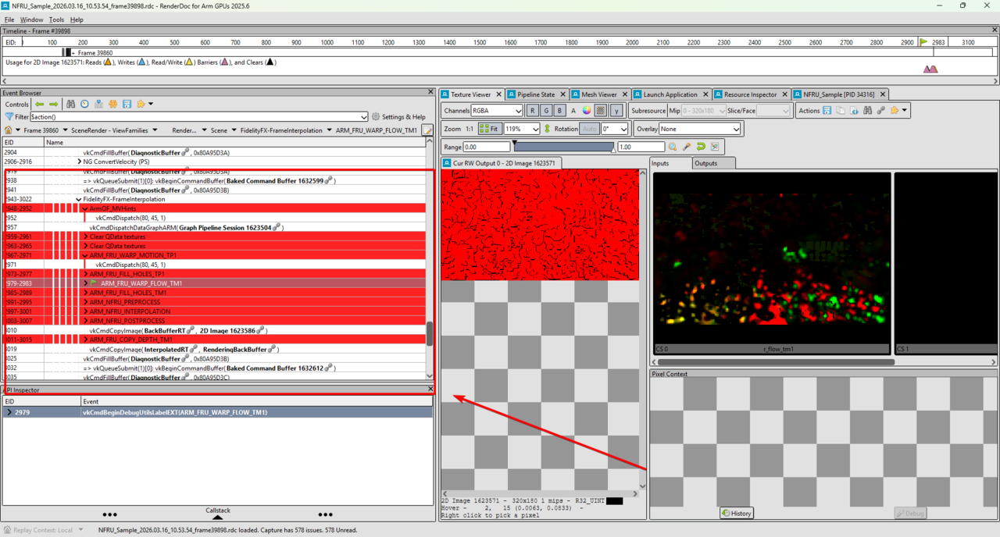

## Why use RenderDoc for Arm GPUs with NFRU

When you integrate NFRU into your game, you need visual debugging and performance profiling. RenderDoc is a frame capture and analysis tool that you can use to review frames, Vulkan API calls, shader inputs and outputs, and GPU resource states. 

Arm provides additional features for RenderDoc in [RenderDoc for Arm GPUs](https://developer.arm.com/Tools%20and%20Software/RenderDoc%20for%20Arm%20GPUs).

Use RenderDoc for Arm GPUs to:

- Investigate unexpected visual output or step through the rendering process
- Analyze the sequence of Vulkan API calls your engine makes
- Inspect memory usage or GPU resource states
- Validate your data graph pipeline or identify synchronization issues

## Install Arm Performance Studio

Download Arm Performance Studio from the [Arm Performance Studio Downloads](https://developer.arm.com/Tools%20and%20Software/Arm%20Performance%20Studio#Downloads) page. For NFRU, use version `2025.6` or later.

For setup instructions, see the [Arm Performance Studio install guide](/install-guides/ams).

After installation, you'll find RenderDoc for Arm GPUs in the Windows **Start** menu.

## Prepare a Windows non-editor build

NFRU does not run in Development Editor, DebugGame Editor, or Debug Editor. Use the editor only to cook content, and prepare the same non-editor build you used to validate NFRU:

1. Start the project using **Development Editor**.
2. Select **Platforms > Windows > Cook Content** and wait for cooking to finish.
3. Close Unreal Editor.
4. In Visual Studio 2022, compile a **Development**, **DebugGame**, or **Debug** non-editor build for Win64.
5. Locate the exported `.exe` under `<project-root>\Binaries\Win64`.

If you changed only C++ code after the last cook, recompile without recooking. If you changed shaders or assets, cook the content again before profiling.

## Launch the Windows executable from RenderDoc

To profile your build:

1. Open RenderDoc for Arm GPUs.
2. Select **Launch Application**.
3. Enter the full path to the non-editor `.exe` in the **Executable Path** field.
4. (Optional) Add command-line arguments in the **Command-line Arguments** field.
5. Set the **Working Directory** to your packaged build folder if needed.
6. Select **Launch**.

Your application launches under RenderDoc. You can now capture frames and analyze GPU activity.

Before you capture a frame, enter `stat FrameGen` in the application console to confirm that NFRU is generating and pacing frames. Keep Vulkan Configurator running with the required Graph and Tensor emulation layers active while you profile.

## Capture a frame in RenderDoc

To capture a frame:

1. With your application running, return to the RenderDoc window.
2. Select the **Capture Frame Immediately** button (camera icon) or press `F12` while your game window is focused.

The captured frame appears in RenderDoc.

You can now analyze the rendering pipeline, inspect Vulkan API calls, and debug visual output at each stage.

## Analyze the event list

After capturing a frame, use the RenderDoc event browser to review the sequence of Vulkan API calls and draw events. Select individual events to inspect their details, view associated resources, and debug specific pipeline stages.

With RenderDoc, you can:

- Step through draw calls and dispatches
- Inspect bound resources, descriptor sets, and shaders
- Explore your data graph pipeline execution frame by frame

For more information, see the [Debug With RenderDoc User Guide](https://developer.arm.com/documentation/109669/latest).

## What you've accomplished

You've now learned how to set up and use RenderDoc for Arm GPUs to debug your game. You've completed a full workflow for NFRU in Unreal Engine.

You can integrate neural frame generation into Unreal Engine, optimize it for your hardware using console variables, and debug your rendering pipeline.
