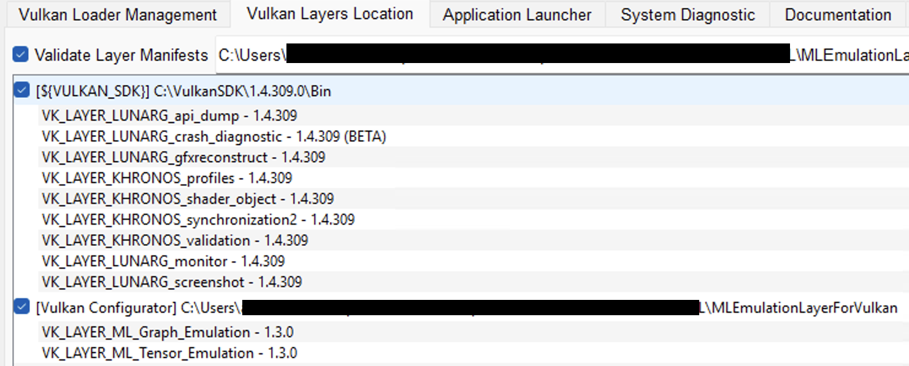
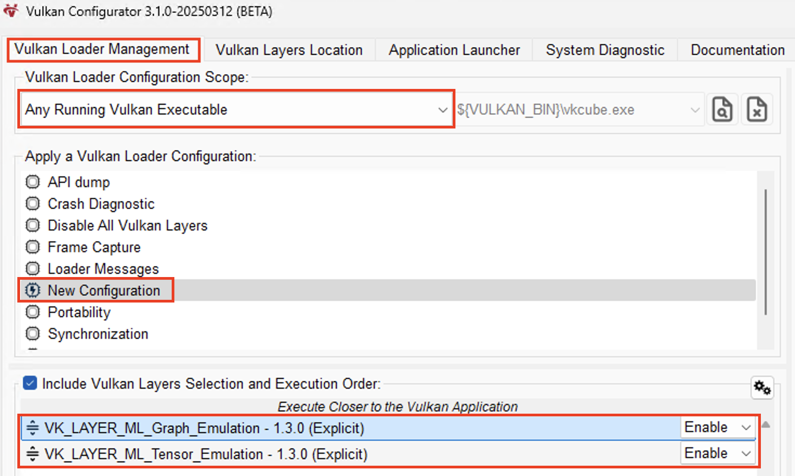
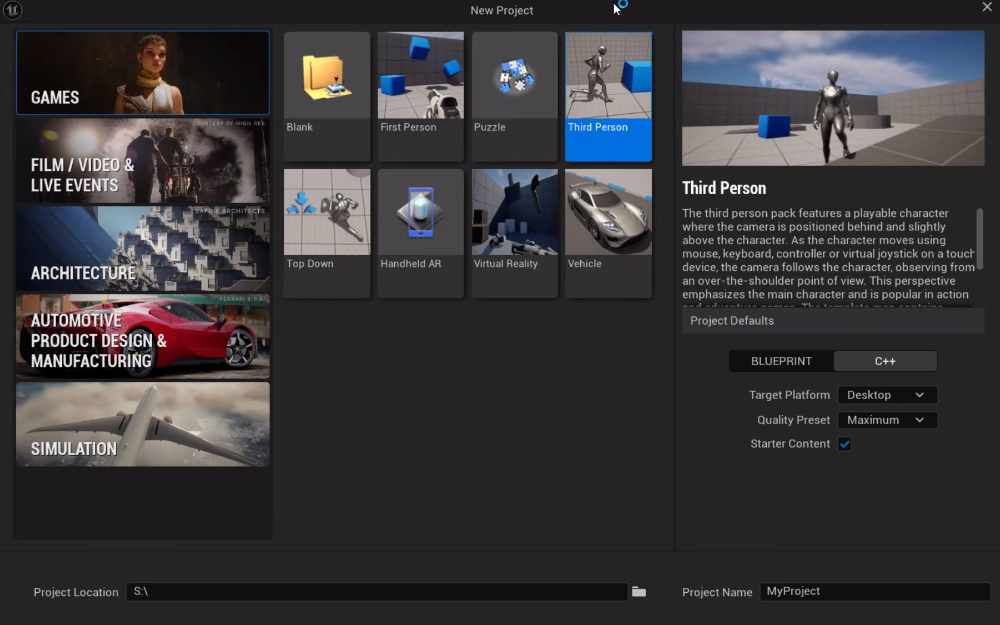
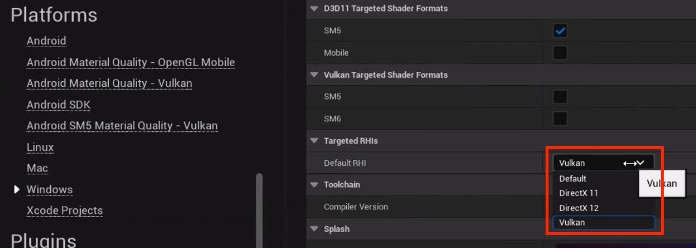
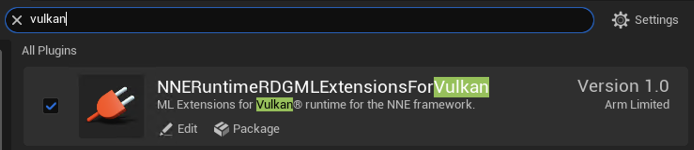

## Install dependencies

To run NSS in your Unreal Engine project, install and configure the following:

- **Vulkan SDK**: Required for development of applications that use Vulkan, and to enable the Vulkan Configurator. The latter sets up the emulation layers used for running ML extensions for Vulkan workloads.
- **ML Emulation Layer for Vulkan**: These layers allows neural inference to run in emulation through Vulkan’s compute backend. They are activated by Vulkan Configurator to run with the Unreal Engine plugin. The layers are included in the `NNERuntimeRDGMLExtensionsForVulkan` zip you downloaded in a previous step. The Vulkan layer configuration activates the ML Emulation Layer for Vulkan, which implements the ML extensions for Vulkan.
- **NSS for Unreal Engine plugins**: These include `NSS` (the inference and model interface) and `NNERuntimeRDGMLExtensionsForVulkan` (which connects Unreal’s Render Dependency Graph to the ML extensions for Vulkan).

These components allow you to run NSS in Unreal Engine, using ML emulation layers for Vulkan for development and testing.

## Install Vulkan Software Development Kit

Go to the [Vulkan SDK landing page](https://vulkan.lunarg.com/sdk/home) and download the SDK Installer for Windows. After you have run the installer, you can move on to the next step.

## Configure Vulkan Layers

Vulkan Configurator is a program that will run the emulation layers in the background when you want to utilize them with Unreal Engine.

To emulate the ML extensions for Vulkan:
1. Launch the **Vulkan Configurator** (bundled with the Vulkan SDK) from the Windows **Start** menu.
2. In the **Apply a Vulkan Loader Configuration** list, right-click and choose **Create a new Configuration**. You can give the new configuration any name, for example `NSS`.
3. Navigate to the **Vulkan Layers Location** tab.
4. Append a user-defined path pointing to the emulation layers you downloaded in the previous section:
   ```
   <download-path>/NNERuntimeRDGMLExtensionsForVulkan/MLEmulationLayerForVulkan
   ```


5. Switch back to the **Vulkan Loader Management** tab. Ensure the Graph layer is listed *above* the Tensor layer, and that you've set up the configuration scope as shown in the image.




{}
Keep the Vulkan Configurator running to enable the emulation layers during engine execution.
{}

## Enable NSS for Unreal Engine

1. Open Unreal Engine and create a new **Third Person** template project using the **C++** option.



2. Open the project in **Visual Studio**. Build it from source through **Build** > **Build Solution** or with `Ctrl+Shift+B`.

After the build is finished, open your project in Unreal Engine.

## Change Unreal’s Rendering Interface to Vulkan

By default, Unreal uses DirectX. Instead, you need to choose Vulkan as the default RHI:
1. Go to:
   ```
   Project Settings > Platform > Windows > Targeted RHIs > Default RHI
   ```
2. Select **Vulkan**.
3. Restart Unreal Engine to apply the change.



## Create the Plugins directory

Open your project directory in Windows explorer, and create a new folder called `Plugins`.

Enabling the plugin will look slightly different depending on what Unreal version you are using. Follow the steps corresponding to your setup.

## For Unreal 5.5

1. Copy the downloaded and extracted `.zip` into the new `Plugins` directory:
   - `UE5.5`
   - `NNERuntimeRDGMLExtensionsForVulkan`
2. Re-open Unreal Engine. When prompted, confirm plugin integration.
3. Rebuild your project in Visual Studio from source.
4. Verify the installation by opening the Plugins view in Unreal Engine, and making sure the checkbox is selected for both `NSS` and `NNERuntimeRDGMLExtensionsForVulkan` as shown. Restart Unreal Engine if prompted.




## For Unreal 5.4

1. Copy the downloaded and extracted `.zip` into the new `Plugins` directory:
   - `UE5.4`
2. Re-open Unreal Engine. When prompted, confirm plugin integration.
3. Rebuild your project in Visual Studio from source.
4. Verify the installation by opening the Plugins view in Unreal Engine, and making sure the checkbox is selected for `NSS`. Restart Unreal Engine if prompted.

With the emulation layers and plugins configured, you're ready to run Neural Super Sampling in Unreal Engine. Continue to the next section to test the integration.
