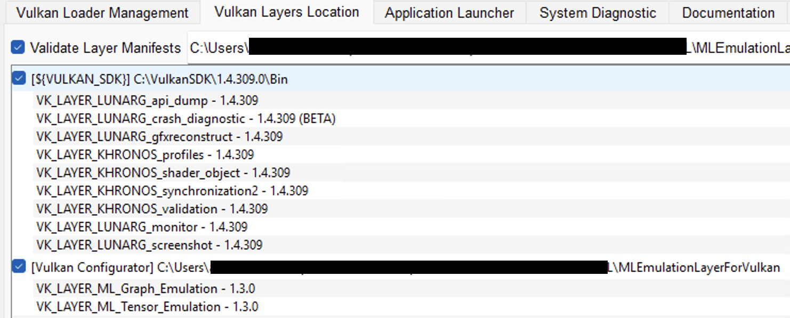
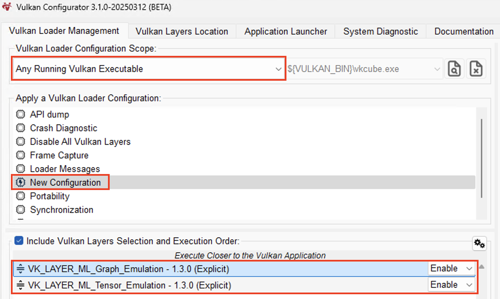

## Install dependencies

To run NSS in your Unreal Engine project, you will need to install and configure the following:

- **Vulkan SDK version 1.4.321.0 or later**: Required for developing applications that use Vulkan and for accessing Vulkan Configurator. Vulkan Configurator sets up the emulation layers used for running ML extensions for Vulkan workloads.
- **ML Emulation Layer for Vulkan version 0.10.0 or later**: Download the standalone Windows release from the `arm/ai-ml-emulation-layer-for-vulkan` repository. Its Graph and Tensor layers run ML workloads through Vulkan's compute backend.
- **Arm Neural Graphics Plugin 1.1.0**: You will download and integrate the plugin in the next section.

These components allow you to run NSS in Unreal Engine, using ML emulation layers for Vulkan for development and testing.

## Install Vulkan Software Development Kit

Go to the [Vulkan SDK landing page](https://vulkan.lunarg.com/sdk/home) and download version 1.4.321.0 or later of the SDK installer for Windows. After you run the installer, continue to the next step.

## Download the emulation layers

Go to the [ML Emulation Layer for Vulkan releases](https://github.com/arm/ai-ml-emulation-layer-for-vulkan/releases) and download version 0.10.0 or later of the `Windows_AMD64.zip` archive.

Extract the archive in a location of your choice. The extracted `bin` directory contains:

- `VkLayer_Graph.dll` and `VkLayer_Graph.json`
- `VkLayer_Tensor.dll` and `VkLayer_Tensor.json`

The ML Emulation Layer for Vulkan is a separate download from Arm Neural Graphics Plugin 1.1.0. Do not use emulation-layer binaries bundled with, or copied from, the plugin package.

## Configure Vulkan Layers

Use Vulkan Configurator to make the standalone Graph and Tensor layers available to Unreal Engine.

To emulate the ML extensions for Vulkan:

1. Launch the **Vulkan Configurator** (bundled with the Vulkan SDK) from the Windows **Start** menu.
2. In the **Apply a Vulkan Loader Configuration** list, right-click and choose **Create a new Configuration**. You can give the new configuration any name, for example `NSS`.
3. Navigate to the **Vulkan Layers Location** tab.
4. Append a user-defined path pointing to the `bin` directory from the release you extracted:

   ```text
   <extracted-emulation-layer>\bin
   ```

   

5. Confirm that `VK_LAYER_ML_Graph_Emulation` and `VK_LAYER_ML_Tensor_Emulation` appear in the layer list.

6. Switch back to the **Vulkan Loader Management** tab. Ensure the Graph layer is listed *above* the Tensor layer, and that you've set up the configuration scope as shown in the image.

   

{}
Make sure you keep Vulkan Configurator running in the background as you go through the next steps.
{}

With the standalone ML emulation layers configured, Vulkan can run machine learning workloads through the ML extensions for Vulkan. This enables neural inference to execute alongside the graphics pipeline during development, without requiring access to hardware with dedicated neural accelerators.

The next step is to integrate Neural Super Sampling into an Unreal Engine project. You’ll do this by installing the Arm Neural Graphics Plugin 1.1.0 and creating a simple example game that lets you verify the setup and visualize the upscaling in action.
