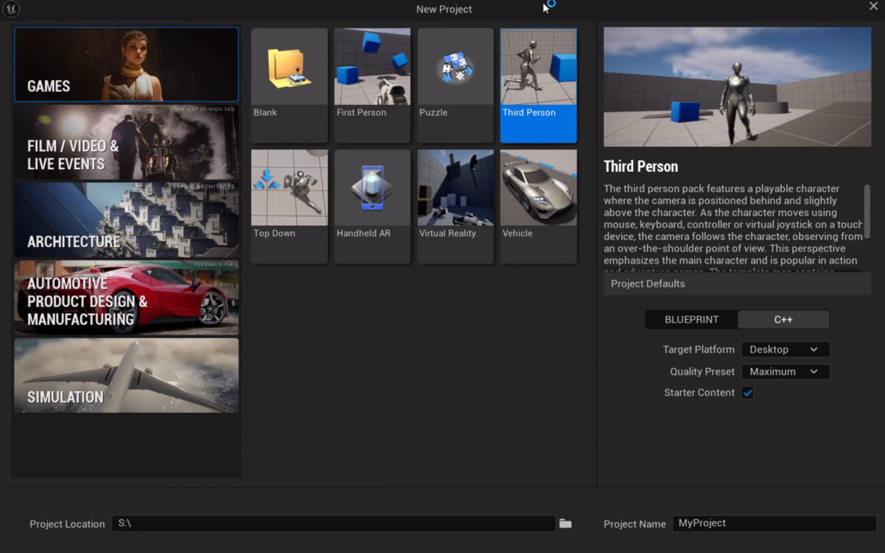

## Download the NSS plugin

This repository's release package contains everything you need to set up NSS for Unreal Engine, including the plugin and the VGF model file.

[**Neural Super Sampling Unreal Engine Plugin** → GitHub Repository](https://github.com/arm/neural-graphics-for-unreal)

Download the latest release `.zip` and extract it on your Windows machine. 

{}
For this UE version, the steps will be slightly different. Refer to the repository documentation for more information.
{}


## Enable NSS for Unreal Engine

1. Open Unreal Engine and create a new **Third Person** template project using the **C++** option.



2. Open the project in **Visual Studio**. Build it from source through **Build** > **Build Solution** or with `Ctrl+Shift+B`.

After the build is finished, open your project in Unreal Engine.

## Change Unreal’s Rendering Interface to Vulkan

By default, Unreal uses DirectX. Instead, you need to choose Vulkan as the default RHI:
1. Go to:
   ```
   Project Settings > Platform > Windows > Targeted RHIs > Default RHI
   ```
2. Select **Vulkan**.
3. Restart Unreal Engine to apply the change.


## Create the Plugins directory

Open your project directory in Windows explorer, and create a new folder called `Plugins`.


## Enable the plugin

The plugin is included in the release package you downloaded in the previous section. The package contains a separate folder for each supported Unreal Engine version. Make sure you use the folder that matches your engine version (for example, UE5.5 for Unreal Engine 5.5).

1.	Copy the appropriate engine-version folder from the extracted .zip archive into your project's Plugins directory.
2.	Reopen Unreal Engine. When prompted, confirm that you want to enable the plugin.
3.	Rebuild your project from source in Visual Studio.
4.	Verify the installation by opening Edit → Plugins in Unreal Engine and confirming that the NSS plugin is enabled. Restart Unreal Engine if prompted.


With the emulation layers and plugins configured, you're ready to run Neural Super Sampling in Unreal Engine. Continue to the next section to test the integration.

