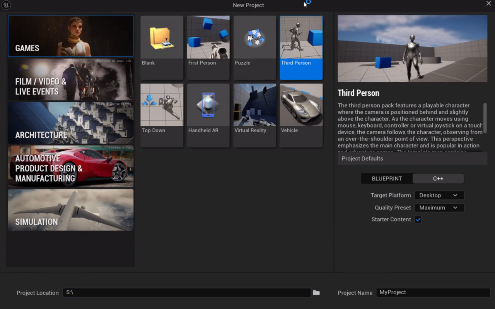
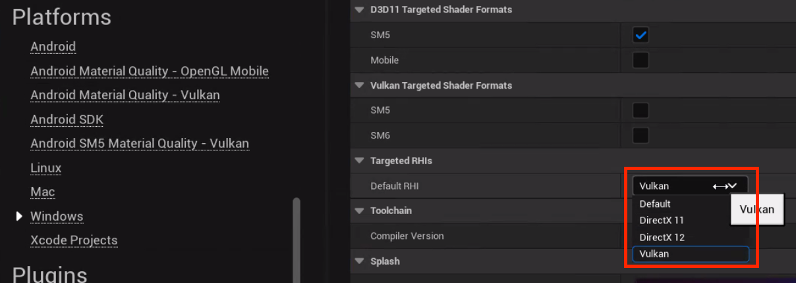
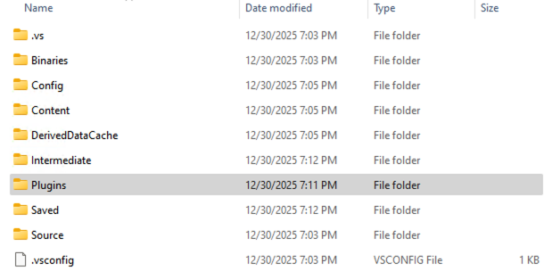

## Download the Arm Neural Graphics Plugin

The Arm Neural Graphics Plugin 1.1.0 release package contains the plugin and VGF model file you need to set up NSS for Unreal Engine.

[**Arm Neural Graphics Plugin** → GitHub repository](https://github.com/arm/neural-graphics-for-unreal)

Download the 1.1.0 release `.zip` and extract it on your Windows machine.

{}
This version is deprecated. Refer to the repository documentation for more information.
{}


## Enable NSS for Unreal Engine

1. Open Unreal Engine and create a new **Third Person** template project using the **C++** option.



2. Open the project in **Visual Studio**. Build it from source through **Build** > **Build Solution** or with `Ctrl+Shift+B`.

After the build is finished, open your project in Unreal Engine.

## Change Unreal’s Rendering Interface to Vulkan

By default, Unreal uses DirectX. Instead, you need to choose Vulkan as the default RHI:
1. Go to:
   ```
   Project Settings > Platform > Windows > Targeted RHIs > Default RHI
   ```
2. Select **Vulkan**.
3. Restart Unreal Engine to apply the change.



## Create the Plugins directory

Open your project directory in Windows explorer, and create a new folder called `Plugins`.



## Enable the plugin

The extracted archive contains the Arm Neural Graphics Plugin in the `neural-graphics-for-unreal` folder.

1. Copy the `neural-graphics-for-unreal` folder into your project's `Plugins` directory.
2. Reopen Unreal Engine. When prompted, confirm that you want to enable the plugin.
3. Rebuild your project from source in Visual Studio.
4. Open **Edit > Plugins** and search for **Arm Neural Graphics Plugin**. If its checkbox is clear, select it. Restart Unreal Engine if prompted.

With the emulation layers and Arm Neural Graphics Plugin configured, you're ready to run Neural Super Sampling in Unreal Engine. Continue to the next section to test the integration.
