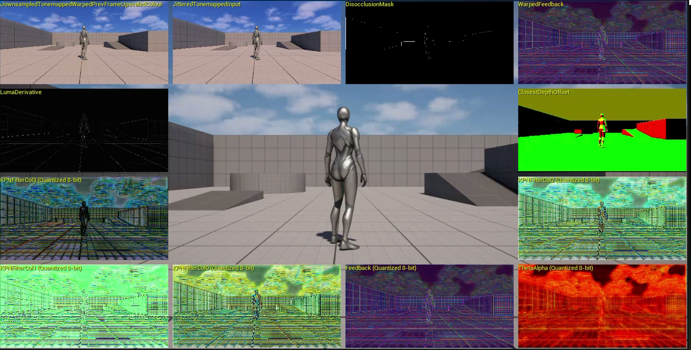

## Start the level and verify NSS

Press the green **Play** button to start the level. To verify NSS is running, you can run this command in Unreal:
   ```
   ShowFlag.VisualizeTemporalUpscaler 1
   ```
You’ll see **NSS** listed in the rendering summary.

{}
In **Project Settings > Plugins > Neural Super Sampling**, you can view and configure the active neural network model being used.
{}

Run `ShowFlag.VisualizeTemporalUpscaler 0` to disable the overview. To visualize the NSS model output in real-time, run the following command:
   ```
   r.NSS.Debug 2
   ```

This will add real-time views showing the model’s processed outputs, such as predicted filter coefficients and feedback, as below. In the [Wrapping up section](/learning-paths/mobile-graphics-and-gaming/nss-unreal/6-wrapping-up.md), you will find links to learn more about what the debug outputs mean.



## NSS model on Hugging Face

The model that powers NSS is published on Hugging Face in the [VGF format](https://github.com/arm/ai-ml-sdk-vgf-library). This format is optimized for inference via ML extensions for Vulkan.

Visit the [NSS model page on Hugging Face](https://huggingface.co/Arm/neural-super-sampling/)

On this landing page, you can read more about the model, and learn how to run a test case - a _scenario_ - using the ML SDK for Vulkan.

## Result

You now have Neural Super Sampling integrated and running inside Unreal Engine. This setup provides a real-time testbed for neural upscaling.

Proceed to the next section to debug your frames using RenderDoc, or move on to the final section to explore more resources on the technology behind NSS.
