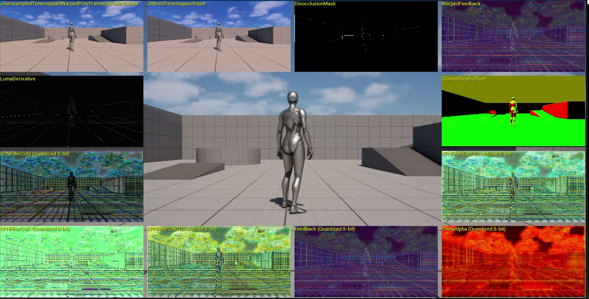

## Start the level and verify NSS

Press the green **Play** button to start the level. To verify NSS is running, you can run this command in Unreal:
   ```
   ShowFlag.VisualizeTemporalUpscaler 1
   ```
You’ll see **NSS** listed in the rendering summary.

{}
In **Edit > Project Settings > Plugins > Arm Neural Graphics Plugin 1.1.0**, you can view and configure the NSS settings.
{}

Run `ShowFlag.VisualizeTemporalUpscaler 0` to disable the overview. To visualize the NSS model output in real-time, run the following command:
   ```
   r.NSS.Debug 1
   ```

This will add real-time views showing the model’s processed outputs, such as predicted filter coefficients and feedback, as below. In the [Wrapping up section](/learning-paths/mobile-graphics-and-gaming/nss-unreal/6-wrapping-up/), you will find links to learn more about what the debug outputs mean.



## NSS console variables

Use these Unreal Engine console variables to configure NSS behavior, debug views, and resource lifetime. Enter a variable and value in the Unreal Engine console, for example, `r.NSS.Enable 1`.

| Console variable | Default | Value range | Details |
|------------------|---------|-------------|---------|
| `r.NSS.Enable` | `0` | `0`, `1` | Enables NSS for Temporal Upscale. |
| `r.NSS.EnabledInEditorViewport` | `0` | `0`, `1` | Enables NSS for Temporal Upscale in the editor viewport. |
| `r.NSS.Debug` (UE 5.4 and UE 5.6) | `0` | `0`, `1` | Displays 16 debug outputs in a 4x4 grid. |
| `r.NSS.Debug` (UE 4.27) | `0` | `0`, `1` | Displays 12 debug outputs in a 3x4 grid. |
| `r.NSS.AdjustMipBias` | `1` | `0`, `1` | Allows NSS to adjust the minimum global texture mip bias: `r.ViewTextureMipBias.Min` and `r.ViewTextureMipBias.Offset`. |
| `r.NSS.ShaderQualityMode` | `1` | `0`, `1`, `2` | Selects shader quality: `0` for quality (high), `1` for balanced (default), and `2` for performance (low). |
| `r.NSS.UseFragmentShader` | `1` | `0`, `1` | Uses a fragment job for NSS. |
| `r.NG.DeferDelete` | `5` | `> 0` | Sets the number of frames to defer deletion. |

## Troubleshooting tips

If the example does not behave as expected, check the following common issues before continuing.

### Check for build issues in Visual Studio
- Build failures related to `AutomationTool`, `Gauntlet`, or other `*.Automation` projects can be ignored.
- Focus on whether the project itself, named as `<Your Project Name>Editor`, builds successfully.

### Check you Unreal Engine configuration
- Verify that Vulkan is selected as the **Default RHI**.
- Confirm the **Arm Neural Graphics Plugin** is enabled and that Unreal Engine was restarted after enabling it.
- Check **Edit > Project Settings > Plugins > Arm Neural Graphics Plugin 1.1.0** to confirm that NSS is enabled.

If the Arm Neural Graphics Plugin is enabled but NSS appears to have no effect:
- Confirm that you installed version 0.10.0 or later of the standalone [ML Emulation Layer for Vulkan](https://github.com/arm/ai-ml-emulation-layer-for-vulkan).
- Ensure Vulkan Configurator is running.
- Verify that the correct layer configuration is selected and active.
- Double-check that:
  - The emulation layer path points to the extracted release's `bin` directory
  - The Graph layer is ordered above the Tensor layer

Refer back to the [emulation layer section](/learning-paths/mobile-graphics-and-gaming/nss-unreal/2-emulation-layer/) for the full Vulkan Configurator setup and validation steps.

### Check the software and hardware setup
- Confirm that you're using Arm Neural Graphics Plugin 1.1.0 with a supported Unreal Engine version.
- Verify that your GPU driver supports Vulkan.
- Verify that your Visual Studio version aligns with the Unreal Engine version you are using.
- Return to the Visual Studio build output and inspect the logs carefully to identify the first reported error

Build or startup failures are often caused by version mismatches or missing dependencies.

## NSS model on Hugging Face

The model that powers NSS is published on Hugging Face in the [VGF format](https://github.com/arm/ai-ml-sdk-vgf-library). This format is optimized for inference via ML extensions for Vulkan.

Visit the [NSS model page on Hugging Face](https://huggingface.co/Arm/neural-super-sampling/)

On this landing page, you can read more about the model, and learn how to run a test case - a _scenario_ - using the ML SDK for Vulkan.

## Result

You now have Neural Super Sampling integrated and running inside Unreal Engine. This setup provides a real-time testbed for neural upscaling.

Proceed to the next section to debug your frames using RenderDoc, or move on to the final section to explore more resources on the technology behind NSS.
