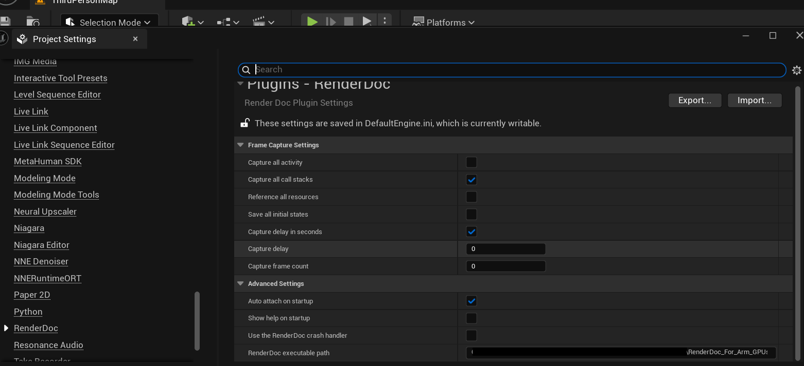
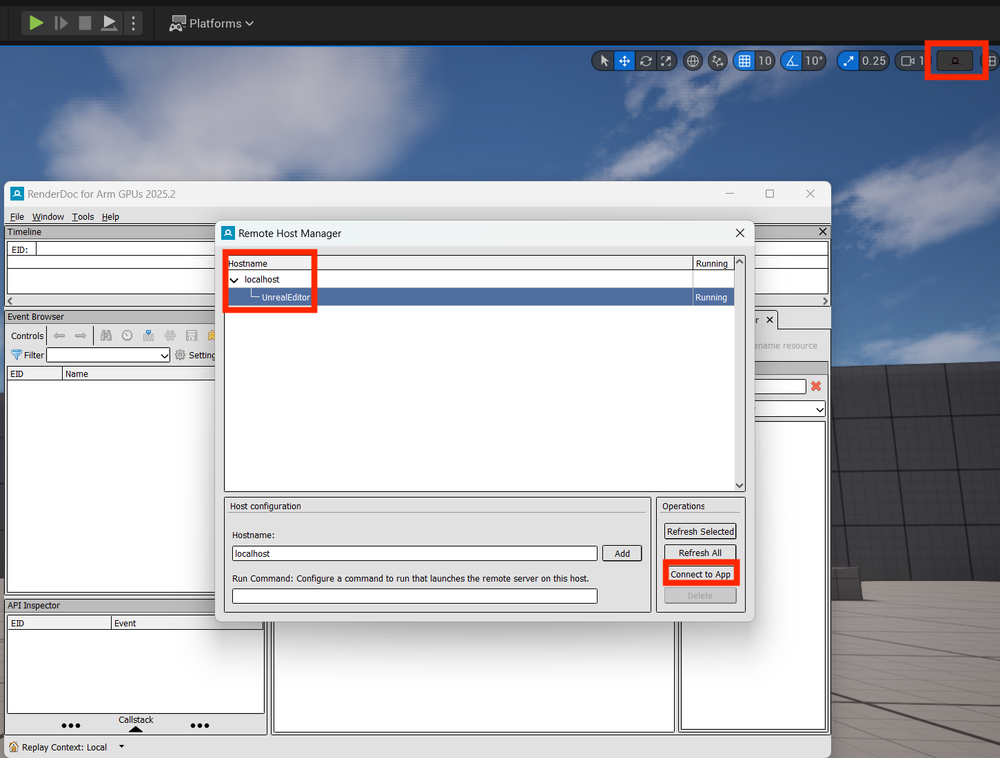

## Why use RenderDoc with Neural Super Sampling?

As you integrate neural upscaling techniques into your game, visual debugging and performance profiling become essential. RenderDoc is a powerful frame capture and analysis tool that allows you to step through a frame, inspect Vulkan API calls, view shader inputs and outputs, and understand the state of resources. Arm has released some additional features, which are captured in [RenderDoc for Arm GPUs](https://developer.arm.com/Tools%20and%20Software/RenderDoc%20for%20Arm%20GPUs).

You might want to use RenderDoc when:

- You see unexpected visual output or want to step through the frame rendering process.
- You need to analyze the sequence of Vulkan API calls made by the engine.
- You’re inspecting memory usage or the state of specific GPU resources.
- You want to validate your data graph pipeline execution or identify synchronization issues.

## Install Arm Performance Studio

To access RenderDoc for Arm GPUs containing the added features with ML extensions for Vulkan, you should install Arm Performance Studio. Download it from the [Arm Performance Studio Downloads](https://developer.arm.com/Tools%20and%20Software/Arm%20Performance%20Studio#Downloads). The minimum version to use is `2025.4`

Refer to the [Arm Performance Studio install guide](/install-guides/ams) to set it up.

Upon a finished installation, you can find the installed version of RenderDoc for Arm GPUs using the Windows **Start** menu.

## Use in Unreal Engine

### 1. Configure the executable path

To enable integration with Unreal Engine:

1. Open your Unreal Engine project.
2. Go to **Edit > Project Settings > Plugins > RenderDoc**.
3. Under **Path to RenderDoc executable**, enter the full path to the directory where the `qrenderdoc.exe` binary is located.
4. Restart Unreal Engine for the setting to take effect.

## 2. Ways to capture

### Option 1: Attach to the Running Editor

1. Launch RenderDoc for Arm GPUs separately.
2. Go to **File > Attach to Running Instance**.
3. A list of running Vulkan-enabled applications will appear. Select the hostname that corresponds to the UE Editor session (with UI) or use Standalone Running App (see image below).
4. Click **Connect to App**.
5. Click **Capture Frame Immediately** or set up the capture settings otherwise.

### Option 2: Use plugin inside Unreal Engine
1. Open your project and scene where you want to perform a capture.
2. Click the **RenderDoc Capture** button in the Level Viewport (see image below).

## 3. Capture a Frame

1. Return to Unreal Engine and **Play in Editor** to launch your game level.
2. In RenderDoc for Arm GPUs, click **Capture Frame Now** (camera icon) or press `F12` while the UE window is focused.
3. Once captured, double-click the frame in RenderDoc to open a detailed breakdown of the GPU workload.

You can now:

- Step through draw calls and dispatches.
- Inspect bound resources, descriptor sets, and shaders.
- Explore the execution of your data graph pipeline frame-by-frame.

If you want to learn more about RenderDoc for Arm GPUs, you can check out the [Debug With RenderDoc User Guide](https://developer.arm.com/documentation/109669/latest).
