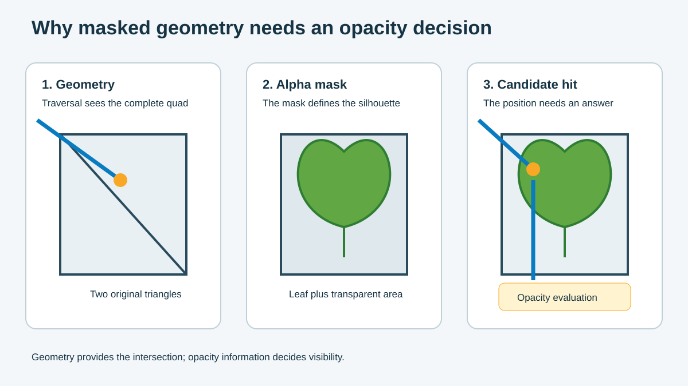

## Identify the ray tracing problem

Imagine a ray passing through a tree filled with hundreds of leaves. Each leaf might be a rectangular mesh with a texture that makes most of that rectangle transparent. The ray can therefore intersect the rectangle without hitting the visible part of the leaf.

The renderer must check the leaf's alpha mask before it accepts the intersection. One check is inexpensive, but the work adds up when shadow and reflection rays pass through many layers of foliage, fences, or grilles.

Opacity Micromaps (OMM) move much of this decision into ray traversal. OMM stores a simplified description of the alpha mask in a form that the traversal hardware can read. This can prevent the renderer from running shader-side material logic for every candidate intersection.

## Separate geometry from opacity

A leaf often uses a quad made from two triangles. The geometry describes the complete rectangle, while an alpha texture cuts the leaf shape out of it. It helps to treat these as two separate layers of information:

| Data layer | Question it answers |
| --- | --- |
| Geometry | Where can a ray intersect a triangle? |
| Opacity | Is the intersected position visible? |

The figure shows a ray intersecting the transparent part of the quad. The geometry test reports a valid triangle hit, but the alpha test shows that the ray missed the visible leaf. OMM helps the traversal hardware make that second decision earlier.

## Compare rasterization and ray traversal

You might already handle this kind of material with alpha testing during rasterization. Ray tracing solves the same visual problem at a different point in the rendering process. Rasterization creates a fragment before the pixel shader checks the alpha texture. Ray traversal finds a possible triangle intersection before it knows whether that point is visible.

| Rendering path | Opacity decision |
| --- | --- |
| Rasterization | A pixel shader samples alpha and discards the fragment when it fails the cutoff |
| Ray tracing without OMM | An any-hit shader or ray-query candidate handler evaluates the mask |
| Ray tracing with OMM | Traversal resolves known regions and keeps only unknown regions for shader-side evaluation |

A shadow or reflection ray can pass through several overlapping leaves. Without OMM, each possible hit can repeat texture access, material setup, and control flow. With OMM, traversal first reads a compact state for the small region that the ray hit:

| OMM state | Traversal action |
| --- | --- |
| Opaque | Accept the region as opaque |
| Transparent | Ignore the region and continue traversal |
| Unknown | Keep the candidate for shader-side evaluation |

## Identify suitable assets

Not every alpha-tested asset benefits from OMM. You get the clearest value when the opacity pattern remains stable and most of the mask can be classified before the game runs. Use the following examples as a starting point when you review an asset:

| Asset pattern | OMM fit | Evidence to check |
| --- | --- | --- |
| Static foliage | Strong candidate | Stable mask, repeated ray hits, and narrow alpha edges |
| Chain-link fence or grille | Strong candidate | Stable binary cutouts and enough subdivision for thin features |
| Animated or changing mask | Conditional | A defined update or rebuild policy |
| Alpha-blended surface | Poor candidate | Continuous transparency needs a blending path |
| Rasterization-only asset | No benefit | The asset never participates in ray traversal |

Also check every mesh level of detail (LOD) separately. Its UV coordinates, triangle links, and alpha data must match the version used to create the OMM. Otherwise, valid OMM data can become attached to the wrong triangle and produce incorrect opacity results.

## Decide whether to continue

Before continuing, choose one alpha-tested asset from your own project or picture a common example, such as a leaf or wire fence. Ask three questions: does it participate in ray tracing, does its alpha mask remain stable, and will rays cross it often enough for repeated opacity checks to matter?

If the answer to all three questions is yes, the asset is a reasonable OMM candidate. Keep dynamic masks and assets with mostly uncertain opacity on the existing shader-side path until profiling gives you a reason to change them.

### What you've learned

You can now distinguish the geometry intersection from the opacity decision and identify assets that are reasonable OMM candidates. Next, choose how microtriangles represent the asset's opacity.
