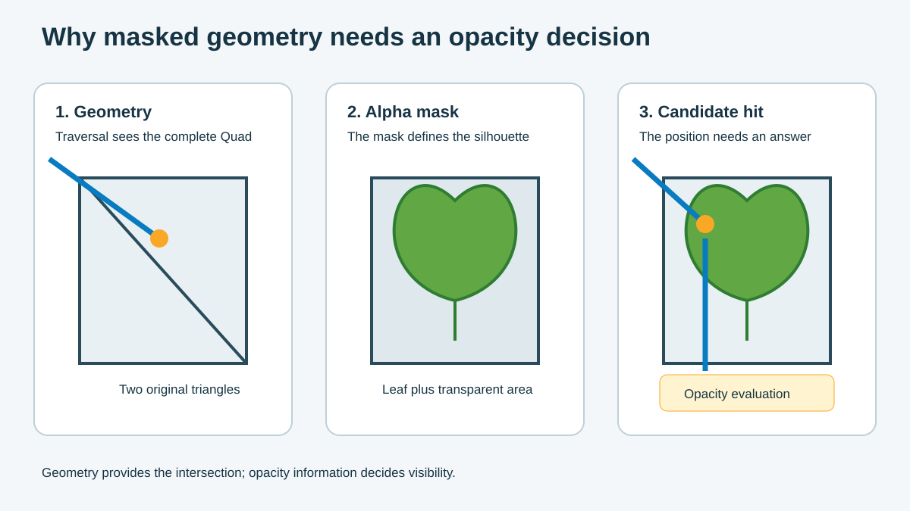

Opacity Micromaps (OMM) solve a specific ray tracing problem. A ray hits a triangle, but the renderer still needs to check the alpha mask.

## Separate geometry from opacity

Foliage, wire mesh and grilles often use simple geometry. A leaf Quad contains two triangles that cover a rectangle.

An alpha texture creates the visible leaf shape. A cutoff value divides the texture into visible and transparent regions.

You can think of the asset as two data layers:

- Geometry tells traversal where the triangles are.
- Opacity tells traversal whether a hit position is visible.



The figure shows the complete Quad first. It then shows the leaf shape from the alpha mask. The final panel shows a ray hitting the transparent part of the Quad.

The triangle hit remains valid. Traversal needs opacity data to accept the hit or continue through it.

## Compare rasterization with ray traversal

Rasterization creates fragments before a pixel shader checks the alpha texture. The shader discards a fragment when it fails the cutoff.

Ray traversal starts with geometry in an acceleration structure. It finds a ray-triangle intersection before it knows the alpha result.

For opaque geometry, the intersection provides a clear answer. For masked geometry, the intersection becomes a candidate hit. The hit position can still fall outside the visible shape.

An engine can run an any-hit shader or material code to check the mask. This path supports detailed material logic. It also repeats similar work for every candidate hit.

## Follow a ray through foliage

A tree can contain thousands of leaf Quads. Shadow rays and reflection rays can pass through many overlapping leaves.

One ray can follow this sequence:

1. The ray hits the first leaf Quad.
2. The alpha mask marks the hit position as transparent.
3. Traversal continues to the next Quad.
4. The renderer checks opacity again.
5. The process ends at an opaque region or when the ray leaves the scene.

One opacity check is small. Many primitives, overlapping leaves, and many rays increase the total work.

## Add OMM to the traversal path

OMM stores opacity states for small regions inside each original triangle. These regions are called microtriangles.

After the ray hits a triangle, traversal uses the hit position to select one microtriangle. It then reads one of these results:

- `opaque`: accept the region as opaque;
- `transparent`: ignore the region and continue traversal;
- `unknown`: send the candidate to the shader path for more work.

```text
Original triangle
      +
Microtriangle opacity states
      =
Earlier opacity decisions during traversal
```

OMM keeps the original mesh and material. It adds a compact data layer that traversal can read.

## Identify suitable content

Start with alpha-tested content that uses stable masks. The following table shows common patterns.

| Content | OMM data pattern | Main setting to check |
| --- | --- | --- |
| Foliage | Large opaque and transparent regions with a narrow edge | UVs, cutoff, subdivision, and deformation |
| Chain-link fence | Small, repeated holes | Wire width and microtriangle density |
| Grille | Stable binary cutouts | Triangle size and texture frequency |
| Animated mask | Opacity changes at runtime | Update plan and shader path |
| Alpha-blended surface | Continuous transparency | Use an alpha-blending rendering path |

When you review an asset, ask how many opacity results the baker can calculate before runtime. OMM works best when traversal can reuse many resolved results.

The next module explains how subdivision and OMM states store those results.
