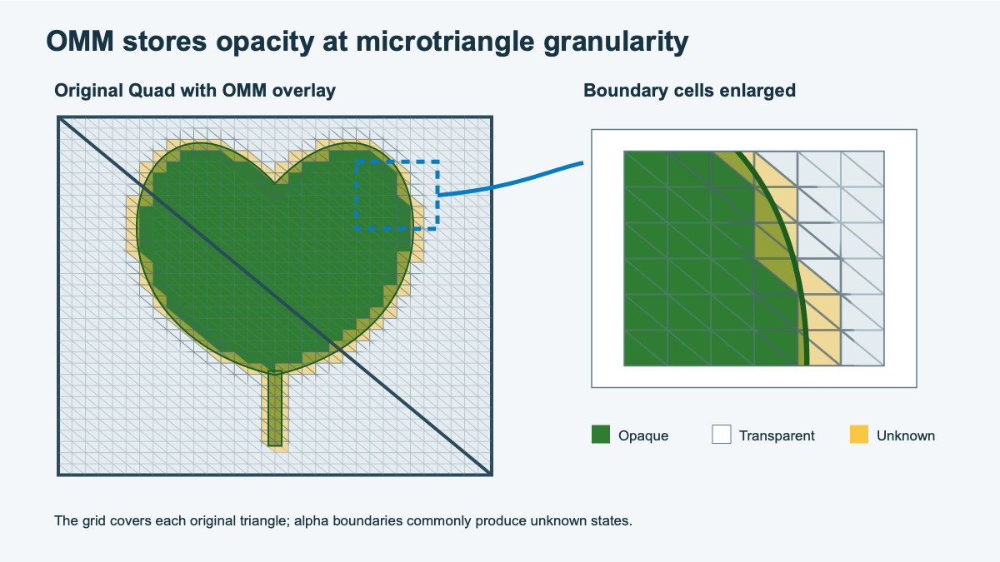

## Turn an alpha mask into traversal data

After you identify a suitable asset, you need to describe its opacity in a form that ray traversal can use. OMM does this by dividing each original triangle into smaller regions called *microtriangles*. Each microtriangle records whether its part of the alpha mask is opaque, transparent, or still uncertain.

This subdivision changes the OMM data, not the mesh. It doesn't add polygons to the source model or to the bottom-level acceleration structure (BLAS). You can think of it as placing a finer decision grid over the original triangle.



The figure keeps the two original triangles and overlays a finer OMM grid. Opaque regions cover the inside of the leaf, transparent regions cover empty parts of the quad, and unknown regions follow the detailed edge. The closer the grid follows that edge, the more opacity decisions traversal can make without shader help.

## Choose a subdivision level

The subdivision level controls the resolution of the OMM grid. A low level uses a few large regions. A higher level uses many smaller regions and can follow a curved or detailed alpha boundary more closely.

This extra detail has a cost: each step up creates four times as many microtriangles. For level `N`, the number in each original triangle is:

```text
microtriangle count = 4^N = 2^(2N)
```

| Level | Microtriangles per original triangle | Typical use |
| ---: | ---: | --- |
| 0 | 1 | One state for the complete triangle |
| 1 | 4 | A coarse cutout |
| 2 | 16 | Large silhouette changes |
| 3 | 64 | Curved alpha edges |
| 4 | 256 | Fine detail with higher data cost |

Choose the level by comparing the size of the source triangle with the detail in its alpha mask. Also consider the intended LOD and viewing distance. Don't map the subdivision level directly to screen pixels because the same triangle can appear at many sizes on screen.

## Choose a state format

Subdivision decides how small the regions are. The state format decides what each region can say about its opacity.

The `VK_KHR_opacity_micromap` extension defines 2-state and 4-state formats. A 2-state OMM must call every region opaque or transparent. A 4-state OMM can also leave a region unknown, allowing the existing shader path to resolve difficult edges at runtime.

| Format | State | Normal traversal action | If forced to 2-state |
| --- | --- | --- | --- |
| 2-state | Fully transparent | Ignore the hit | No change |
| 2-state | Fully opaque | Handle the region as opaque | No change |
| 4-state | Fully transparent | Ignore the hit | No change |
| 4-state | Fully opaque | Handle the region as opaque | No change |
| 4-state | Unknown-transparent | Keep shader-side evaluation available | Treat the region as transparent |
| 4-state | Unknown-opaque | Keep shader-side evaluation available | Treat the region as opaque |

During normal 4-state traversal, both unknown values mean that more evaluation is needed. The transparent and opaque variants only produce different results when a ray or instance forces the OMM into 2-state evaluation.

This gives you two practical starting strategies:

| Strategy | OMM setup | Main tradeoff |
| --- | --- | --- |
| Shader-assisted edge detail | 4-state with low or moderate subdivision | Smaller OMM data, but unknown edges retain some shader-side work |
| Hardware-resolved binary detail | 2-state with higher subdivision | No unknown states, but more microtriangles and possible silhouette error |

Use the 2-state strategy only when you can classify every region without damaging the image. Marking visible detail as transparent can remove a valid hit. Marking empty space as opaque can create false shadows or reflections.

## Classify sample microtriangles

You can practice the classification step without OMM-capable hardware. The exercise uses an alpha cutoff of `0.5`: values below the cutoff are transparent, while values at or above it are opaque. Each row contains representative samples from one microtriangle.

| Region | Representative alpha samples | Your classification |
| --- | --- | --- |
| A | `1.00`, `0.92`, `0.87` | Opaque, transparent, or unknown? |
| B | `0.00`, `0.08`, `0.14` | Opaque, transparent, or unknown? |
| C | `0.05`, `0.62`, `0.91` | Opaque, transparent, or unknown? |
| D | `0.42`, `0.45`, `0.48` | Opaque, transparent, or unknown? |
| E | `0.49`, `0.50`, `0.51` | Opaque, transparent, or unknown? |

Classify each region, then calculate the raw state payload for one level-2 triangle. Level 2 contains 16 microtriangles. The 2-state format uses one bit per microtriangle, while the 4-state format uses two bits.

### Check your classification and payload calculation

Compare your answers with the following classifications:

| Region | Classification | Reason |
| --- | --- | --- |
| A | Opaque | Every sample is on the visible side of the cutoff |
| B | Transparent | Every sample is below the cutoff |
| C | Unknown | The region crosses the cutoff |
| D | Transparent | Every sample is below the cutoff |
| E | Unknown | The region lies on both sides of the cutoff |

A level-2 triangle needs 16 bits, or 2 bytes, of raw 2-state data. It needs 32 bits, or 4 bytes, of raw 4-state data. These values describe the state payload only. Record metadata, alignment, and implementation-specific storage can increase the final size.

## Interpret the result

The result should contain large areas of opaque and transparent microtriangles, with a narrow band of unknown regions around the alpha boundary. If much of the triangle remains unknown, traversal still needs shader help for many hits.

A wide unknown band can mean that the subdivision level is too low. It can also point to a mismatch in filtering or cutoff, texture detail that is too fine for the grid, or material logic that the baker can't reproduce.

### What you've learned

You have classified opacity regions and compared the accuracy and storage implications of the two formats. Next, connect the baked representation to the Mali G2-Ultra NX traversal path.
