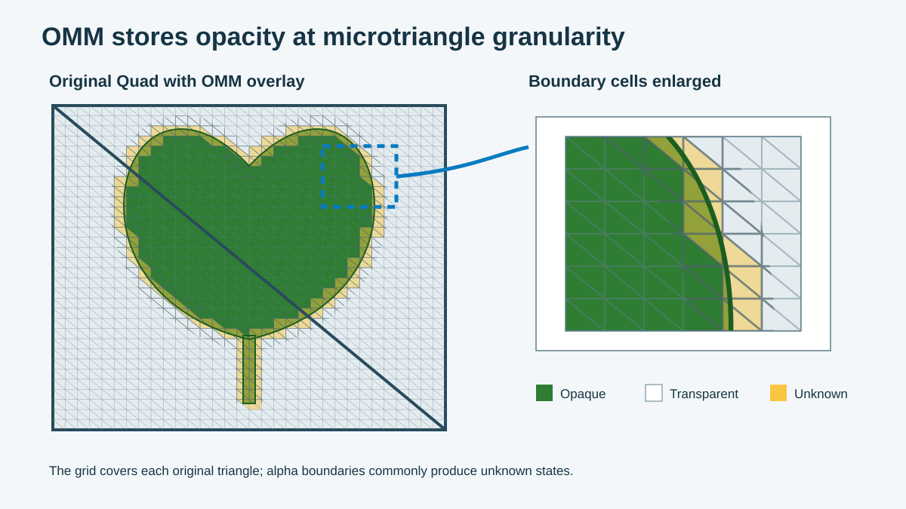

An opacity micromap divides an original triangle into smaller regions called microtriangles. OMM stores one opacity state for each region.

## Treat microtriangles as data

The microtriangle grid belongs to the OMM data. It does not add polygons to the source mesh.

The BLAS still contains the original triangles. OMM gives traversal a finer map inside each triangle.



The figure keeps the Quad and its two original triangles. It places a microtriangle grid over them.

The enlarged area shows three states. Green regions are opaque, white regions are transparent, and yellow regions are unknown.

## Choose a subdivision level

The subdivision level controls the number of microtriangles. Each new level divides every microtriangle into four smaller regions.

For level `N`, use this formula:

```text
microtriangle count = 4^N = 2^(2N)
```

| Subdivision level | Microtriangles per original triangle | Typical detail |
| ---: | ---: | --- |
| 0 | 1 | One state for the complete triangle |
| 1 | 4 | A very coarse cutout |
| 2 | 16 | Large changes in the silhouette |
| 3 | 64 | Curved alpha edges |
| 4 | 256 | Fine detail with higher data cost |

Each level increases the data by four times. Compare the triangle size with the alpha texture detail before you select a level.

A large triangle with a detailed mask needs finer data. A mesh with many small triangles can often use a lower level.

## Use 2-state and 4-state formats

`VK_KHR_opacity_micromap` defines two formats.

| Format | State | Traversal action |
| --- | --- | --- |
| 2-state | Fully transparent | Ignore the hit and continue traversal |
| 2-state | Fully opaque | Handle the region as opaque |
| 4-state | Fully transparent | Use the same transparent action |
| 4-state | Fully opaque | Use the same opaque action |
| 4-state | Unknown-transparent | Keep the shader path with a transparent default |
| 4-state | Unknown-opaque | Keep the shader path with an opaque default |

The `4-state` format adds two unknown values. Both keep the shader path available. Their default opacity behavior is different.

In the rest of this Learning Path, `unknown` refers to either unknown value unless the distinction matters.

These formats support two common game-content strategies. A `4-state` OMM can use low or moderate subdivision and reserve fine alpha edges for shader evaluation through unknown states. A `2-state` OMM can use finer subdivision to classify every microtriangle as opaque or transparent and avoid opacity any-hit shading, or equivalent ray query candidate evaluation, for that OMM geometry.

Treat these strategies as starting points, not fixed presets. Mask detail, triangle density, quality targets, and OMM resource cost determine the right choice. *Check support conditions and tradeoffs* compares the two strategies.

## Understand the alpha boundary

The baker compares each microtriangle with the alpha cutoff.

- A region inside the visible shape becomes opaque.
- A region outside the visible shape becomes transparent.
- A region that crosses the edge often becomes unknown.

For a leaf, you normally see opaque data across the interior. Transparent data fills the Quad outside the leaf. Unknown data follows the edge, notches, and thin stem.

If unknown data covers most of the Quad, check these items:

- subdivision level;
- alpha filtering;
- texture detail and UV scale;
- material logic that the baker reads.

## Link data to each original triangle

OMM records data for each original triangle. A record contains a data offset, subdivision level, and format.

The engine also keeps a triangle mapping. This mapping links each source triangle to its OMM record.

You can use a special state when one complete triangle has one result. For example, a triangle can be fully opaque or fully transparent. This saves space because it needs no microtriangle payload.

## Balance accuracy and cost

Use opacity states that preserve the rendered result. A wrong transparent state can remove a valid hit. A wrong opaque state can add false occlusion.

Unknown keeps the result safe when the baker cannot resolve a region. More unknown data also sends more candidates to the shader path.

Balance three settings for each asset:

1. Subdivision controls edge accuracy.
2. The format controls the available states.
3. Unknown coverage controls how much work remains for the shader path.

The next module follows this data from the baker to runtime traversal.
