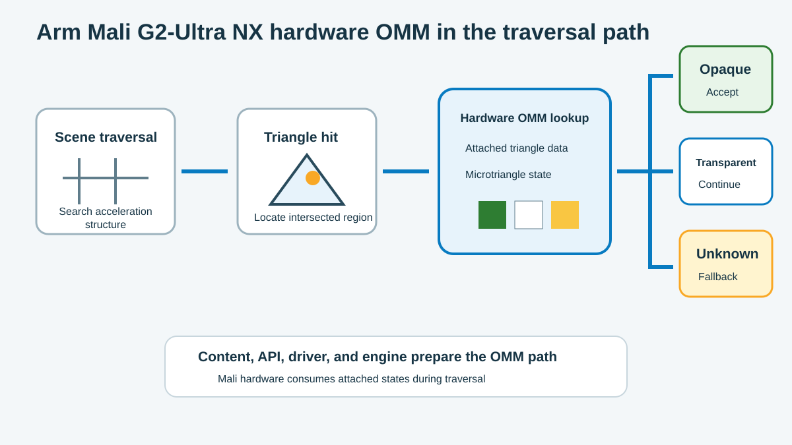

## Connect baked data to hardware traversal

So far, you have treated OMM as asset data: a grid of microtriangles with opacity states. To gain a runtime benefit, the engine must turn that data into a GPU resource and connect it to the matching scene geometry.

Arm Mali G2-Ultra NX can read OMM data in its hardware ray tracing path. Your engine prepares and links the data before traversal begins. When a ray reaches a triangle, the hardware reads the state for the microtriangle it hit and decides whether it can resolve the intersection immediately.



This distinction matters when you debug the feature. A successful offline bake proves that you produced OMM data, but it doesn't prove that the GPU is using it. The resource build, triangle mapping, and traversal controls must also be correct.

## Follow the runtime lifecycle

It helps to follow one asset from its source files to a rendered frame. At each stage, keep evidence that you can inspect if the final image or performance doesn't match your expectations.

| Stage | What your engine does | Evidence to retain |
| --- | --- | --- |
| Prepare and bake | Keep the mesh, triangle order, UVs, alpha source, cutoff, filtering, format, and subdivision on one asset version | Bake report and source version |
| Build the micromap | Query build sizes, allocate result and scratch storage, and build the OMM data | Successful build and resource sizes |
| Link triangle data | Map each source triangle to its OMM record during the BLAS build | Triangle mapping and BLAS build input |
| Enable traversal | Configure the ray pipeline or ray-query shader for OMM | Active pipeline flag or execution mode |
| Keep resources valid | Synchronize builds and keep the micromap alive while the BLAS uses it | Resource lifetime and synchronization records |

Under `VK_KHR_opacity_micromap`, the micromap GPU resource uses a `VkAccelerationStructureKHR` handle. When your engine builds the BLAS, it attaches the micromap and provides a mapping from every source triangle to the correct OMM record. This mapping is what connects an intersection in the scene to the opacity states created by the baker.

## Query device support

Knowing that your target uses Mali G2-Ultra NX isn't enough to enable OMM. The Vulkan driver must also expose the extension and feature. Query `VK_KHR_opacity_micromap`, then enable its `micromap` feature before you create OMM resources.

The driver also reports limits that you must compare with the data produced by your asset pipeline:

| Property | Decision it constrains |
| --- | --- |
| `maxOpacity2StateSubdivisionLevel` | Highest usable 2-state detail level |
| `maxOpacity4StateSubdivisionLevel` | Highest lossless 4-state detail level |
| `maxOpacityLossy4StateSubdivisionLevel` | Highest level available to a lossy 4-state build |
| `maxMicromapTriangles` | Maximum number of triangles in one micromap |

These limits turn device support into an asset compatibility decision. For example, a device can support OMM while rejecting an asset whose subdivision level is too high. Confirm the extension, feature, relevant limits, and engine configuration before loading an OMM-enabled BLAS.

## Enable the traversal path

Vulkan doesn't assume that every shader is prepared to traverse geometry with OMM data. You must opt in through the path your renderer uses. Ray pipelines and inline ray queries use different controls:

| Traversal path | Required enablement |
| --- | --- |
| Ray pipeline | Create the pipeline with `VK_PIPELINE_CREATE_RAY_TRACING_OPACITY_MICROMAP_BIT_KHR` |
| Ray query | Declare the `OpacityMicromapIdKHR` SPIR-V execution mode with a value that resolves to `true` |

For a GLSL shader that uses ray queries, enable `GL_EXT_opacity_micromap_ray_query_mode` and redeclare the built-in constant:

```glsl
#extension GL_EXT_opacity_micromap_ray_query_mode : require
const bool gl_EnableOpacityMicromapEXT = true;
```

You can use a specialization constant instead if the engine selects the behavior when it creates the pipeline. In either form, the value must resolve to `true` before the shader performs a ray query against an acceleration structure that can contain OMM data.

> **Ray query correctness requirement**
>
> Traversing an OMM-enabled acceleration structure without enabling `OpacityMicromapIdKHR` is undefined behavior. The implementation does not automatically fall back to shader-side opacity evaluation.

## Define the unsupported fallback

Not every device or configuration will take the OMM path, so preserve the renderer's original alpha-tested path as a fallback. The two paths should differ in how they resolve opacity, not in what the player sees.

| Path | Micromap and BLAS behavior | Opacity behavior |
| --- | --- | --- |
| Supported | Build the micromap and attach its triangle mapping to the BLAS | Traversal resolves known states; unknown states retain shader-side evaluation |
| Unsupported or disabled | Build the original alpha-tested BLAS without OMM data | The ray pipeline uses its any-hit path, or the ray query uses its existing candidate handler |

Both paths must use the same alpha source, cutoff, filtering, and material logic. When you disable OMM, the amount of traversal and shader work can change, but the rendered image should not.

If you have a Mali G2-Ultra NX test device, record its reported limits and compare them with the format and subdivision level you selected. You can still complete the final exercise without a device because it includes a saved capability report.

### What you've learned

You can now trace an OMM from asset data into a BLAS, identify the required Vulkan opt-in, and define a safe fallback. Next, use that information to make and validate an adoption decision.
