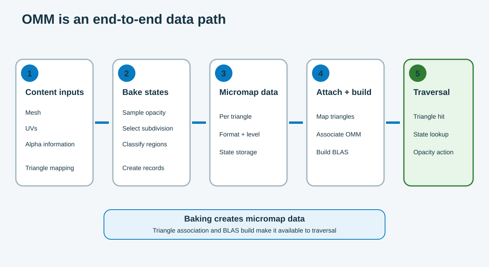

OMM uses one data path from content authoring to runtime traversal. The baker creates states. The engine links them to triangles and builds runtime geometry.

The figure shows five stages. Each stage passes data to the next stage. A completed bake is only the middle of the path.

## 1. Prepare the source data

The baker needs these inputs:

- source mesh and triangle order;
- UV coordinates;
- alpha texture or material opacity data;
- alpha cutoff and texture sampling settings;
- subdivision level and OMM format.

Keep these inputs on the same asset version. A changed mesh, UV layout, or alpha texture can make older OMM data invalid.

For animated or deformed content, define when you reuse or rebuild the data. Also define which LODs use OMM.

## 2. Bake the opacity states

The baker reads the alpha data in each source triangle. It creates the microtriangle grid and assigns one state to each region.

The output contains more than a debug image. It includes:

- packed opacity states;
- one subdivision level and format for each OMM triangle;
- a link from source triangles to OMM records;
- sizes and counts that the engine uses for the GPU build.

Keep the triangle order stable after the bake. If a mesh tool reorders triangles, regenerate the triangle links.

## 3. Build the micromap resource

At load time, the engine copies the baked data to GPU buffers. It queries the required sizes and allocates result and scratch storage.

The engine then builds the micromap. In the Vulkan KHR path, Vulkan stores the micromap in a `VkAccelerationStructureKHR` object.

The engine also adds the required synchronization. It keeps the final micromap alive while the BLAS and traversal use it.

## 4. Link OMM to source triangles

The engine links each original triangle to one OMM record. This link tells traversal which data belongs to a triangle hit.

A mesh section can use several link types:

- a link to complete microtriangle data;
- a fully opaque special state;
- a fully transparent special state;
- an unknown special state;
- the standard shader path for selected geometry.

Treat these as separate milestones:

1. The asset contains baked OMM data.
2. The GPU contains a built micromap.
3. Runtime geometry links triangles to that micromap.

## 5. Build the BLAS

The engine adds the triangle links to the BLAS geometry description. Scene instances can then reference OMM-enabled geometry through the TLAS.

The runtime path also checks:

- device features and limits;
- ray pipeline or ray query settings;
- instance controls;
- resource lifetime and rebuild rules.

When an editor reports a successful bake, verify the BLAS as well. Use a debug or capture tool to confirm the triangle links.

## 6. Read OMM during traversal

At runtime, the ray follows this order:

1. Traversal searches the TLAS and BLAS.
2. The ray intersects an original triangle.
3. The hit position selects one microtriangle.
4. Hardware reads the linked OMM state.
5. Opaque accepts the region.
6. Transparent continues traversal.
7. Unknown keeps the shader path.

The ray reaches geometry before it reads OMM. The colored cells in the figure only show the data linked to that geometry.

## Find the stage that causes a problem

Use the symptom to select your first check.

| Symptom | Check first |
| --- | --- |
| Missing leaf edges or false shadows | Alpha source, cutoff, UVs, and baked states |
| The asset contains OMM but the BLAS does not | Triangle links and BLAS build input |
| The micromap builds but traversal does not use it | Device, driver, pipeline, and runtime settings |
| Most regions are unknown | Subdivision, format, and alpha sampling |
| An LOD change creates artifacts | Per-LOD data, links, and rebuild rules |

This staged view separates content errors from runtime integration errors. The next module shows how Arm Mali G2 reads the final states.
