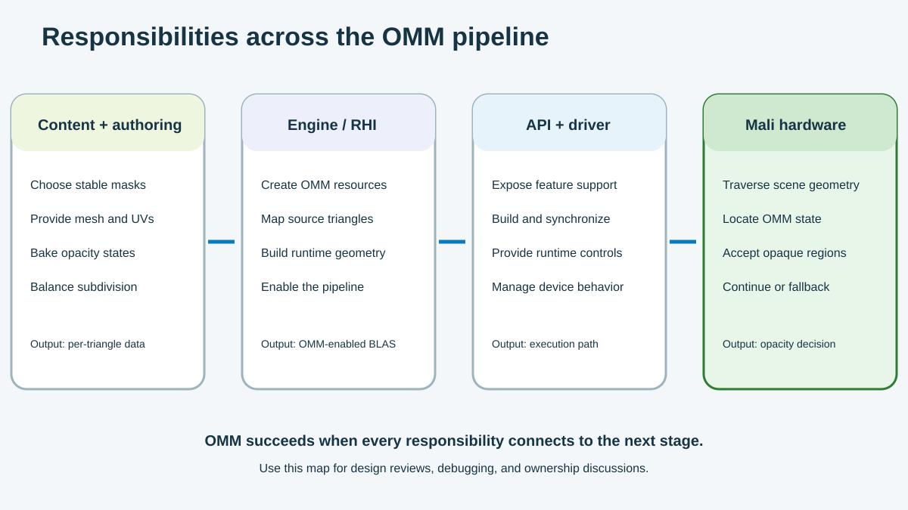

## Make a decision you can validate

You now have all the pieces needed to evaluate OMM, but they only become useful when you connect them in one decision. A suitable asset still needs a sensible bake strategy, a supported runtime path, and a fallback that preserves the original image.

The following exercise asks you to make that decision for a sample leaf asset. You don't need OMM-capable hardware because the exercise provides both bake results and a saved device capability report.

The responsibility map shows how content, baking, engine integration, and the driver contribute to the final result. Use it to identify where each piece of evidence comes from and who should investigate a failure.

## Review the sample asset

Consider a team that wants to use OMM for a static ginkgo leaf. The asset is a two-triangle quad with an alpha mask, and it appears in ray-traced shadows and reflections. Its mesh, UV coordinates, alpha mask, cutoff, and filtering remain stable for each level of detail (LOD), so it passes the initial suitability check.

The team tests two bake strategies. The results are illustrative, and the raw payload sizes don't include record metadata, alignment, or implementation-specific storage.

| Evidence | 4-state candidate | 2-state candidate |
| --- | --- | --- |
| Subdivision level | 3 | 5 |
| Microtriangles per original triangle | 64 | 1,024 |
| Raw state payload per original triangle | 16 bytes | 128 bytes |
| Resolved regions | 82% | 100% |
| Unknown regions | 18%, concentrated along the edge and stem | None |
| Reference-image comparison | Matches | Matches |
| Runtime behavior | Edge candidates retain shader-side evaluation | Every OMM candidate resolves during traversal |

The target profile sets a budget of 32 bytes of raw OMM state data for each original triangle. Profiling also shows that shader-side evaluation along the leaf edge is measurable, but it doesn't dominate frame time. Your decision therefore needs to balance storage against the benefit of resolving every region in hardware.

Before choosing a candidate, also check that the target device can use it. The saved capability report contains these illustrative values:

| Capability | Value |
| --- | --- |
| `VK_KHR_opacity_micromap` | Available |
| `micromap` | `VK_TRUE` |
| `maxOpacity2StateSubdivisionLevel` | 5 |
| `maxOpacity4StateSubdivisionLevel` | 4 |
| Required ray-query execution mode | Enabled |

## Record your decision

Use the evidence to complete the decision record. There can be more than one technically valid approach, but your choice should respect the data budget and explain how you will preserve image quality.

| Decision | Your answer |
| --- | --- |
| Should this asset use OMM? | Yes or no, with a reason |
| Format and subdivision | Choose one candidate |
| Fallback | Define the behavior when OMM is unavailable |
| Image validation | State what you will compare |
| Runtime validation | State what proves the OMM path executed |
| Rebuild rule | State which asset changes invalidate the bake |

### Review the suggested adoption plan

For the stated constraints, use the level-3, 4-state candidate. It stays within the 32-byte raw payload budget, matches the reference image, and resolves most regions during traversal. It leaves the difficult leaf edge and thin stem as unknown, where shader-side evaluation can preserve their detail.

| Decision | Suggested record |
| --- | --- |
| Use OMM | Yes; the mask is stable, the asset receives rays, and most regions resolve |
| Format and subdivision | 4-state at level 3 |
| Fallback | Build the original alpha-tested BLAS without OMM and keep the same cutoff, filtering, and alpha source |
| Image validation | Compare OMM-on, OMM-off, and reference images across shadows, reflections, LODs, and camera distances |
| Runtime validation | Record device support, successful micromap and BLAS builds, triangle links, state ratios, and active pipeline or shader controls |
| Rebuild rule | Rebuild after changes to triangle order, UVs, alpha data, cutoff, filtering, or LOD source data |

The device also supports the level-5, 2-state candidate, and that option removes all unknown regions. However, its 128-byte raw payload exceeds the asset budget. Reconsider it only if the resource budget changes and profiling shows enough benefit from removing the remaining shader-side work.

## Diagnose a failed validation

Validation can fail even when the bake itself succeeds. Start with the symptom you can observe, then work backward through the owner and data most likely to explain it:

| Observation | Start with | Inspect |
| --- | --- | --- |
| The leaf loses edge detail | Content and baker | Cutoff, UVs, subdivision, filtering, and states |
| The OMM build fails | Engine and driver | Features, sizes, buffers, and synchronization |
| The BLAS has no OMM links | Engine | Triangle mapping and BLAS input |
| Mali G2-Ultra NX does not enable OMM | Engine and driver | Extension, feature, limits, and pipeline settings |
| Unknown covers too much area | Content and baker | Texture detail, format, subdivision, and filtering |
| OMM and reference images differ | All owners | Asset version, links, states, and runtime controls |

## What you've accomplished

You started with a familiar rendering problem: rays repeatedly testing transparent parts of alpha-masked geometry. From there, you qualified an asset, classified its opacity regions, and chose a format and subdivision level. You then connected that data to the Mali G2-Ultra NX traversal path and kept the original alpha-tested path as a fallback.

Your adoption record gives the team something concrete to review. It captures not only the chosen settings, but also the image and runtime evidence needed to check the decision again after an asset, engine, or driver change.
