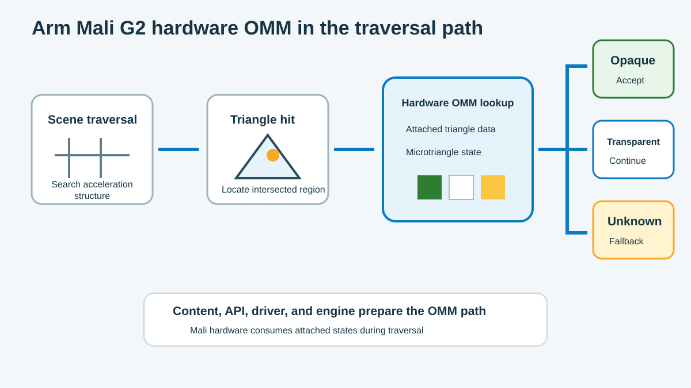

Arm Mali G2 supports OMM in the ray tracing path. Traversal can read microtriangle states that the engine links to triangle geometry.

The figure shows the runtime order. The ray traverses the scene, hits a triangle, reads OMM, and follows one of three paths.

## Prepare data for Mali hardware

Software prepares the data before traversal starts. The runtime path includes:

- original triangle geometry;
- a built opacity micromap;
- links from triangles to OMM records;
- subdivision levels and formats;
- enabled pipeline, shader, and instance settings.

Mali hardware reads one compact state for the hit region. It does not need the complete material graph for a resolved opaque or transparent state.

## Follow the hardware decision

The acceleration structure first removes geometry that the ray cannot reach. Traversal then finds a possible triangle hit.

The hit position selects one microtriangle in the linked OMM data.

| OMM state | Traversal action | Result |
| --- | --- | --- |
| Fully opaque | Accept the region as opaque | Continue with opaque-hit handling |
| Fully transparent | Ignore the region | Search behind the triangle |
| Unknown-transparent | Keep the shader path | Start with a transparent default |
| Unknown-opaque | Keep the shader path | Start with an opaque default |

The `2-state` format uses the first two states. The `4-state` format also uses both unknown states.

On a Mali device that exposes OMM and the required format and subdivision limits, either content strategy can use hardware traversal. Select the strategy per asset instead of treating one format as the Mali default.

## Keep more opacity work in traversal

Without OMM, masked candidate hits often run shader code that samples the alpha texture. This work can include material setup, texture access, and control flow.

OMM gives hardware a compact answer for each resolved region. More resolved hits mean fewer candidates reach the shader path.

When you estimate the value of OMM, check these workload properties:

- How often do rays hit masked geometry?
- Do the main masked assets use OMM?
- What percentage of hit regions are opaque or transparent?
- Does unknown data stay close to alpha edges?
- How much memory and build work does the OMM use?
- How much of the frame still comes from other GPU work?

These properties explain why results vary by scene and camera view.

## Connect Vulkan to Mali hardware

`VK_KHR_opacity_micromap` defines the interface between the engine and driver. It covers:

- feature and property queries;
- OMM formats and build inputs;
- links between OMM and triangle geometry;
- controls for traversal.

On a Mali system, the driver connects these Vulkan operations to the hardware OMM path.

An engine or RHI performs five main tasks:

1. Query OMM features and limits.
2. Create and build the micromap.
3. Link OMM records during the BLAS build.
4. Enable OMM for ray pipelines or ray queries.
5. Manage resources, synchronization, and shader fallback.

This interface lets you use the same Vulkan behavior while the Mali driver handles device execution.

## Use OMM with ray pipelines and ray queries

Ray pipelines and ray queries both traverse acceleration structures. Both can read OMM data linked to triangle geometry.

They use different enablement controls. Ray pipelines use pipeline settings. A ray query shader uses the `OpacityMicromapKHR` SPIR-V execution mode. In GLSL, `layout(constant_id = N) gl_EnableOpacityMicromapExt;` exposes this mode through a specialization constant.

> **Ray query correctness requirement**
>
> Every shader that executes a ray query against an acceleration structure that can contain OMM data must declare `OpacityMicromapKHR`, and its value must resolve to `true`. Traversing such an acceleration structure without enabling this execution mode is undefined behavior. The implementation does not automatically fall back to shader-side opacity evaluation.

Gate the ray query path with both device support and shader configuration. A shader with the execution mode omitted or specialized to `false` must not traverse an acceleration structure that contains OMM data. See [Inside the Traversal: How the GPU Uses Your Micromap](https://docs.vulkan.org/tutorial/latest/Building_a_Simple_Engine/Courses/Opacity_Micromaps/04_hardware_traversal_with_omm.html) for the Vulkan requirement.

The responsibility handoff is simple. The baker creates states, the engine links them, the driver enables the path, and Mali hardware reads them.

The next module shows every layer that supports this handoff.
