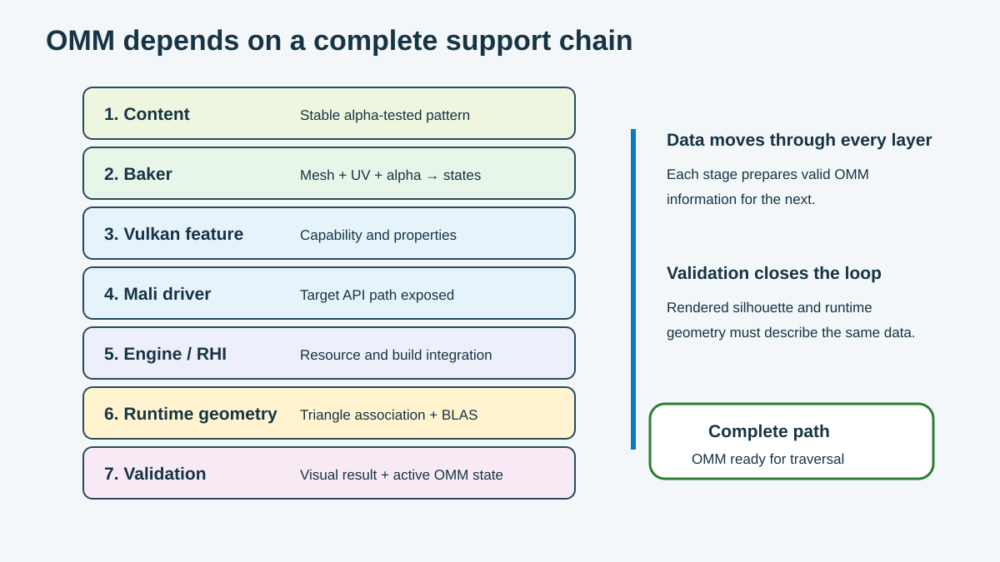

OMM needs support from content, tools, the API, the driver, the engine, and hardware. Each layer passes valid data to the next layer.

Use the figure to find the source of a problem. Start with content for image errors. Start with runtime geometry for missing OMM links.

## Check the content

OMM data matches one mesh, UV layout, alpha source, and cutoff value. Record these inputs for every asset.

Check the following items:

- Does the asset take part in ray tracing?
- Does its opacity pattern stay stable?
- Does each mesh LOD use the correct UV layout?
- Does the texture contain enough detail for the selected subdivision?
- How does animation or deformation change the asset?
- Do the baker and material use the same cutoff and filtering?

Use different settings for different asset types. A fence, a leaf, and a hair card do not need the same subdivision level.

## Query Vulkan support

`VK_KHR_opacity_micromap` defines the Vulkan OMM path. Query the `micromap` feature before you create OMM resources.

Also query these limits:

- maximum `2-state` subdivision level;
- maximum `4-state` subdivision level;
- lossy `4-state` subdivision limit;
- maximum number of OMM triangles.

Store these values in the device capability data. Your engine can use them for asset loading, quality settings, and pipeline creation.

Extension support, driver support, and engine enablement are separate checks. Confirm all three.

## Define the unsupported fallback

Treat OMM support as a runtime capability branch. Do not assume that every device or rendering path can use it.

If the extension is absent, the `micromap` feature is `VK_FALSE`, or the required driver or engine path is unavailable:

1. Do not create or build OMM resources.
2. Do not attach OMM data when building the BLAS.
3. Build the BLAS through the original alpha-tested geometry path.
4. Keep shader-side opacity evaluation active. A ray pipeline uses its any-hit path; a ray query uses its existing candidate-handling path.
5. Use the same alpha source, filtering, cutoff, and material logic so the rendered result remains equivalent.
6. Expect performance to return to the pre-OMM baseline instead of changing the image or failing the render path.

This device-level fallback differs from an `Unknown` microtriangle. Unsupported hardware uses no OMM data. An `Unknown` state occurs only on the supported OMM path and sends that individual candidate to shader-side evaluation. See [Seeing the Difference and Knowing When to Use It](https://docs.vulkan.org/tutorial/latest/Building_a_Simple_Engine/Courses/Opacity_Micromaps/06_results_guidance_and_tradeoffs.html) for the Vulkan fallback guidance.

## Connect the driver and engine

The Mali driver exposes Vulkan OMM features. The engine or RHI creates the resources and links them to geometry.

The engine handles these core tasks:

- query OMM sizes;
- allocate result and scratch buffers;
- build the micromap;
- link source triangles to OMM records;
- build the BLAS;
- enable ray pipeline or ray query controls;
- keep resources alive for traversal.

A baked asset needs this runtime path before hardware can read its states.

## Choose a format and subdivision strategy

Format and subdivision work together. Choose them from the content and the amount of shader-side opacity evaluation that the frame can afford.

Two common game-content strategies are useful starting points:

| Strategy | OMM setup | Runtime behavior | Good fit | Main tradeoff |
| --- | --- | --- | --- | --- |
| Shader-assisted edge detail | `4-state` with low or moderate subdivision | Opaque and transparent regions stay in hardware. Unknown edges use any-hit shading or ray query candidate evaluation. | Complex masks that need fine material evaluation at their edges | Some shader-side opacity cost remains |
| Hardware-resolved binary detail | `2-state` with higher subdivision, approaching alpha-mask texel detail at the target LOD | Every microtriangle is opaque or transparent. OMM candidates do not enter opacity any-hit shading or equivalent ray query evaluation. | Stable binary masks where avoiding shader-side opacity work is the priority | More microtriangles, build work, and resource use |

The `4-state` strategy can limit OMM data by accepting controlled unknown coverage. The `2-state` strategy spends more OMM detail to remove unknown states. It can fully avoid shader-side opacity evaluation for that OMM geometry, but only if the binary bake still meets the image-quality target.

Do not map subdivision directly to screen pixels. Compare triangle size with alpha-mask texel detail at the intended LOD and camera range. Each additional subdivision level multiplies the microtriangle count by four. Although `2-state` stores one bit per microtriangle, a sufficiently high level can still cost more than a lower-level `4-state` OMM.

Do not confuse compact `2-state` encoding with Vulkan lossy micromap builds. Lossy build support applies to `4-state`, is bounded by `maxOpacityLossy4StateSubdivisionLevel`, and is a separate quality and resource lever. Query the device limits before selecting it. See the [Vulkan micromap data format](https://docs.vulkan.org/spec/latest/chapters/VK_KHR_opacity_micromap/micromaps.html) and [VK_KHR_opacity_micromap proposal](https://docs.vulkan.org/features/latest/features/proposals/VK_KHR_opacity_micromap.html).

## Review unknown coverage

Unknown keeps the shader path available for a difficult region. It protects image correctness around alpha edges.

For a typical cutout, unknown data forms a narrow edge. Large unknown areas leave more work for the shader path.

If unknown covers most of the OMM, check:

- subdivision level;
- texture detail and UV scale;
- alpha filtering;
- cutoff value;
- material logic available to the baker.

## Account for resource cost

OMM adds data and build work. Track each cost separately.

| Cost | Source | Control |
| --- | --- | --- |
| Asset storage | Baked triangle data | Format, subdivision, build mode, and selected asset coverage |
| GPU memory | Built OMM resources | Streaming, LOD rules, and resource sharing |
| Build time | OMM and BLAS builds | Cached data and batched builds |
| Scratch memory | Temporary build storage | Pools and buffer reuse |
| Update work | Dynamic geometry or opacity | Rebuild rules and shader fallback |

Static foliage can reuse OMM data for a long time. Dynamic content needs a clear update plan.

## Validate the image and runtime path

Check the rendered result first:

- leaf edges, stems, and cutout holes;
- shadows, reflections, and visibility results;
- mips, LODs, camera distance, and animation;
- OMM and forced unsupported fallback rendering against the same reference image.

Then check the runtime data:

- device features and limits, including a forced OMM-off test;
- successful OMM build and BLAS triangle links on the supported path;
- no OMM resources or links, with shader-side opacity evaluation active on the fallback path;
- selected strategy, format, subdivision values, and unknown ratio;
- active pipeline, shader, and instance controls;
- `OpacityMicromapKHR` resolves to `true` for every ray query shader that can access OMM data;
- OMM state in a debug or capture tool.

This support chain turns OMM into a feature you can inspect and maintain. The final module maps each stage to the team that owns it.
