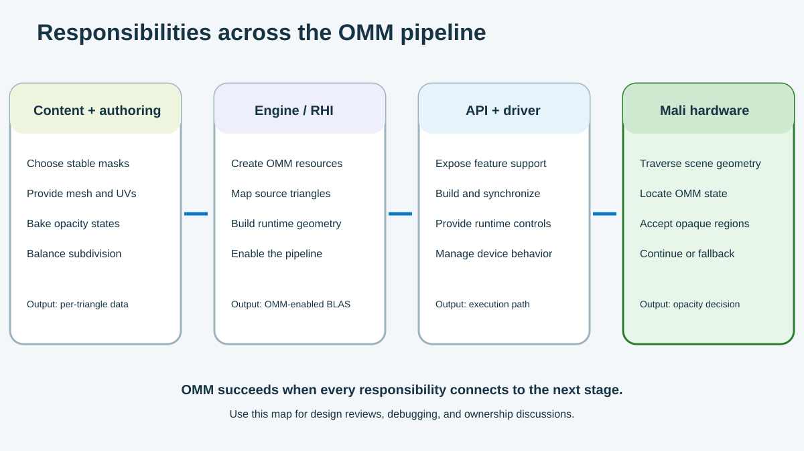

OMM crosses four areas: content, the engine, the API and driver, and Mali hardware. Each area owns a clear part of the data path.

Use the figure during design reviews and debugging. It helps you find the owner of each input and output.

## Prepare content and OMM data

The content team selects masked assets and defines their OMM settings.

For each asset, record:

- mesh and UV version;
- alpha texture and cutoff;
- LOD settings;
- subdivision level;
- `2-state` or `4-state` format;
- animation and rebuild rules.

Link every bake to a source asset version. When the mesh, UVs, or mask changes, regenerate the OMM data.

## Build runtime geometry

The engine converts baked data into GPU resources. It keeps the triangle links and includes OMM in the BLAS build.

The engine also:

- selects settings that fit the device limits;
- enables OMM for selected LODs and ray paths;
- manages OMM, scratch, and BLAS resources;
- rebuilds data after streaming or scene changes;
- exposes debug controls and capture labels;
- reports build and support errors.

These controls make OMM visible to developers. You can tell whether the problem starts in content or runtime integration.

## Connect Vulkan and the driver

Vulkan defines the OMM interface between the engine and driver.

The engine supplies features, resource descriptions, build inputs, synchronization, and triangle links. The driver validates the inputs and creates the device data.

The driver also reports supported formats and subdivision limits. Your engine uses these values to select compatible asset data.

If one package supports several devices, prepare suitable quality settings for each capability level.

## Read states on Mali hardware

Arm Mali G2 reads the linked OMM during acceleration-structure traversal.

After a ray hits a triangle, hardware selects the matching microtriangle state. It accepts opaque, continues through transparent, or keeps the shader path for unknown.

Hardware receives compact states and triangle links. It relies on the earlier stages to prepare correct data.

## Follow one ginkgo leaf from asset to ray hit

The following example connects every stage:

1. An artist creates a leaf Quad with two triangles.
2. An alpha mask defines the fan-shaped leaf and narrow stem.
3. The asset settings select a cutoff, `4-state` format, and subdivision level.
4. The baker reads the triangles, UVs, and alpha texture.
5. It marks the leaf interior as opaque and the outer area as transparent.
6. It marks edge regions as unknown.
7. The engine builds the OMM resource.
8. It links both source triangles to their OMM records.
9. The BLAS build includes those links.
10. A scene instance references the BLAS through the TLAS.
11. A ray hits one triangle and selects a microtriangle.
12. Mali hardware reads the state and selects the next action.

This sequence shows the boundary between software and hardware. Software prepares the opacity data. Hardware reads it during traversal.

This example uses the shader-assisted strategy: `4-state` keeps the OMM at a moderate subdivision level and sends only unknown edge regions to shader-side opacity evaluation.

### Compare the 2-state alternative

The same leaf can use a hardware-resolved binary strategy:

- keep the same alpha source, cutoff, UVs, and target LOD;
- select a higher subdivision level that approaches the required alpha-mask texel detail;
- bake every microtriangle as opaque or transparent with `2-state`;
- compare the silhouette and shadow against the `4-state` reference;
- measure OMM resource size, build time, and shader-side opacity work.

The `2-state` path has no unknown regions, so Mali hardware resolves every OMM candidate for that geometry without opacity any-hit shading or equivalent ray query evaluation. Adopt it only when the binary result preserves the required image quality and its additional OMM detail fits the resource budget.

## Map problems to owners

| Observation | Start with | Inspect |
| --- | --- | --- |
| The leaf loses edge detail | Content and baker | Cutoff, UVs, subdivision, and states |
| The OMM build fails | Engine, RHI, and driver | Features, sizes, buffers, and synchronization |
| The BLAS has no OMM links | Engine and RHI | Triangle mapping and BLAS input |
| One device does not enable OMM | Engine and driver | Extension, features, limits, and pipeline settings |
| Unknown covers too much area | Content and baker | Texture detail, format, subdivision, and filtering |
| OMM and reference images differ | All owners | Asset version, links, states, and runtime controls |

## Keep the feature maintainable

Store useful OMM data in asset reports. Include triangle coverage, subdivision levels, state ratios, resource size, and the source version.

Use these reports to find unusual assets. They also help you estimate memory and build work.

Start with stable foliage or cutout structures. Build a visual baseline and resource settings. Then expand to more complex content.

OMM acts as a contract. Software prepares per-triangle opacity states, and Arm Mali G2 consumes them during traversal.

Keep the asset version, triangle links, and state meanings consistent. This makes OMM easier to validate, debug, and extend.
