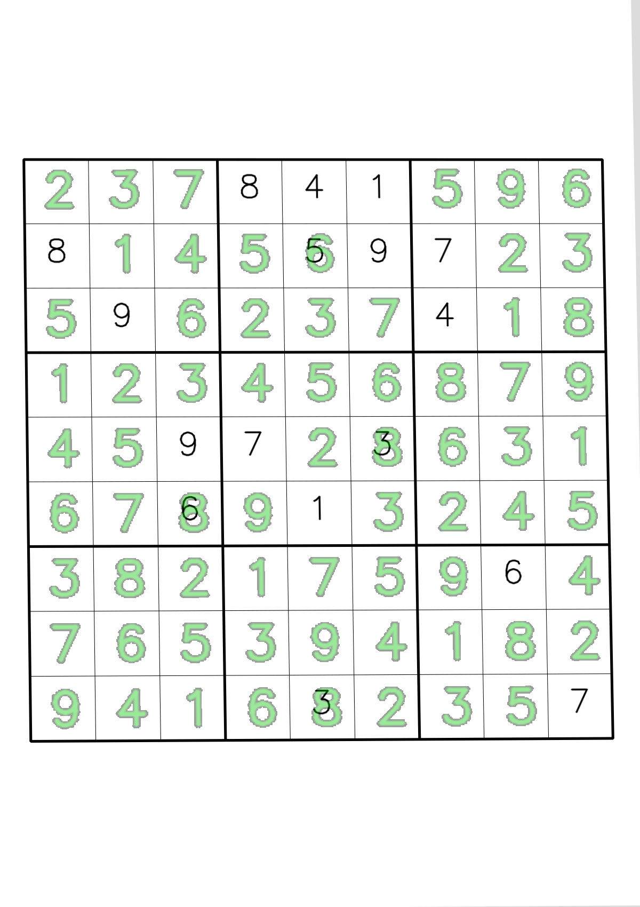

---
# User change
title: "Sudoku Processor. From Image to Solution"
weight: 7
layout: "learningpathall"

---

## Objective ##

In this section, we integrate all previous components into a complete Sudoku processing pipeline. Starting from a full Sudoku image, we detect and rectify the grid, split it into individual cells, recognize digits using the ONNX model, and finally solve the puzzle using a deterministic solver. By the end of this step, you will have an end-to-end system that takes a photograph of a Sudoku puzzle and produces a solved board, along with visual outputs for debugging and validation.

## Context
So far, we have:
1. Generated a synthetic, well-labeled Sudoku digit dataset,
2. Trained a lightweight CNN (DigitNet) to recognize digits and blanks,
3. Exported the model to ONNX with dynamic batch support,
4. Validated inference correctness and analyzed errors using confusion matrices.

At this point, the digit recognizer is reliable in isolation. The remaining challenge is connecting vision with reasoning: extracting the Sudoku grid from an image, mapping each cell to a digit, and applying a solver. This section bridges that gap.

## Overview of the pipeline
To implement the Sudoku processor, create the file (sudoku_processor.py) and paste the implementation below:

```python
import cv2 as cv
import numpy as np
import onnxruntime as ort

class SudokuProcessor:
    def __init__(
        self,
        onnx_path: str,
        input_size: int = 28,
        warp_size: int = 450,
        blank_class: int = 0,
        blank_conf_threshold: float = 0.65,
        providers=("CPUExecutionProvider",),
    ):
        """
        onnx_path: path to sudoku_digitnet.onnx
        input_size: model input spatial size (28)
        warp_size: size of rectified square board (e.g., 450 => each cell ~50px)
        blank_class: class index used for blanks (0)
        blank_conf_threshold: if model confidence < threshold, treat as blank (helps noisy cells)
        """
        self.onnx_path = onnx_path
        self.input_size = input_size
        self.warp_size = warp_size
        self.blank_class = blank_class
        self.blank_conf_threshold = blank_conf_threshold

        self.sess = ort.InferenceSession(onnx_path, providers=list(providers))
        self.input_name = self.sess.get_inputs()[0].name  # typically "input"
        self.output_name = self.sess.get_outputs()[0].name  # typically "logits"
    
    def process_image(self, bgr: np.ndarray, overlay: bool = True):
        """
        Returns:
          board (9x9 ints with 0 for blank),
          solved_board (9x9 ints, or None if unsolved),
          debug dict (warped, contours, etc.),
          overlay_bgr (optional solution overlay)
        """
        warped, H, quad = self.detect_and_warp_board(bgr)
        cells = self.split_cells(warped)
        board, conf = self.recognize_board(cells)

        solved = [row[:] for row in board]
        ok = solve_sudoku(solved)

        overlay_img = None
        if overlay and ok:
            overlay_img = self.overlay_solution(bgr, H, board, solved)

        debug = {
            "warped": warped,
            "homography": H,
            "quad": quad,
            "confidence": conf,
        }
        return board, (solved if ok else None), debug, overlay_img

    # -----------------------------
    # Board detection / rectification
    # -----------------------------
    def detect_and_warp_board(self, bgr: np.ndarray):
        """
        Finds the largest Sudoku-like quadrilateral and warps it to a square.
        Returns warped_board, homography, quad_points.
        """
        gray = cv.cvtColor(bgr, cv.COLOR_BGR2GRAY)
        blur = cv.GaussianBlur(gray, (5, 5), 0)

        # Strong binary image helps contour finding (works well for printed grids)
        thr = cv.adaptiveThreshold(
            blur, 255, cv.ADAPTIVE_THRESH_GAUSSIAN_C, cv.THRESH_BINARY_INV, 31, 7
        )

        # Remove small noise, connect lines a bit
        kernel = cv.getStructuringElement(cv.MORPH_RECT, (3, 3))
        thr = cv.morphologyEx(thr, cv.MORPH_CLOSE, kernel, iterations=2)

        contours, _ = cv.findContours(thr, cv.RETR_EXTERNAL, cv.CHAIN_APPROX_SIMPLE)
        if not contours:
            raise RuntimeError("No contours found. Try a clearer image or different thresholding.")

        # Pick the largest contour that approximates to 4 points
        contours = sorted(contours, key=cv.contourArea, reverse=True)
        quad = None
        for c in contours[:20]:
            peri = cv.arcLength(c, True)
            approx = cv.approxPolyDP(c, 0.02 * peri, True)
            if len(approx) == 4:
                quad = approx.reshape(4, 2).astype(np.float32)
                break

        if quad is None:
            raise RuntimeError("Could not find a 4-corner Sudoku grid. Try a more fronto-parallel image.")

        quad = order_quad_points(quad)

        dst = np.array(
            [[0, 0], [self.warp_size - 1, 0], [self.warp_size - 1, self.warp_size - 1], [0, self.warp_size - 1]],
            dtype=np.float32,
        )
        H = cv.getPerspectiveTransform(quad, dst)
        warped = cv.warpPerspective(bgr, H, (self.warp_size, self.warp_size))

        return warped, H, quad

    # -----------------------------
    # Cell splitting / preprocessing
    # -----------------------------
    def split_cells(self, warped_bgr: np.ndarray):
        """
        Splits a rectified square board into 81 cell images.
        Returns list of (r, c, cell_bgr).
        """
        cells = []
        step = self.warp_size // 9
        for r in range(9):
            for c in range(9):
                y0, y1 = r * step, (r + 1) * step
                x0, x1 = c * step, (c + 1) * step
                cell = warped_bgr[y0:y1, x0:x1].copy()
                cells.append((r, c, cell))
        return cells

    def preprocess_cell(self, cell_bgr: np.ndarray):
        """
        Produces a 28x28 float32 tensor in the same normalization as training:
          grayscale -> [0,1] -> normalize to [-1,1] via (x-0.5)/0.5
        Also tries to suppress grid lines / borders by cropping margins.
        """
        g = cv.cvtColor(cell_bgr, cv.COLOR_BGR2GRAY)

        # Crop a margin to remove grid lines/borders
        h, w = g.shape
        m = int(0.12 * min(h, w))  # ~12% margin
        g = g[m:h - m, m:w - m]

        # Binarize & clean (helps isolate printed digits)
        g_blur = cv.GaussianBlur(g, (3, 3), 0)
        bw = cv.adaptiveThreshold(g_blur, 255, cv.ADAPTIVE_THRESH_GAUSSIAN_C, cv.THRESH_BINARY_INV, 21, 5)

        # Remove small specks
        bw = cv.morphologyEx(bw, cv.MORPH_OPEN, np.ones((2, 2), np.uint8), iterations=1)

        # If almost empty => likely blank
        if (bw > 0).sum() < 15:
            # Return a near-empty input; classifier should produce blank
            resized = cv.resize(g, (self.input_size, self.input_size), interpolation=cv.INTER_AREA)
        else:
            # Use bw mask to focus on digit; keep as grayscale for the model
            resized = cv.resize(g, (self.input_size, self.input_size), interpolation=cv.INTER_AREA)

        x = resized.astype(np.float32) / 255.0
        x = (x - 0.5) / 0.5  # [-1,1]
        x = x[None, None, :, :]  # [1,1,H,W]
        return x

    # -----------------------------
    # Inference
    # -----------------------------
    def recognize_board(self, cells):
        """
        Runs batched ONNX inference on 81 cells and returns:
          board[9][9] with 0 for blank
          conf[9][9] with max softmax probability
        """
        xs = []
        coords = []
        for r, c, cell in cells:
            coords.append((r, c))
            xs.append(self.preprocess_cell(cell))

        X = np.concatenate(xs, axis=0).astype(np.float32)  # [81,1,28,28]
        logits = self.sess.run([self.output_name], {self.input_name: X})[0]  # [81,10]
        probs = softmax(logits, axis=1)
        pred = probs.argmax(axis=1)
        conf = probs.max(axis=1)

        board = [[0 for _ in range(9)] for _ in range(9)]
        conf_grid = [[0.0 for _ in range(9)] for _ in range(9)]
        for i, (r, c) in enumerate(coords):
            p = int(pred[i])
            cf = float(conf[i])

            # Optional safety: low-confidence => blank
            if cf < self.blank_conf_threshold:
                p = self.blank_class

            board[r][c] = p
            conf_grid[r][c] = cf

        return board, conf_grid

    # -----------------------------
    # Overlay
    # -----------------------------
    def overlay_solution(self, original_bgr, H, board, solved):
        """
        Overlays ONLY the filled-in digits (where original board has 0).
        """
        invH = np.linalg.inv(H)
        overlay = original_bgr.copy()

        step = self.warp_size // 9
        # Create a transparent layer in warped space then map back
        layer = np.zeros((self.warp_size, self.warp_size, 3), dtype=np.uint8)

        for r in range(9):
            for c in range(9):
                if board[r][c] != 0:
                    continue
                d = solved[r][c]
                # text placement in warped coordinates
                x = int(c * step + step * 0.32)
                y = int(r * step + step * 0.72)
                cv.putText(layer, str(d), (x, y), cv.FONT_HERSHEY_SIMPLEX, 1.2, (0, 200, 0), 2, cv.LINE_AA)

        # Warp overlay layer back to original image
        h0, w0 = original_bgr.shape[:2]
        back = cv.warpPerspective(layer, invH, (w0, h0))

        # Blend
        mask = (back.sum(axis=2) > 0).astype(np.uint8) * 255
        mask3 = cv.merge([mask, mask, mask])
        overlay = np.where(mask3 > 0, cv.addWeighted(overlay, 0.6, back, 0.4, 0), overlay)
        return overlay


# -----------------------------
# Solver (backtracking)
# -----------------------------
def solve_sudoku(board):
    pos = find_empty(board)
    if pos is None:
        return True
    r, c = pos
    for v in range(1, 10):
        if valid(board, r, c, v):
            board[r][c] = v
            if solve_sudoku(board):
                return True
            board[r][c] = 0
    return False


def find_empty(board):
    for r in range(9):
        for c in range(9):
            if board[r][c] == 0:
                return (r, c)
    return None


def valid(board, r, c, v):
    # row
    for j in range(9):
        if board[r][j] == v:
            return False
    # col
    for i in range(9):
        if board[i][c] == v:
            return False
    # box
    br, bc = 3 * (r // 3), 3 * (c // 3)
    for i in range(br, br + 3):
        for j in range(bc, bc + 3):
            if board[i][j] == v:
                return False
    return True


# -----------------------------
# Utilities
# -----------------------------
def order_quad_points(pts):
    """
    Orders 4 points into: top-left, top-right, bottom-right, bottom-left.
    """
    pts = np.array(pts, dtype=np.float32)
    s = pts.sum(axis=1)
    diff = np.diff(pts, axis=1).reshape(-1)

    tl = pts[np.argmin(s)]
    br = pts[np.argmax(s)]
    tr = pts[np.argmin(diff)]
    bl = pts[np.argmax(diff)]

    return np.array([tl, tr, br, bl], dtype=np.float32)


def softmax(x, axis=1):
    x = x - np.max(x, axis=axis, keepdims=True)
    e = np.exp(x)
    return e / (np.sum(e, axis=axis, keepdims=True) + 1e-12)
```

The Sudoku processor follows a sequence of steps:
1. Grid detection – find the outer Sudoku grid in the input image.
2. Perspective rectification – warp the grid to a square, top-down view.
3. Cell extraction – split the rectified grid into 81 cell images.
4. Digit recognition – run batched ONNX inference to classify each cell.
5. Board reconstruction – assemble a 9×9 numeric board.
6. Solving – apply a backtracking Sudoku solver.
7. Visualization – overlay the solution and render clean board images.

We encapsulate the entire pipeline in a reusable class called SudokuProcessor. This class loads the ONNX model once and exposes a single high-level method that processes an input image and returns both intermediate results and final outputs.

Conceptually, the processor:
* Accepts a BGR image,
* Returns the recognized board, the solved board (if solvable), and optional visual overlays.

This design keeps inference fast and makes the processor easy to integrate later into an Android application or embedded system.

## Grid detection and rectification
The first task is to locate the Sudoku grid in the image. We convert the image to grayscale, apply adaptive thresholding, and use contour detection to find large rectangular shapes. The largest contour that approximates a quadrilateral is assumed to be the Sudoku grid.

Once the four corners are identified, we compute a perspective transform and warp the grid into a square image. This rectified representation removes camera tilt and perspective distortion, allowing all subsequent steps to assume a fixed geometry.

We order the four corners consistently (top-left → top-right → bottom-right → bottom-left) before computing the perspective transform.

## Splitting the grid into cells
After rectification, the grid is divided evenly into a 9×9 array. Each cell is cropped based on its row and column index. At this stage, every cell corresponds to one Sudoku position and is ready for preprocessing and classification.

Each cell undergoes light preprocessing before inference:
* Conversion to grayscale,
* Cropping of a small margin to suppress grid lines,
* Adaptive thresholding and morphological cleanup to isolate printed digits,
* Resizing to the model’s input size (28×28),
* Normalization to match the training distribution.

We crop a margin to suppress grid lines, because grid strokes can dominate the digit pixels and cause systematic misclassification. Cells with very little foreground content are treated as blank candidates, reducing false digit detections in empty cells.

## Batched ONNX inference
All 81 cell tensors are stacked into a single batch and passed to ONNX Runtime in one call. Because the model was exported with a dynamic batch dimension, this batched inference is efficient and mirrors how the model will be used in production.

The output logits are converted to probabilities, and the most likely class is selected for each cell. Optionally, a confidence threshold can be applied so that low-confidence predictions are treated as blanks.

The result is a 9×9 board where:
* 0 represents a blank cell,
* 1–9 represent recognized digits.

## Solving the Sudoku
With the recognized board constructed, we apply a classic backtracking Sudoku solver. This solver deterministically fills empty cells while respecting Sudoku constraints (row, column, and 3×3 block rules).

If the solver succeeds, we obtain a complete solution. If it fails, the failure usually indicates one or more recognition errors, which can be diagnosed using the intermediate visual outputs.

## Visualization and outputs
The processor saves several artifacts to help debugging and demonstration:
- `artifacts/warped.png` – rectified top-down view of the Sudoku grid.
- `artifacts/overlay_solution.png` – solution digits overlaid onto the original image (if solved).
- (Optional) `artifacts/recognized_board.png`, `artifacts/solved_board.png`, `artifacts/boards_side_by_side.png` – clean board renderings if you enabled those helpers.

## Running the processor
A small driver script (05_RunSudokuProcessor.py) demonstrates how to use the SudokuProcessor:

```python
import os
import cv2 as cv

from sudoku_processor import SudokuProcessor

def print_board(board, title="Board"):
    print("\n" + title)
    for r in range(9):
        row = ""
        for c in range(9):
            v = board[r][c]
            row += (". " if v == 0 else f"{v} ")
            if c % 3 == 2 and c != 8:
                row += "| "
        print(row.strip())
        if r % 3 == 2 and r != 8:
            print("-" * 21)


def main():
    # Use any image path you like:
    # - a real photo 
    # - a synthetic grid, e.g. data/grids/val/000001_cam.png
    img_path = "data/grids/val/000001_cam.png"
    onnx_path = os.path.join("artifacts", "sudoku_digitnet.onnx")

    bgr = cv.imread(img_path)
    if bgr is None:
        raise RuntimeError(f"Could not read image: {img_path}")

    proc = SudokuProcessor(onnx_path=onnx_path, warp_size=450, blank_conf_threshold=0.65)

    board, solved, dbg, overlay = proc.process_image(bgr, overlay=True)

    print_board(board, "Recognized board")
    if solved is None:
        print("\nSolver failed (board might contain recognition errors).")
    else:
        print_board(solved, "Solved board")

    # Save debug outputs
    cv.imwrite("artifacts/warped.png", dbg["warped"])
    if overlay is not None:
        cv.imwrite("artifacts/overlay_solution.png", overlay)
        print("\nSaved: artifacts/overlay_solution.png")
    print("Saved: artifacts/warped.png")

if __name__ == "__main__":
    main()
```

You simply provide the path to a Sudoku image and the ONNX model, and the script saves all intermediate and final results to the artifacts/ directory.

Representational result is shown below:



## Summary
By completing this section, you have built a full vision-to-solution Sudoku system:
1. A trained and validated ONNX digit recognizer,
2. A robust OpenCV-based image processing pipeline,
3. A deterministic solver,
4. Clear visual diagnostics at every stage.

In the next step of the learning path, we will focus on optimization and deployment.