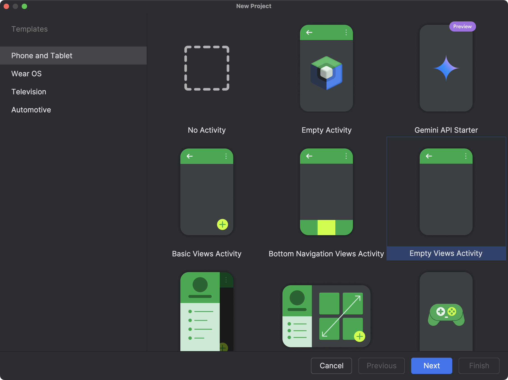
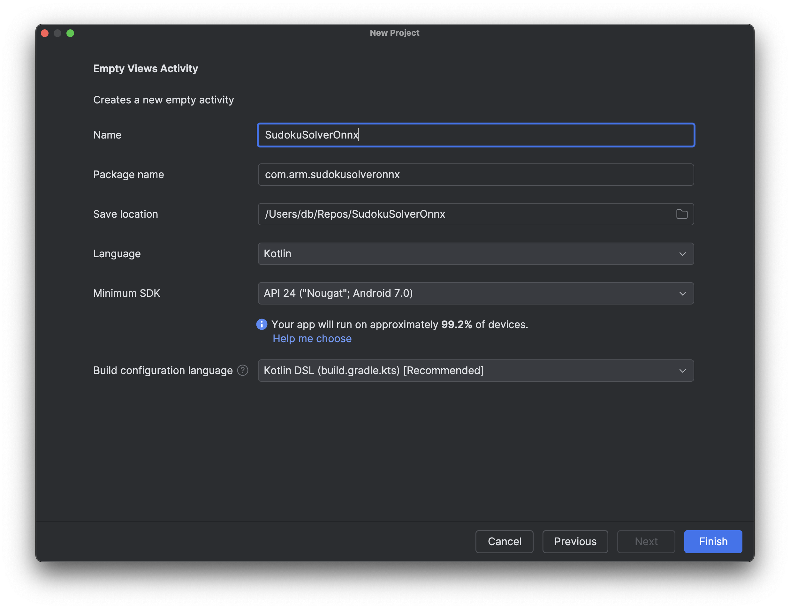
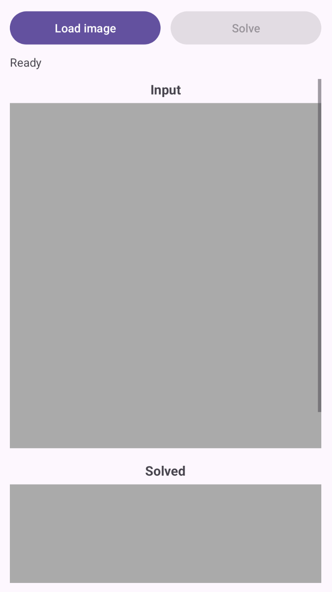
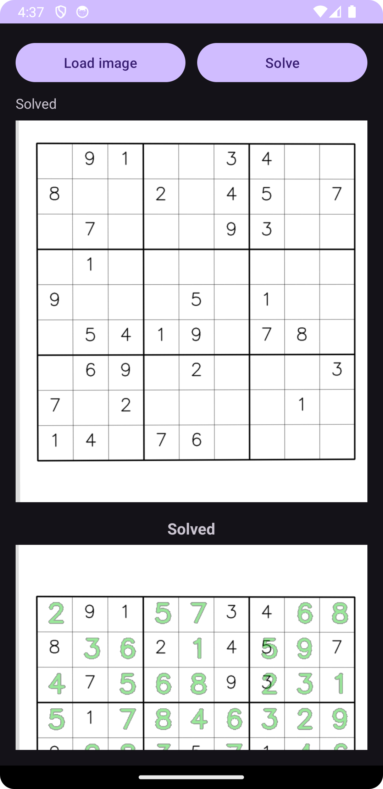

---
# User change
title: "Android Deployment. From Model to App"

weight: 9

layout: "learningpathall"
---

## Objective ##
In this section, we transition from a desktop prototype to a fully on-device Android application. The goal is to demonstrate how the optimized Sudoku pipeline—image preprocessing, ONNX inference, and deterministic solving—can be packaged and executed entirely on a mobile device, without relying on any cloud services.

Rather than starting with a live camera feed, we begin with a fixed input bitmap that was generated earlier in the learning path. This approach allows us to focus on correctness, performance, and integration details before introducing additional complexity such as camera permissions, real-time capture, and varying lighting conditions. By keeping the input controlled, we can verify that the Android implementation faithfully reproduces the behavior observed in Python.

Over the course of this section, we will:
1. Create a new Android project and add the required dependencies.
2. Bundle the trained ONNX model and a sample Sudoku image with the application.
3. Implement a minimal user interface that loads the image and triggers the solver.
4. Re-implement the Sudoku processing pipeline on Android, including preprocessing, batched ONNX inference, and solving.
5. Display the solved result as an image, confirming that the entire pipeline runs locally on the device.

By the end of this section, you will have a working Android app that takes a Sudoku image, runs neural network inference and solving on-device, and displays the solution. This completes the learning path by showing how a trained and optimized ONNX model can be deployed in a real mobile application, closing the loop from data generation and training to practical, end-user deployment.

## Project creation
We start by creating a new Android project using Android Studio. This project will host the Sudoku solver application and serve as the foundation for integrating ONNX Runtime and OpenCV.

1. Create a new project:
* Open Android Studio and click New Project.
* In the Templates screen, select Phone and Tablet, then choose Empty Views Activity.


This template creates a minimal Android application without additional UI components, which is ideal for a focused, step-by-step integration.

* Click Next to proceed to the project configuration screen.

2. Configure the project.  In the configuration screen, fill in the fields as follows:
* Name: SudokuSolverOnnx. This is the application name that will appear in Android Studio and on the device.
* Package name: com.arm.sudokusolveronnx. This package name clearly reflects the purpose of the app and its use of ONNX on Arm platforms.
* Save location. Choose a convenient directory on your system (for example, your repositories folder).
* Language: Kotlin. Kotlin is the recommended language for modern Android development and integrates cleanly with ONNX Runtime APIs.
* Minimum SDK: API 24 (Android 7.0 – Nougat). This provides wide device coverage while remaining compatible with ONNX Runtime and OpenCV.
* Build configuration language: Kotlin DSL (build.gradle.kts). We use the Kotlin DSL for Gradle, which is now the recommended option.



* After confirming these settings, click Finish. Android Studio will create the project and generate a basic MainActivity along with the necessary Gradle files.

## View
We now define the user interface of the Android application. The goal of this view is to remain intentionally simple while clearly exposing the end-to-end Sudoku workflow. The interface will consist of:
* A button row at the top that allows the user to load a Sudoku image and trigger the solver.
* A status text area used to display short messages (for example, whether an image has been loaded or the puzzle has been solved).
* An input image view that displays the selected Sudoku bitmap.
* An output image view that displays the solved result.

This layout is sufficient to validate that the ONNX model, preprocessing pipeline, and solver are all working correctly on Android before adding more advanced features such as camera input or animations.

To define the view, open the file res/layout/activity_main.xml and replace its contents with the following layout definition:
```xml
<?xml version="1.0" encoding="utf-8"?>
<androidx.constraintlayout.widget.ConstraintLayout
    xmlns:android="http://schemas.android.com/apk/res/android"
    xmlns:app="http://schemas.android.com/apk/res-auto"
    android:id="@+id/root"
    android:layout_width="match_parent"
    android:layout_height="match_parent"
    android:padding="16dp">

    <!-- Pinned header: buttons + status -->
    <LinearLayout
        android:id="@+id/header"
        android:layout_width="0dp"
        android:layout_height="wrap_content"
        android:orientation="vertical"
        app:layout_constraintTop_toTopOf="parent"
        app:layout_constraintStart_toStartOf="parent"
        app:layout_constraintEnd_toEndOf="parent">

        <!-- Buttons row -->
        <LinearLayout
            android:id="@+id/buttonRow"
            android:layout_width="match_parent"
            android:layout_height="wrap_content"
            android:orientation="horizontal"
            android:gravity="center_vertical"
            android:baselineAligned="false">

            <Button
                android:id="@+id/btnLoadRandom"
                android:layout_width="0dp"
                android:layout_height="wrap_content"
                android:layout_weight="1"
                android:text="Load image" />

            <Space
                android:layout_width="12dp"
                android:layout_height="0dp" />

            <Button
                android:id="@+id/btnSolve"
                android:layout_width="0dp"
                android:layout_height="wrap_content"
                android:layout_weight="1"
                android:text="Solve"
                android:enabled="false" />
        </LinearLayout>

        <!-- Status -->
        <TextView
            android:id="@+id/txtStatus"
            android:layout_width="match_parent"
            android:layout_height="wrap_content"
            android:text="Ready"
            android:textSize="14sp"
            android:paddingTop="8dp"
            android:paddingBottom="8dp" />

    </LinearLayout>

    <!-- Scrollable content (images) -->
    <ScrollView
        android:id="@+id/scrollContent"
        android:layout_width="0dp"
        android:layout_height="0dp"
        android:fillViewport="true"
        app:layout_constraintTop_toBottomOf="@id/header"
        app:layout_constraintBottom_toBottomOf="parent"
        app:layout_constraintStart_toStartOf="parent"
        app:layout_constraintEnd_toEndOf="parent">

        <LinearLayout
            android:id="@+id/contentRoot"
            android:layout_width="match_parent"
            android:layout_height="wrap_content"
            android:orientation="vertical">

            <!-- Input label -->
            <TextView
                android:id="@+id/txtInputLabel"
                android:layout_width="wrap_content"
                android:layout_height="wrap_content"
                android:text="Input"
                android:textStyle="bold"
                android:textSize="16sp"
                android:layout_gravity="center_horizontal"
                android:paddingTop="8dp"
                android:paddingBottom="6dp" />

            <!-- Input image -->
            <ImageView
                android:id="@+id/imgInput"
                android:layout_width="match_parent"
                android:layout_height="420dp"
                android:contentDescription="Input Sudoku"
                android:scaleType="centerCrop"
                android:adjustViewBounds="true"
                android:background="@android:color/darker_gray" />

            <!-- Solved label -->
            <TextView
                android:id="@+id/txtOutputLabel"
                android:layout_width="wrap_content"
                android:layout_height="wrap_content"
                android:text="Solved"
                android:textStyle="bold"
                android:textSize="16sp"
                android:layout_gravity="center_horizontal"
                android:paddingTop="16dp"
                android:paddingBottom="6dp" />

            <!-- Output image -->
            <ImageView
                android:id="@+id/imgOutput"
                android:layout_width="match_parent"
                android:layout_height="420dp"
                android:contentDescription="Solved Sudoku"
                android:scaleType="centerCrop"
                android:adjustViewBounds="true"
                android:background="@android:color/darker_gray" />

            <!-- Extra bottom padding so last image isn't flush -->
            <Space
                android:layout_width="0dp"
                android:layout_height="16dp" />

        </LinearLayout>
    </ScrollView>

</androidx.constraintlayout.widget.ConstraintLayout>
```

This layout uses a ConstraintLayout as the root container to ensure it adapts cleanly across different screen sizes. The UI is split into two parts: a pinned header and a scrollable content area. The pinned header at the top contains a horizontal button row with two equally sized buttons:
* Load image randomly selects one of the bundled Sudoku bitmaps and displays it in the Input view.
* Solve triggers the inference and solving pipeline (it starts disabled and becomes enabled after an image is loaded).
* Directly below the buttons, a status text field provides quick feedback to the user (for example, whether an image has been loaded or the solver is running).

Below the header, the screen contains a ScrollView that holds the image content:
* The Input section displays the selected Sudoku bitmap.
* The Solved section displays the output image produced after running inference and solving.

Because the image area is scrollable, the layout remains usable even on smaller screens, while the buttons and status remain accessible at all times.

When rendered, this produces a clear, vertically structured interface with a fixed control panel at the top and large input/output images underneath, as shown in the figure below.



At this stage, the UI is intentionally minimal. In the next step, we will connect this view to the application logic in MainActivity, load a sample Sudoku bitmap, and wire up the Load image and Solve buttons to the ONNX-based processing pipeline.

## Preparing input images for the Android app
Before wiring the application logic, we need to provide the Android app with a small set of Sudoku images that it can load and solve. For this learning path, we deliberately use a fixed collection of pre-generated images (from Preparing a Synthetic Sudoku Digit Dataset) instead of a camera feed. This keeps the Android integration simple and allows us to focus on ONNX inference and solver integration first.

1. Select Sudoku images. From the earlier Python steps, select a small number of generated Sudoku images. These can be either:
* Clean grids (book-style), or
* Camera-like grids (with perspective distortion and noise).

For example, you might choose:
data/grids/val/000000_cam.png 
data/grids/val/000000_clean.png
...

Using both clean and camera-like images is useful later for testing robustness.

2. Rename images to Android-friendly names. Android resource names must follow strict rules:
* lowercase letters only,
* numbers allowed,
* underscores allowed,
* no spaces or hyphens.

Rename your files accordingly, for example:
* sudoku_01.png
* sudoku_cam_01.png

3. Copy the renamed PNG files into the following directory of your Android project:

app/src/main/res/drawable/

After copying, Android Studio will automatically generate resource IDs for these images.

4. Once the images are in place:
* Let Android Studio finish indexing and syncing.
* Open the Project view and navigate to res/drawable/.
* Verify that the images appear without errors.

You should now be able to reference these images in Kotlin code using identifiers such as:

R.drawable.sudoku_01
R.drawable.sudoku_cam_01

In this tutorial, the Load image button will randomly select one of these drawable resources and display it in the app. This provides a deterministic and repeatable input source while validating the full Sudoku pipeline on Android.

At this point, the Android project has all the static resources it needs. In the next step, we will implement MainActivity.kt, wire up the Load image and Solve buttons, and display the selected Sudoku image in the UI.

## Preparing the ONNX model for the Android app
In addition to the input images, the Android application needs access to the trained ONNX model so that it can run inference directly on the device. Android does not allow arbitrary file access by default, so the model must be bundled with the app as an asset.

1. From the previous optimization steps, you should have at least one ONNX model available in your Python project, for example:
* sudoku_digitnet.onnx (FP32 model), or
* sudoku_digitnet.int8.onnx (INT8 quantized model, if supported on your target device).

For the initial Android integration, it is recommended to start with the FP32 model, as it offers the broadest compatibility. You can switch to the quantized model later once everything is working end-to-end.

2. In your Android project, create the following directory if it does not already exist:

app/src/main/assets/

If you prefer to keep assets organized, you can also create a subfolder:

app/src/main/assets/models/

Both approaches work. In the examples that follow, we will assume the model is placed directly under assets/.

3. Prepare the model for android such that it does not contain external resources. Android assets are not normal filesystem paths, so models that reference external.onnx.data files will fail to load unless they are merged into a single ONNX file. To do so, create another Python file 07_PrepareModelForAndroid.py:
```python
import onnx
from onnx import external_data_helper

IN_PATH  = "artifacts/sudoku_digitnet.onnx"
OUT_PATH = "artifacts/sudoku_digitnet_android.onnx"

model = onnx.load(IN_PATH)

# If the model references external data, load it into the model object
external_data_helper.load_external_data_for_model(model, base_dir="artifacts")

# Clear external locations so it can be saved as a single file
for init in model.graph.initializer:
    if init.data_location == onnx.TensorProto.EXTERNAL:
        init.data_location = onnx.TensorProto.DEFAULT
        # Remove external data metadata entries
        del init.external_data[:]

# Save as a single-file ONNX
onnx.save_model(model, OUT_PATH, save_as_external_data=False)
print("Saved:", OUT_PATH)
```

4. Run the script. Then, copy the selected ONNX model file (sudoku_digitnet_android) into the assets directory, for example:
```console
app/src/main/assets/sudoku_digitnet_android.onnx
```

or, if using a subfolder:
```console
app/src/main/assets/models/sudoku_digitnet_android.onnx
```
5. After copying the model:
* Let Android Studio finish indexing and syncing the project.
* In the Project view, expand the assets folder.
* Verify that the ONNX file appears without any warnings or errors.

6. Assets are accessed via the Android AssetManager. Later in this tutorial, we will load the model using code similar to:
```console
assets.open("sudoku_digitnet_android.onnx")
```
If you placed the model in a subfolder, include the relative path:
```console
assets.open("models/sudoku_digitnet_android.onnx")
```
This input stream will be passed to ONNX Runtime to create an inference session on the device. At this point, the Android project contains:
* A set of Sudoku images in res/drawable/,
* A trained ONNX model in assets/.

In the next step, we will implement MainActivity.kt, wire up the Load image and Solve buttons, and verify that the app can successfully load both the image and the ONNX model before running inference.

## Implement MainActivity.kt (Load image + basic UI wiring)
Open app/src/main/java/com/arm/sudokusolveronnx/MainActivity.kt and replace it with:

```kotlin
package com.arm.sudokusolveronnx

import android.graphics.Bitmap
import android.graphics.BitmapFactory
import android.os.Bundle
import android.widget.Button
import android.widget.ImageView
import android.widget.TextView
import androidx.appcompat.app.AppCompatActivity
import kotlin.random.Random

class MainActivity : AppCompatActivity() {

    private lateinit var btnLoadRandom: Button
    private lateinit var btnSolve: Button
    private lateinit var txtStatus: TextView
    private lateinit var imgInput: ImageView
    private lateinit var imgOutput: ImageView

    private var currentBitmap: Bitmap? = null

    // Clean and camera-like pools (you copied these into res/drawable/)
    private val sudokuCleanImages = listOf(
        R.drawable.sudoku_01,
        R.drawable.sudoku_02,
        R.drawable.sudoku_03,
        R.drawable.sudoku_04,
        R.drawable.sudoku_05,
        R.drawable.sudoku_06,
        R.drawable.sudoku_07,
        R.drawable.sudoku_08,
        R.drawable.sudoku_09,
        R.drawable.sudoku_10,
    )

    private val sudokuCamImages = listOf(
        R.drawable.sudoku_cam_01,
        R.drawable.sudoku_cam_02,
        R.drawable.sudoku_cam_03,
        R.drawable.sudoku_cam_04,
        R.drawable.sudoku_cam_05,
        R.drawable.sudoku_cam_06,
        R.drawable.sudoku_cam_07,
        R.drawable.sudoku_cam_08,
        R.drawable.sudoku_cam_09,
        R.drawable.sudoku_cam_10,
    )

    override fun onCreate(savedInstanceState: Bundle?) {
        super.onCreate(savedInstanceState)
        setContentView(R.layout.activity_main)

        btnLoadRandom = findViewById(R.id.btnLoadRandom)
        btnSolve = findViewById(R.id.btnSolve)
        txtStatus = findViewById(R.id.txtStatus)
        imgInput = findViewById(R.id.imgInput)
        imgOutput = findViewById(R.id.imgOutput)

        btnSolve.isEnabled = false
        txtStatus.text = "Ready"

        btnLoadRandom.setOnClickListener {
            loadRandomSudokuImage(useCameraLike = true)
        }

        btnSolve.setOnClickListener {
            txtStatus.text = "Solve clicked (engine not wired yet)"
            imgOutput.setImageBitmap(currentBitmap) // temporary: mirror input
        }
    }

    private fun loadRandomSudokuImage(useCameraLike: Boolean) {
        val pool = if (useCameraLike) sudokuCamImages else sudokuCleanImages
        val resId = pool[Random.nextInt(pool.size)]

        val bmp = BitmapFactory.decodeResource(resources, resId)
        currentBitmap = bmp

        imgInput.setImageBitmap(bmp)
        imgOutput.setImageDrawable(null)

        btnSolve.isEnabled = true
        txtStatus.text = if (useCameraLike) "Loaded camera-like Sudoku" else "Loaded clean Sudoku"
    }
}
```

What this gives you immediately
* Tap Load image. Random sudoku_cam_XX loads into Input
* Solve becomes enabled
* Tap Solve. For now it just mirrors the input to output + updates status (We’ll replace that with the real ONNX+OpenCV solver next.)

Run the app now. This verifies your layout IDs are correct and your drawables are packaged properly.

Here is a clean, reader-facing addition you can include in Step 1 (MainActivity wiring) to explain the expected compile error and how to fix it. It’s written in the same instructional tone as the rest of the learning path.

After implementing MainActivity.kt and running the app for the first time, you may encounter a compile-time error. This is expected and related to the Android SDK level used by the project template.

The error occurs because recent versions of Android Studio and its dependencies (in particular androidx.activity and related libraries) require a newer Compile SDK than the default project configuration provides.

Android Studio templates sometimes lag behind the latest library requirements. In this project, we are using up-to-date AndroidX components, which expect the project to be compiled against Android API level 35.

This does not affect which devices your app can run on. It only affects which APIs are available at compile time.

To fix the error, open the Gradle build file for the app module:

app/build.gradle.kts

Update the android {} block so that compileSdk is set to 35, as shown below:

```text
plugins {
    alias(libs.plugins.android.application)
    alias(libs.plugins.kotlin.android)
}

android {
    namespace = "com.arm.sudokusolveronnx"
    compileSdk = 35

    defaultConfig {
        applicationId = "com.arm.sudokusolveronnx"
        minSdk = 24
        targetSdk = 34
        versionCode = 1
        versionName = "1.0"

        testInstrumentationRunner = "androidx.test.runner.AndroidJUnitRunner"
    }

    buildTypes {
        release {
            isMinifyEnabled = false
            proguardFiles(
                getDefaultProguardFile("proguard-android-optimize.txt"),
                "proguard-rules.pro"
            )
        }
    }

    compileOptions {
        sourceCompatibility = JavaVersion.VERSION_11
        targetCompatibility = JavaVersion.VERSION_11
    }

    kotlinOptions {
        jvmTarget = "11"
    }
}

dependencies {
    implementation(libs.androidx.core.ktx)
    implementation(libs.androidx.appcompat)
    implementation(libs.material)
    implementation(libs.androidx.activity)
    implementation(libs.androidx.constraintlayout)

    testImplementation(libs.junit)
    androidTestImplementation(libs.androidx.junit)
    androidTestImplementation(libs.androidx.espresso.core)
}
```

After making this change:
1. Click Sync Now when Android Studio prompts you.
2. Rebuild and run the app.

The project should now compile and launch successfully.

At this point, the app should start, display the UI, and allow you to load random Sudoku images. In the next step, we will replace the placeholder logic in the Solve button with the real ONNX- and OpenCV-based Sudoku processing engine.

## Processing pipeline on Android
With the user interface and static resources in place, we can now wire the full Sudoku processing pipeline on Android. Conceptually, this pipeline mirrors the Python implementation developed earlier in the learning path, but is reimplemented using Android-compatible components.

The pipeline consists of four stages:
1. Grid detection and rectification (OpenCV). The input bitmap is converted to an OpenCV matrix, the Sudoku grid is detected, and a perspective transform is applied to obtain a top-down, square view of the board.
2. Digit recognition (ONNX Runtime). The rectified grid is split into 81 cells, each cell is preprocessed to match the training distribution, and all cells are passed as a single batch to the ONNX model for digit recognition.
3. Solving (Kotlin). The recognized board is solved using a deterministic backtracking algorithm. This step is lightweight but can exhibit occasional tail latency when recognition errors introduce ambiguity.
4. Rendering and overlay. The solution is rendered back onto the original image by inverse-warping a transparent overlay from the rectified grid space to the input image.

### Dependencies
To support this pipeline, we add three dependencies:
* ONNX Runtime for on-device inference,
* OpenCV for image processing and geometric transformations,
* Kotlin coroutines to ensure that heavy computation runs off the UI thread.

We open build.gradle.kts and add the following
```text
dependencies {
    implementation("com.microsoft.onnxruntime:onnxruntime-android:1.18.0")
    implementation("org.opencv:opencv:4.10.0")
    implementation("org.jetbrains.kotlinx:kotlinx-coroutines-android:1.8.1")
}
```

Then sync Gradle. Using the Maven dependency keeps the setup simple for this tutorial.

Then, make sure you have:
```console
app/src/main/assets/sudoku_digitnet_android.onnx
```

### Core components
The Android implementation is organized into three small, focused components:
1. SudokuSolver.kt. Implements a classic backtracking Sudoku solver. This logic is deterministic and independent of the machine learning model.
2. SudokuEngine.kt. Encapsulates the full vision and inference pipeline. It loads the ONNX model from assets, performs grid detection, preprocessing, batched inference, solving, and overlay generation.
3. BoardRenderer.kt. Provides a utility to render a clean Sudoku grid bitmap. This is useful for debugging and for visualizing results independent of the original image.

This separation keeps the codebase readable and makes it easy to extend or replace individual stages later.

Create these Kotlin files under:
```console
app/src/main/java/com/arm/sudokusolveronnx/
```

* SudokuSolver.kt (backtracking)

```kotlin
package com.arm.sudokusolveronnx

object SudokuSolver {
    fun solve(board: Array<IntArray>): Boolean {
        val pos = findEmpty(board) ?: return true
        val r = pos.first
        val c = pos.second
        for (v in 1..9) {
            if (isValid(board, r, c, v)) {
                board[r][c] = v
                if (solve(board)) return true
                board[r][c] = 0
            }
        }
        return false
    }

    private fun findEmpty(board: Array<IntArray>): Pair<Int, Int>? {
        for (r in 0 until 9) for (c in 0 until 9) if (board[r][c] == 0) return r to c
        return null
    }

    private fun isValid(board: Array<IntArray>, r: Int, c: Int, v: Int): Boolean {
        for (j in 0 until 9) if (board[r][j] == v) return false
        for (i in 0 until 9) if (board[i][c] == v) return false
        val br = (r / 3) * 3
        val bc = (c / 3) * 3
        for (i in br until br + 3) for (j in bc until bc + 3) if (board[i][j] == v) return false
        return true
    }
}
```

* SudokuEngine.kt (OpenCV + ORT inference)

```kotlin
package com.arm.sudokusolveronnx

import ai.onnxruntime.OnnxTensor
import ai.onnxruntime.OrtEnvironment
import ai.onnxruntime.OrtSession
import android.content.Context
import android.graphics.Bitmap
import org.opencv.android.Utils
import org.opencv.core.*
import org.opencv.imgproc.Imgproc
import java.nio.FloatBuffer

class SudokuEngine(
    private val context: Context,
    private val modelAssetName: String = "sudoku_digitnet_android.onnx",
    private val warpSize: Int = 450,
    private val inputSize: Int = 28,
    private val blankConfThreshold: Float = 0.65f
) {
    private val env: OrtEnvironment = OrtEnvironment.getEnvironment()
    private val session: OrtSession

    init {
        val modelBytes = context.assets.open(modelAssetName).use { it.readBytes() }
        val opts = OrtSession.SessionOptions()
        session = env.createSession(modelBytes, opts)
    }

    private data class WarpResult(
        val warped: Mat,
        val H: Mat  // perspective transform from original -> warped
    )

    data class Result(
        val recognized: Array<IntArray>,
        val solved: Array<IntArray>?,
        val solvedBitmap: Bitmap?,
        val overlayBitmap: Bitmap?
    )

    fun solveBitmap(input: Bitmap): Result {
        // Bitmap -> Mat (BGR/RGBA depending on Utils, but works for our pipeline)
        val bgr = Mat()
        Utils.bitmapToMat(input, bgr)

        val warp = detectAndWarp(bgr) ?: return Result(emptyBoard(), null, null, null)

        val board = recognizeBoard(warp.warped)
        val solved = board.map { it.clone() }.toTypedArray()
        val ok = SudokuSolver.solve(solved)

        return if (ok) {
            val solvedGrid = BoardRenderer.render(solved) // keep if you still want it
            val overlay = makeOverlayBitmap(input, warp.H, board, solved)
            Result(board, solved, solvedGrid, overlay)
        } else {
            Result(board, null, null, null)
        }
    }

    private fun emptyBoard(): Array<IntArray> = Array(9) { IntArray(9) }

    private fun detectAndWarp(bgr: Mat): WarpResult? {
        val gray = Mat()
        Imgproc.cvtColor(bgr, gray, Imgproc.COLOR_BGR2GRAY)
        Imgproc.GaussianBlur(gray, gray, Size(5.0, 5.0), 0.0)

        val thr = Mat()
        Imgproc.adaptiveThreshold(
            gray, thr, 255.0,
            Imgproc.ADAPTIVE_THRESH_GAUSSIAN_C,
            Imgproc.THRESH_BINARY_INV,
            31, 7.0
        )

        val kernel = Imgproc.getStructuringElement(Imgproc.MORPH_RECT, Size(3.0, 3.0))
        Imgproc.morphologyEx(thr, thr, Imgproc.MORPH_CLOSE, kernel, Point(-1.0, -1.0), 2)

        val contours = ArrayList<MatOfPoint>()
        Imgproc.findContours(thr, contours, Mat(), Imgproc.RETR_EXTERNAL, Imgproc.CHAIN_APPROX_SIMPLE)
        if (contours.isEmpty()) return null
        contours.sortByDescending { Imgproc.contourArea(it) }

        var quad: MatOfPoint2f? = null
        for (i in 0 until minOf(20, contours.size)) {
            val c = contours[i]
            val peri = Imgproc.arcLength(MatOfPoint2f(*c.toArray()), true)
            val approx = MatOfPoint2f()
            Imgproc.approxPolyDP(MatOfPoint2f(*c.toArray()), approx, 0.02 * peri, true)
            if (approx.total().toInt() == 4) {
                quad = approx
                break
            }
        }
        if (quad == null) return null

        val pts = orderQuad(quad.toArray())
        val dst = arrayOf(
            Point(0.0, 0.0),
            Point((warpSize - 1).toDouble(), 0.0),
            Point((warpSize - 1).toDouble(), (warpSize - 1).toDouble()),
            Point(0.0, (warpSize - 1).toDouble())
        )

        val M = Imgproc.getPerspectiveTransform(MatOfPoint2f(*pts), MatOfPoint2f(*dst))
        val warped = Mat()
        Imgproc.warpPerspective(bgr, warped, M, Size(warpSize.toDouble(), warpSize.toDouble()))
        return WarpResult(warped = warped, H = M)
    }

    private fun orderQuad(pts: Array<Point>): Array<Point> {
        // order: TL, TR, BR, BL
        val sum = pts.map { it.x + it.y }
        val diff = pts.map { it.x - it.y }
        val tl = pts[sum.indices.minBy { sum[it] }]
        val br = pts[sum.indices.maxBy { sum[it] }]
        val tr = pts[diff.indices.maxBy { diff[it] }]
        val bl = pts[diff.indices.minBy { diff[it] }]
        return arrayOf(tl, tr, br, bl)
    }

    private fun recognizeBoard(warpedBgr: Mat): Array<IntArray> {
        val step = warpSize / 9
        val inputs = FloatArray(81 * 1 * inputSize * inputSize)

        var idx = 0
        for (r in 0 until 9) {
            for (c in 0 until 9) {
                val cell = warpedBgr.submat(r * step, (r + 1) * step, c * step, (c + 1) * step)
                val tensor = preprocessCell(cell) // FloatArray length = 1*28*28
                System.arraycopy(tensor, 0, inputs, idx * inputSize * inputSize, inputSize * inputSize)
                idx++
            }
        }

        val shape = longArrayOf(81, 1, inputSize.toLong(), inputSize.toLong())
        val fb = FloatBuffer.wrap(inputs)
        val inputTensor = OnnxTensor.createTensor(env, fb, shape)

        val out = session.run(mapOf("input" to inputTensor))
        val logits = out[0].value as Array<FloatArray> // [81][10]
        out.close()
        inputTensor.close()

        val board = Array(9) { IntArray(9) }
        for (i in 0 until 81) {
            val probs = softmax(logits[i])
            var bestK = 0
            var bestV = probs[0]
            for (k in 1 until probs.size) {
                if (probs[k] > bestV) { bestV = probs[k]; bestK = k }
            }
            val r = i / 9
            val c = i % 9
            board[r][c] = if (bestV < blankConfThreshold) 0 else bestK
        }
        return board
    }

    private fun preprocessCell(cellBgr: Mat): FloatArray {
        val gray = Mat()
        Imgproc.cvtColor(cellBgr, gray, Imgproc.COLOR_BGR2GRAY)

        val m = (0.12 * minOf(gray.rows(), gray.cols())).toInt()
        val cropped = gray.submat(m, gray.rows() - m, m, gray.cols() - m)

        val resized = Mat()
        Imgproc.resize(cropped, resized, Size(inputSize.toDouble(), inputSize.toDouble()), 0.0, 0.0, Imgproc.INTER_AREA)

        val out = FloatArray(inputSize * inputSize)
        var k = 0
        for (y in 0 until inputSize) {
            for (x in 0 until inputSize) {
                val v = resized.get(y, x)[0].toFloat() / 255f
                out[k++] = (v - 0.5f) / 0.5f
            }
        }
        return out
    }

    private fun softmax(x: FloatArray): FloatArray {
        var max = x[0]
        for (v in x) if (v > max) max = v
        val e = FloatArray(x.size)
        var sum = 0f
        for (i in x.indices) {
            val v = kotlin.math.exp((x[i] - max).toDouble()).toFloat()
            e[i] = v
            sum += v
        }
        for (i in e.indices) e[i] /= (sum + 1e-12f)
        return e
    }

    private fun makeOverlayBitmap(
        originalBitmap: Bitmap,
        H: Mat,
        recognized: Array<IntArray>,
        solved: Array<IntArray>
    ): Bitmap {
        // Convert original to Mat (could be RGBA on Android)
        val original = Mat()
        Utils.bitmapToMat(originalBitmap, original)

        // Ensure original is BGR (3 channels)
        val originalBgr = Mat()
        if (original.channels() == 4) {
            Imgproc.cvtColor(original, originalBgr, Imgproc.COLOR_RGBA2BGR)
        } else {
            original.copyTo(originalBgr)
        }

        // Create layer in warped space (BGR)
        val layer = Mat.zeros(warpSize, warpSize, CvType.CV_8UC3)
        val step = warpSize / 9
        for (r in 0 until 9) {
            for (c in 0 until 9) {
                if (recognized[r][c] != 0) continue
                val d = solved[r][c]
                val x = (c * step + step * 0.32).toInt()
                val y = (r * step + step * 0.72).toInt()
                Imgproc.putText(
                    layer, d.toString(),
                    Point(x.toDouble(), y.toDouble()),
                    Imgproc.FONT_HERSHEY_SIMPLEX,
                    1.2,
                    Scalar(0.0, 200.0, 0.0), // green in BGR
                    2,
                    Imgproc.LINE_AA
                )
            }
        }

        // Inverse warp to original size (BGR)
        val invH = Mat()
        Core.invert(H, invH)

        val back = Mat.zeros(originalBgr.size(), CvType.CV_8UC3)
        Imgproc.warpPerspective(layer, back, invH, originalBgr.size())

        // Mask where back has pixels
        val mask = Mat()
        Imgproc.cvtColor(back, mask, Imgproc.COLOR_BGR2GRAY)
        Imgproc.threshold(mask, mask, 1.0, 255.0, Imgproc.THRESH_BINARY)

        // Blend (same size + same channels)
        val blended = Mat()
        Core.addWeighted(originalBgr, 0.6, back, 0.4, 0.0, blended)

        // Copy only where mask is present
        val outBgr = originalBgr.clone()
        blended.copyTo(outBgr, mask)

        // Convert back to bitmap (need RGBA for Android Bitmap)
        val outRgba = Mat()
        Imgproc.cvtColor(outBgr, outRgba, Imgproc.COLOR_BGR2RGBA)

        val outBmp = Bitmap.createBitmap(originalBitmap.width, originalBitmap.height, Bitmap.Config.ARGB_8888)
        Utils.matToBitmap(outRgba, outBmp)
        return outBmp
    }
}
```

* BoardRenderer.kt
```
package com.arm.sudokusolveronnx

import android.graphics.*

object BoardRenderer {
    fun render(board: Array<IntArray>, cell: Int = 80, margin: Int = 24): Bitmap {
        val size = 9 * cell + 2 * margin
        val bmp = Bitmap.createBitmap(size, size, Bitmap.Config.ARGB_8888)
        val canvas = Canvas(bmp)
        canvas.drawColor(Color.WHITE)

        val thin = Paint().apply { color = Color.BLACK; strokeWidth = 2f; isAntiAlias = true }
        val thick = Paint().apply { color = Color.BLACK; strokeWidth = 6f; isAntiAlias = true }

        // grid
        for (i in 0..9) {
            val p = if (i % 3 == 0) thick else thin
            val x = (margin + i * cell).toFloat()
            val y = (margin + i * cell).toFloat()
            canvas.drawLine(x, margin.toFloat(), x, (margin + 9 * cell).toFloat(), p)
            canvas.drawLine(margin.toFloat(), y, (margin + 9 * cell).toFloat(), y, p)
        }

        val textPaint = Paint().apply {
            color = Color.BLACK
            textSize = (cell * 0.62f)
            isAntiAlias = true
            textAlign = Paint.Align.CENTER
            typeface = Typeface.create(Typeface.SANS_SERIF, Typeface.BOLD)
        }

        val fm = textPaint.fontMetrics
        val textYOffset = (fm.ascent + fm.descent) / 2f

        for (r in 0 until 9) {
            for (c in 0 until 9) {
                val v = board[r][c]
                if (v == 0) continue
                val cx = margin + c * cell + cell / 2f
                val cy = margin + r * cell + cell / 2f - textYOffset
                canvas.drawText(v.toString(), cx, cy, textPaint)
            }
        }
        return bmp
    }
}
```

### Overlay rendering
Instead of simply rendering a solved grid, the application overlays the missing digits directly onto the original Sudoku image. This is achieved by drawing the solution in the rectified grid space and then mapping it back to the input image using the inverse perspective transform.

Only cells that were originally empty are filled, and the solution digits are rendered in green to distinguish them from the original puzzle. This approach closely matches how real-world Sudoku solver apps present results and provides an intuitive visual confirmation that the pipeline is working correctly.

## MainActivity integration
MainActivity acts as a thin integration layer between the UI and the processing engine. Its responsibilities are intentionally minimal:
* loading a random Sudoku image from resources,
* invoking the solver on a background thread,
* updating the UI with the solved result or an error message.

All heavy computation is delegated to SudokuEngine, which ensures that the UI remains responsive during processing.

```Kotlin
package com.arm.sudokusolveronnx

import android.graphics.Bitmap
import android.graphics.BitmapFactory
import android.os.Bundle
import android.widget.Button
import android.widget.ImageView
import android.widget.TextView
import androidx.appcompat.app.AppCompatActivity
import androidx.lifecycle.lifecycleScope
import kotlinx.coroutines.Dispatchers
import kotlinx.coroutines.launch
import kotlinx.coroutines.withContext
import kotlin.random.Random
import org.opencv.android.OpenCVLoader
class MainActivity : AppCompatActivity() {

    private lateinit var btnLoadRandom: Button
    private lateinit var btnSolve: Button
    private lateinit var txtStatus: TextView
    private lateinit var imgInput: ImageView
    private lateinit var imgOutput: ImageView
    private lateinit var engine: SudokuEngine

    private var currentBitmap: Bitmap? = null

    // Clean and camera-like pools (you copied these into res/drawable/)
    private val sudokuCleanImages = listOf(
        R.drawable.sudoku_01,
        R.drawable.sudoku_02,
        R.drawable.sudoku_03,
        R.drawable.sudoku_04,
        R.drawable.sudoku_05,
        R.drawable.sudoku_06,
        R.drawable.sudoku_07,
        R.drawable.sudoku_08,
        R.drawable.sudoku_09,
        R.drawable.sudoku_10,
    )

    private val sudokuCamImages = listOf(
        R.drawable.sudoku_cam_01,
        R.drawable.sudoku_cam_02,
        R.drawable.sudoku_cam_03,
        R.drawable.sudoku_cam_04,
        R.drawable.sudoku_cam_05,
        R.drawable.sudoku_cam_06,
        R.drawable.sudoku_cam_07,
        R.drawable.sudoku_cam_08,
        R.drawable.sudoku_cam_09,
        R.drawable.sudoku_cam_10,
    )

    override fun onCreate(savedInstanceState: Bundle?) {
        super.onCreate(savedInstanceState)
        setContentView(R.layout.activity_main)

        btnLoadRandom = findViewById(R.id.btnLoadRandom)
        btnSolve = findViewById(R.id.btnSolve)
        txtStatus = findViewById(R.id.txtStatus)
        imgInput = findViewById(R.id.imgInput)
        imgOutput = findViewById(R.id.imgOutput)

        btnSolve.isEnabled = false

        val ok = OpenCVLoader.initLocal()
        txtStatus.text = if (ok) "OpenCV ready" else "OpenCV init failed"

        engine = SudokuEngine(this)

        btnLoadRandom.setOnClickListener {
            loadRandomSudokuImage(useCameraLike = true)
        }

        btnSolve.setOnClickListener {
            val bmp = currentBitmap ?: return@setOnClickListener
            txtStatus.text = "Solving..."
            btnSolve.isEnabled = false

            lifecycleScope.launch {
                val result = withContext(Dispatchers.Default) {
                    engine.solveBitmap(bmp)
                }

                if (result.overlayBitmap != null) {
                    imgOutput.setImageBitmap(result.overlayBitmap)
                    txtStatus.text = "Solved"
                } else {
                    txtStatus.text = "Solve failed (recognition errors)"
                }

                btnSolve.isEnabled = true
            }
        }
    }

    private fun loadRandomSudokuImage(useCameraLike: Boolean) {
        val pool = if (useCameraLike) sudokuCamImages else sudokuCleanImages
        val resId = pool[Random.nextInt(pool.size)]

        val bmp = BitmapFactory.decodeResource(resources, resId)
        currentBitmap = bmp

        imgInput.setImageBitmap(bmp)
        imgOutput.setImageDrawable(null)

        btnSolve.isEnabled = true
        txtStatus.text = if (useCameraLike) "Loaded camera-like Sudoku" else "Loaded clean Sudoku"
    }
}
```

Depending on your OpenCV packaging, you may use initLocal() or initDebug().

## Testing the application
With the full pipeline integrated, the application can now be tested end-to-end on an Android device or emulator.

To test the app:
1. Tap Load image to randomly select one of the bundled Sudoku bitmaps (clean or camera-like).
2. The selected image is displayed in the Input section.
3. Tap Solve to run the complete on-device pipeline:
* OpenCV detects and rectifies the Sudoku grid,
* the ONNX model performs batched digit recognition,
* the Sudoku solver reconstructs and solves the board,
* the solution is overlaid back onto the original image.

The figures below show two representative test cases. In each example, the upper image corresponds to the original Sudoku puzzle, while the lower image shows the same puzzle with the missing digits filled in and overlaid in green. This visual comparison confirms that grid detection, digit recognition, solving, and rendering are all functioning correctly on-device.




These tests demonstrate that the application is robust to perspective distortion and partial digit placement, and that the model performs reliably when deployed via ONNX Runtime on Android.

## Summary and next steps
In this learning path, you have built a complete, end-to-end workflow for deploying machine learning models with ONNX on Arm64 and mobile devices. Starting from model development in Python, you moved step by step through export, optimization, and integration, ultimately deploying a fully functional solution that runs entirely on an Android device.

Along the way, you trained and exported a neural network to the ONNX format, explored how to optimize inference for edge deployment, and built a robust vision pipeline using OpenCV. You then brought these components together on Android by integrating ONNX Runtime and implementing a Sudoku solver that performs image preprocessing, neural network inference, and deterministic solving entirely on-device, without any cloud dependency.

It is also important to recognize the current limitations of the approach. While the system performs well on most test images, there are cases where digit recognition may fail or produce ambiguous results—particularly under challenging lighting conditions, strong perspective distortion, or when digits are faint or partially occluded. In such cases, recognition errors can propagate to the solver, leading to longer solve times or, occasionally, failure to find a valid solution. These limitations are typical for lightweight, on-device vision systems and highlight the trade-offs between model complexity, robustness, and performance at the edge.

Despite these constraints, the application stands as a practical and self-contained example of edge AI deployment. It demonstrates how ONNX can serve as a bridge between model development and real-world deployment, enabling the same model to move seamlessly from a desktop environment to a mobile platform.

From here, there are many natural directions for improvement. You could enhance robustness by incorporating additional training data or more advanced preprocessing, extend the app to use live camera input with CameraX, refine the user experience with animations and progress feedback, or experiment with quantized models on devices that support additional execution providers. The same architectural pattern can also be applied beyond Sudoku, to other document- or grid-based vision problems where lightweight, on-device inference is essential.

This concludes the learning path and provides a solid foundation for building, optimizing, and deploying ONNX-based machine learning applications on Arm64 and mobile platforms.

## Companion code
You can find the companion code in these repositories:
1. [Sudoku solver](https://github.com/dawidborycki/SudokuSolverOnnx.git)
2. [Python scripts](https://github.com/dawidborycki/ONNX-LP.git)
