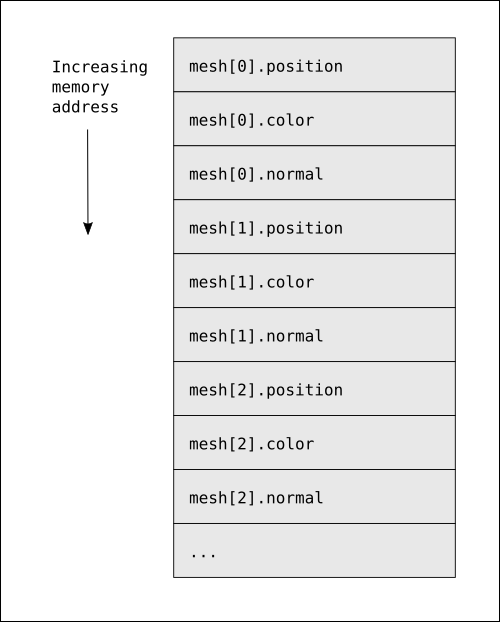
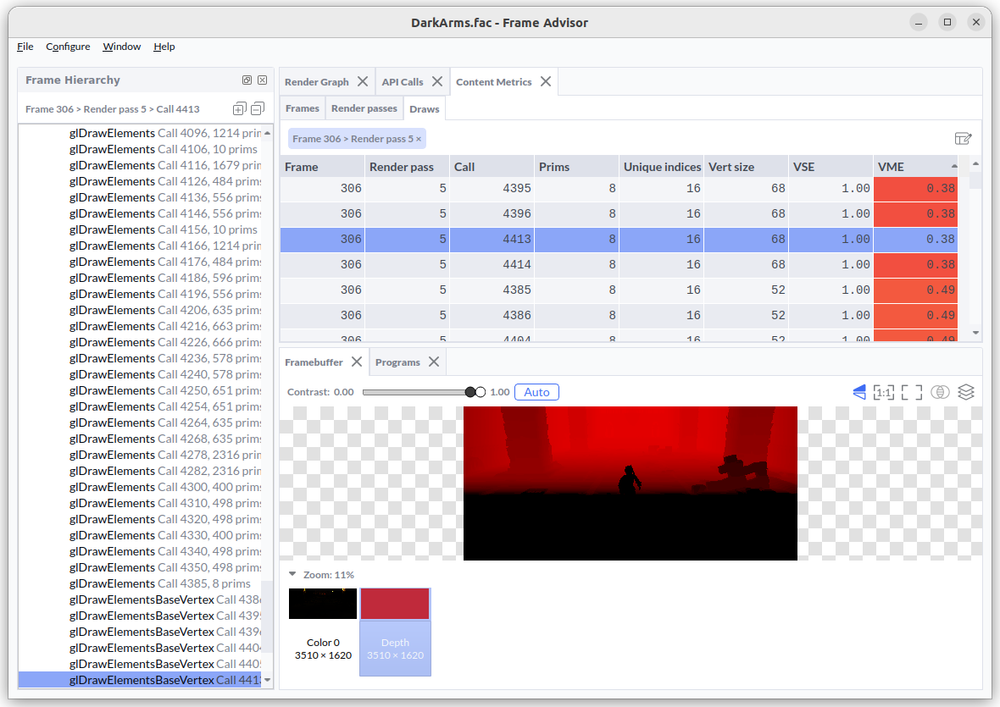

## Diagnosing poor Vertex Memory Efficiency with Frame Advisor

Imagine you're developing a graphics application targeting an Arm Immortalis GPU, but you're seeing subpar performance. 

After profiling your frame with Arm Frame Advisor, you might notice that the shadow map draw calls have low Vertex Memory Efficiency (VME), as shown in the image below. 

This raises an important question: what's causing the inefficiency, and how can you fix it?

 in shadow map draw calls.")

## Finding a solution

This Learning Path shows you approaches to addressing this problem, by demonstrating:

* Common sources of rendering inefficiencies.
* How to identify and rectify issues using Arm Frame Advisor. 

## Shadow mapping

In this scenario, draw calls in the shadow map render pass are responsible for the low Vertex Memory Efficiency (VME) scores. To understand why, let's begin by reviewing what these draws are doing.

*Shadow mapping* is the mechanism that decides whether each visible pixel is lit or in shadow. The process begins by rendering a shadow map - a texture rendered from the point of view of the light source. This texture stores the distance to the nearest surfaces visible to the light. 

During the final render pass, the GPU compares the depth of each pixel from the camera’s viewpoint to the corresponding value in the shadow map. If the pixel is farther away than what the light "sees," it’s considered occluded and rendered in shadow. Otherwise, it is lit.

## Mesh layout

The primary input for shadow map creation is the geometry of all objects that cast shadows. In this scenario, assume that each object’s vertex data is stored in memory as an array structure, a layout commonly used in many applications:

``` C++
struct Vertex {
   float position[3];
   float color[3];
   float normal[3];
};

std::vector<Vertex> mesh {
   // Model data ...
};

```

This gives the mesh the following layout in memory:



## Why is this suboptimal?

At a first glance, this looks like a standard way of passing mesh data into a GPU,
so where is the inefficiency coming from?

The vertex data that is defined contains all of the attributes that you need for your object, including those that are needed to compute color in the main lighting pass. When generating the shadow map, you only need to compute the position of the object, so most of your vertex attributes will be unused by the shadow map generation draw calls.

The inefficiency comes from how GPUs fetch vertex data from main memory. GPUs don't retrieve individual values from DRAM. Instead, they fetch a small neighborhood of data at once, which is more efficient for memory access. On Arm GPUs, this typically means reading an entire 64-byte cache line at a time.

In this example, fetching a vertex position for shadow map rendering also loads the adjacent color and normal attributes into cache, even though they're not needed. This wastes memory bandwidth and contributes to poor Vertex Memory Efficiency (VME).

## Detecting a suboptimal layout

Arm Frame Advisor analyzes the vertex attribute memory layout for each draw call and reports a Vertex Memory Efficiency (VME) metric to show how efficiently the GPU accesses vertex data.



A VME of 1.0 indicates that the draw call is making an optimal use of the memory bandwidth, with no unnecessary data fetches.

A VME score below 1.0 indicates that unnecessary data is being loaded from memory, wasting bandwidth on attributes not being used in the computation on the GPU.

In this mesh layout you are only using 12 bytes for the `position` field, out of a 36-byte vertex, resulting in a VME score of 0.33.

## Fixing a suboptimal layout

Shadow mapping only needs to load position, so to fix this issue you need to use a memory layout that allows position to be fetched in isolation from the other data. It is still preferable to leave the other attributes interleaved. 

On the CPU, this looks like this:

``` C++
struct VertexPart1 {
   float position[3];
};

struct VertexPart2 {
   float color[3];
   float normal[3];
};

std::vector<VertexPart1> mesh {
   // Model data ...
};

std::vector<VertexPart2> mesh {
   // Model data ...
};
```

This allows the shadow map creation pass to read only useful position data, without any waste. The main lighting pass that renders the full object will then read from both memory regions.

The good news is that this technique is actually a useful one to apply all of the time, even for the main lighting pass! Many mobile GPUs, including Arm GPUs, process geometry in two passes: an initial pass that computes only primitive positions, followed by a second pass that runs the full vertex shader only for primitives that survive culling. By placing position data in a separate buffer or stream, you reduce memory bandwidth wasted on fetching attributes like color or normals for primitives that are ultimately discarded. 

## Conclusion

Arm Frame Advisor provides actionable metrics that can help identify specific inefficiencies in your graphics application. The Vertex Memory Efficiency metric measures how efficiently you are using your input vertex memory bandwidth, indicating what proportion of the input data is actually consumed by the shader program. You can improve VME by adjusting your vertex memory layout to separate attribute data into distinct streams, ensuring that each render pass only loads the data it needs. Avoid packing unused attributes into memory regions accessed by draw calls, as this wastes bandwidth and reduces performance.


