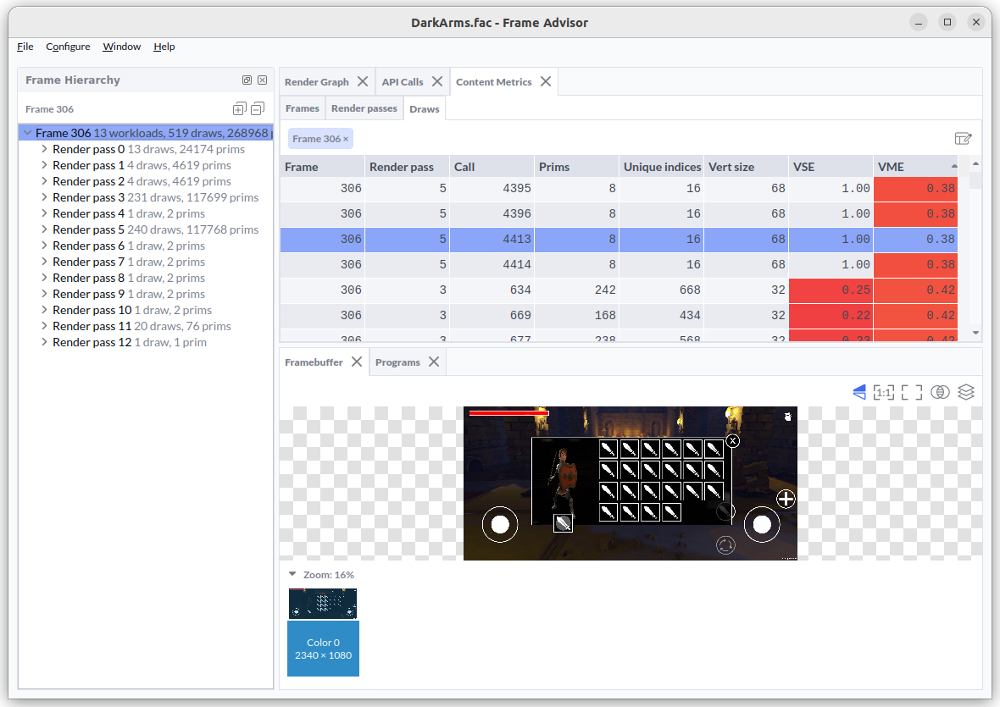

# Optimizing graphics vertex efficiency for Arm GPUs

You are writing a graphics application targeting an Arm Immortalis
GPU, and not hitting your desired performance. When running the Arm
Frame Advisor tool, you spot that the draw calls in your shadow map
creation pass have poor Vertex Memory Efficiency (VME) scores. How
should you go about improving this?



In this Learning Path, you will learn about a common source of rendering
inefficiency, how to spot the issue using Arm Frame Advisor, and how
to rectify it.


## Shadow mapping

In this scenario, draw calls in the shadow map render pass are the
source of our poor VME scores. Let's start by reviewing exactly what
these draws are doing.

Shadow mapping is the mechanism that decides, for every visible pixel,
whether it is lit or in shadow. A shadow map is a texture that is
created as the first part of this process. It is rendered from the
point of view of the light source, and stores the distance to all of
the objects that light can see. Parts of a surface that are visible
to the light are lit, and any part that is occluded must be in shadow.

## Mesh layout

The primary input into shadow map creation is the object geometry for
all of the objects that cast shadows. In this scenario, let's
assume that the vertex data for each object is stored in memory as an
array structure, which is a commonly used layout in many applications:

``` C++
struct Vertex {
   float position[3];
   float color[3].
   float normal[3];
};

std::vector<Vertex> mesh {
   // Model data ...
};

```

This would give the mesh the following layout in memory:


## Why is this sub-optimal?

This looks like a standard way of passing mesh data into a GPU,
so where is the inefficiency coming from?

The vertex data that is defined contains all of the attributes that
you need for your object, including those that are needed to compute
color in the main lighting pass. When generating the shadow map,
you only need to compute the position of the object, so most
of your vertex attributes will be unused by the shadow map generation
draw calls.

The inefficiency comes from how hardware gets the data it needs from
main memory so that computation can proceed. Processors do not fetch
single values from DRAM, but instead fetch a small neighborhood of
data, because this is the most efficient way to read from DRAM. For Arm
GPUs, the hardware will read an entire 64 byte cache line at a time.

In this example, an attempt to fetch a vertex position during shadow
map creation would also load the nearby color and normal values,
even though you do not need them.


## Detecting a sub-optimal layout

Arm Frame Advisor analyzes the attribute memory layout for each draw
call the application makes, and provides the Vertex Memory Efficiency
(VME) metric to show how efficiently that attribute layout is working.


A VME of 1.0 would indicate that the draw call is making an optimal
use of the memory bandwidth, with no unnecessary data fetches.

A VME of less than one indicates that unnecessary data is being loaded
from memory, wasting bandwidth on data that is not being used in the
computation on the GPU.

In this mesh layout you are only using 12 bytes for the `position`
field, out of a total vertex size of 36 bytes, so your VME score would
be only 0.33.


## Fixing a sub-optimal layout

Shadow mapping only needs to load position, so to fix this issue you
need to use a memory layout that allows position to be fetched in
isolation from the other data. It is still preferable to leave the
other attributes interleaved. On the CPU, this would look like the following:

``` C++
struct VertexPart1 {
   float position[3];
};

struct VertexPart2 {
   float color[3].
   float normal[3];
};

std::vector<VertexPart1> mesh {
   // Model data ...
};

std::vector<VertexPart2> mesh {
   // Model data ...
};
```

This allows the shadow map creation pass to read only useful position
data, without any waste. The main lighting pass that renders the full
object will then read from both memory regions.

The good news is that this technique is actually a useful one to apply
all of the time, even for the main lighting pass! Many mobile GPUs,
including Arm GPUs, process geometry in two passes. The first pass
computes only the primitive position, and second pass will process
the remainder of the vertex shader only for the primitives that are
visible after primitive culling has been performed. By splitting
the position attributes into a separate stream, you avoid wasting
memory bandwidth fetching non-position data for primitives that are
ultimately discarded by primitive culling tests.


# Conclusion

Arm Frame Advisor can give you actionable metrics that can identify
specific inefficiencies in your application to optimize.

The VME metric shows how efficiently you are using your input
vertex memory bandwidth, indicating what proportion of the input
data is actually used by the shader program. VME can be improved by
changing vertex memory layout to separate the different streams of
data such that only the data needed for type of computation is packed
together. Try not to mix data in that a computation would not use.

# Other links

Arm's advice on [attribute layouts][2]

[2]: https://developer.arm.com/documentation/101897/0304/Vertex-shading/Attribute-layout
