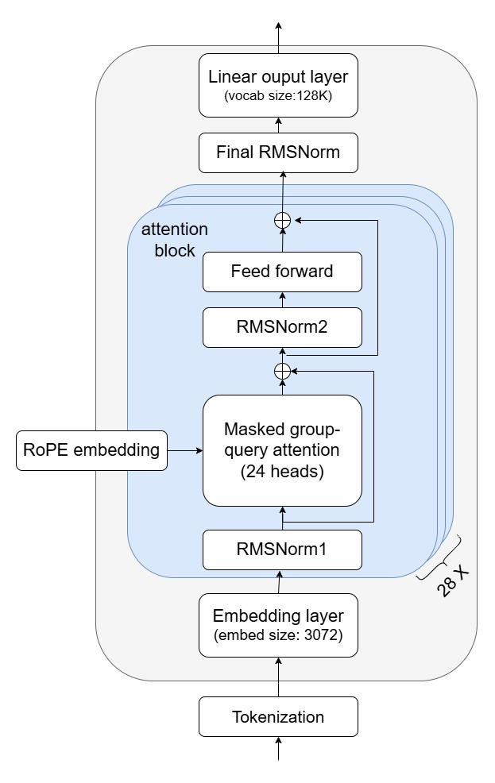
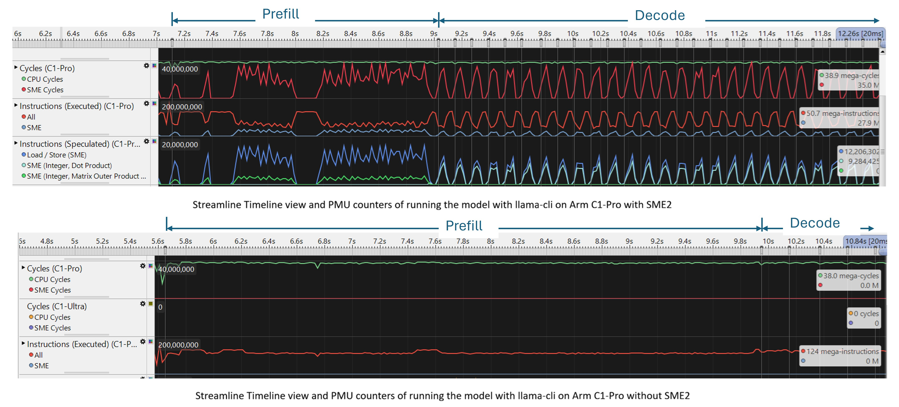
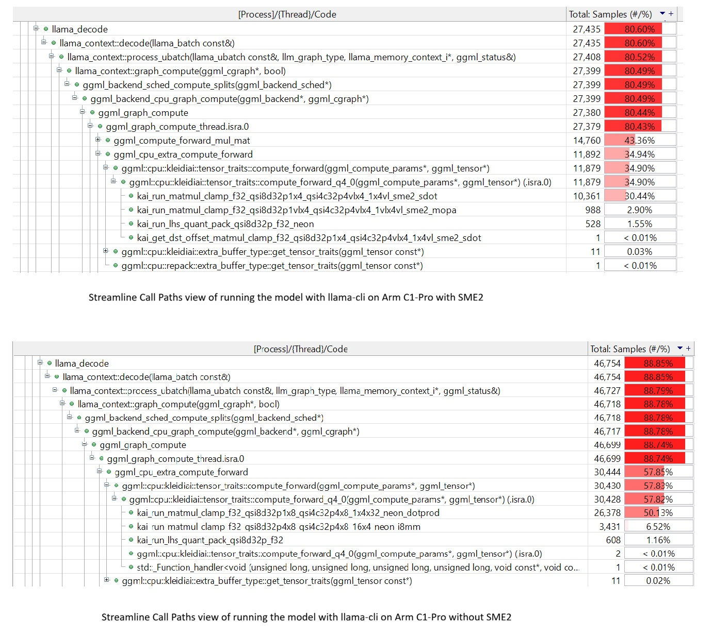

## Run the Llama-3.2-3B-Instruct-Q4_0.gguf model with llama-cli 

In this section, you run the model on an SME2-capable Android device and compare performance with SME2 enabled and disabled.

Put the built `llama-cli` executable and the `Llama-3.2-3B-Instruct-Q4_0.gguf` model file on your Android target that supports SME2. Using Android Debug Bridge (ADB) is usually the easiest way to transfer files and open a shell on the device.

The model is hosted on [Hugging Face](https://huggingface.co/unsloth/Llama-3.2-3B-Instruct-GGUF). Download to your host machine using `curl`:

```bash
curl -L -o Llama-3.2-3B-Instruct-Q4_0.gguf \
    https://huggingface.co/unsloth/Llama-3.2-3B-Instruct-GGUF/resolve/main/Llama-3.2-3B-Instruct-Q4_0.gguf
```

## Transfer the files using ADB
This subsection shows a repeatable way to copy your `llama-cli` binary and GGUF model from your host machine to an Android target device, and then run the same commands from an interactive shell on the device.

Enable **Developer options** and **USB debugging** on the Android device, connect it over USB (or over the network if your setup supports it), and verify that your host can see the device:

```bash
adb devices
```

Create a working directory on the device and push the binary and model into it. Run these commands on your host machine from the directory that contains `llama-cli` and `Llama-3.2-3B-Instruct-Q4_0.gguf`:

```bash
adb shell "mkdir -p /data/local/tmp/llama_sme2"
adb push ./llama-cli /data/local/tmp/llama_sme2/
adb push ./Llama-3.2-3B-Instruct-Q4_0.gguf /data/local/tmp/llama_sme2/
adb shell "chmod +x /data/local/tmp/llama_sme2/llama-cli"
```

Now open an interactive shell and switch to that directory. From here onward, you are running on the Android target device:

```bash
adb shell
cd /data/local/tmp/llama_sme2
```

The figure below shows the architecture of the Llama-3.2-3B model:


## Inference with SME2 enabled

To enable SME2 microkernels, set the `GGML_KLEIDIAI_SME` environment variable before running the application. The flags used here are: `taskset 2` pins the process to CPU core 2 (the Arm C1-Pro core), `-st` enables single-token generation mode to report per-token performance stats, `-C 0x2 -Cb 0x2` sets CPU affinity for operator execution, and `-t 1` limits inference to one thread. If `taskset` is not available on your device, run the command without it.

Run an inference on your target device:

```bash
env GGML_KLEIDIAI_SME="1" taskset 2 ./llama-cli -m ./Llama-3.2-3B-Instruct-Q4_0.gguf -st -C 0x2 -Cb 0x2 -t 1 -p "What is Arm SME2 and how does it accelerate AI workloads?"
```

Here `env GGML_KLEIDIAI_SME="1"` enables SME2 microkernels, `taskset 2` binds the `llama-cli` process to CPU core 2 (the Arm C1-Pro core in our case), `-C 0x2 -Cb 0x2` sets the CPU affinity for operator execution, and `-t 1` sets the number of threads to one. If `taskset` is not available on your target device, run the same command without it.

With the SME2 kernels enabled, you'll notice the following performance output:

```output
[ Prompt: 12.3 t/s | Generation: 9.1 t/s ]
```

Your results will vary depending on the device and the SME2 streaming vector length available.

## Baseline performance without SME2

For a performance comparison, run the model with SME2 microkernels disabled. In this scenario, I8MM and DotProd microkernels are used instead.

```bash
env GGML_KLEIDIAI_SME="0" taskset 2 ./llama-cli -m ./Llama-3.2-3B-Instruct-Q4_0.gguf -st -C 0x2 -Cb 0x2 -t 1 -p "What is Arm SME2 and how does it accelerate AI workloads?"
```

The output is similar to:

```output
[ Prompt: 7.9 t/s | Generation: 5.9 t/s ]
```

## Optional: Use Streamline to profile 

You can profile the model execution with the approach introduced in [Profile llama.cpp performance with Arm Streamline and KleidiAI LLM kernels](https://learn.arm.com/learning-paths/servers-and-cloud-computing/llama_cpp_streamline/). 

The Streamline Timeline view and Annotate Markers in the figure below show that the token generation speeds up significantly at both Prefill and Decode stage. The PMU event counters show that many SME2 instructions, especially SME2 Integer Outer Product Accumulate instructions at the Prefill stage and SME2 Integer Outer Product instructions at the Decode stage, are used for acceleration.



The Streamline Call Paths view below indicates similar speedup, it also shows that DotProd and I8MM KleidiAI microkernels are used instead when SME2 is not enabled. 



## Optional: Print the kernel names at runtime

To investigate which operators in the model graph are delegated to KleidiAI microkernels, you can add some code as below to `./ggml/src/ggml-cpu/kleidiai/kleidiai.cpp` and recompile the binary. When you run the inference, the names of operators that make use of KleidiAI microkernels will be printed. This is only for debugging purposes.

```cpp
    bool compute_forward(struct ggml_compute_params * params, struct
    ggml_tensor * dst) override {
        if (dst->op == GGML_OP_MUL_MAT) {
            if (dst->src[0]->type == GGML_TYPE_Q4_0) {
                //add log for kai microkernel
                std::cout << "kai matmul Q4_0" << dst->name << std::endl;
                return compute_forward_q4_0(params, dst);
            } else if (dst->src[0]->type == GGML_TYPE_Q8_0) {
                //add log for kai microkernel
                std::cout << "kai matmul Q8_0" << dst->name << std::endl;
                return compute_forward_q8_0(params, dst);
            } else if (dst->src[0]->type == GGML_TYPE_F16) {
                //add log for kai microkernel
                std::cout << "kai matmul fp16" << dst->name << std::endl;
                return compute_forward_fp16(params, dst);
            }
```
When running the model, some log will be printed as below:

```output
kai matmul Q4_0 Qcur-27
kai matmul Q4_0 Vcur-27
kai matmul Q4_0 Kcur-27
kai matmul Q4_0 attn_out-27
kai matmul Q4_0 ffn_gate-27
kai matmul Q4_0 ffn_up-27
kai matmul Q4_0 ffn_out-27
```

## Summary

You've run a quantized LLM on an SME2-capable Android device and measured the throughput difference with KleidiAI SME2 microkernels enabled and disabled. The results demonstrate meaningful gains at both the Prefill and Decode stages, making on-device LLM inference faster and more power-efficient on Arm hardware.

With out-of-the-box KleidiAI and SME2 support in llama.cpp, you can achieve significant performance improvements without any changes to the model or application code.

Move on to the Next Steps section to explore profiling and related Arm on-device AI performance resources.
