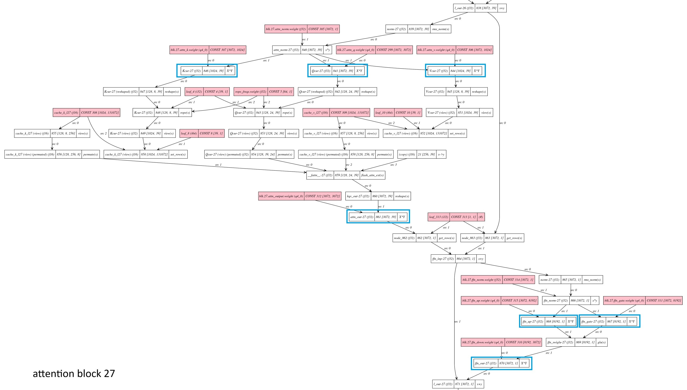

## Run the Llama-3.2-3B-Instruct-Q4_0.gguf model with llama-cli 
Put the built llama-cli executable and Llama-3.2-3B-Instruct-Q4_0.gguf model file to your aarch64 Linux/Android target that supports SME2.
The model can be downloaded [here](https://huggingface.co/unsloth/Llama-3.2-3B-Instruct-GGUF).

The figure below shows the architecture of Llama-3.2-3B model,


For performance evaluation, we run the model by binding it to a single Arm C1-Pro core with CPU affinity. 
To run the model with SME2 microkernels enabled, set the environment variable first. 

```bash
env GGML_KLEIDIAI_SME="1" taskset 2 ./llama-cli -m ./ Llama-3.2-3B-Instruct-Q4_0.gguf -st -C 0x2 -Cb 0x2 -t 1 -p "input your prompt"
```
Where 
- *env GGML_KLEIDIAI_SME="1"* sets the environment variable
- *taskset 2* sets the task affinity and binds the execution of llama-cli to CPU core 2 (the Arm C1-Pro core in our case)
- *-C 0x2 -Cb 0x2* sets the CPU affinity of the execution of operators
- *-t 1* sets the number of threads to 1

For performance comparison, we also run the model with SME2 microkernels disabled by the setting the environment variable,

```bash 
GGML_KLEIDIAI_SME="0"
```
so that I8MM and Dotprod microkernels are used instead.

```bash
env GGML_KLEIDIAI_SME="0" taskset 2 ./llama-cli -m ./ Llama-3.2-3B-Instruct-Q4_0.gguf -st -C 0x2 -Cb 0x2  -t 1 -p "input your prompt"
```
We can profile the model execution with the approach introduced in [Profile llama.cpp performance with Arm Streamline and KleidiAI LLM kernels](https://learn.arm.com/learning-paths/servers-and-cloud-computing/llama_cpp_streamline/).


The Streamline Timeline view and Annotate Markers in the figure below show that the token generation speeds up significantly at both Prefill and Decode stage. The PMU event counters show that many SME2 instructions, especially SME2 Integer Outer Product Accumulate instructions at the Prefill stage and SME2 Integer Outer Product instructions at the Decode stage, are used for acceleration. 


The Streamline Call Paths view below indicates similar speedup, it also shows that DotProd and I8MM KleidiAI microkernels are used instead when SME2 is not enabled. 


To investigate which operators in the model graph are delegated to KleidiAI microkernels, we can add some codes as below to *./ggml/src/ggml-cpu/kleidiai/kleidiai.cpp* to print out the name of operators that make use of kleidiAI microkernels. This is only for debugging purpose.

```c++
    bool compute_forward(struct ggml_compute_params * params, struct
    ggml_tensor * dst) override {
        if (dst->op == GGML_OP_MUL_MAT) {
            if (dst->src[0]->type == GGML_TYPE_Q4_0) {
                //add log for kai microkernel
                std::cout << "kai matmul Q4_0" << dst->name << std::endl;
                return compute_forward_q4_0(params, dst);
            } else if (dst->src[0]->type == GGML_TYPE_Q8_0) {
                //add log for kai microkernel
                std::cout << "kai matmul Q8_0" << dst->name << std::endl;
                return compute_forward_q8_0(params, dst);
            } else if (dst->src[0]->type == GGML_TYPE_F16) {
                //add log for kai microkernel
                std::cout << "kai matmul fp16" << dst->name << std::endl;
                return compute_forward_fp16(params, dst);
            }
```
When running the model, some log will be printed as below,
```text
kai matmul Q4_0 Qcur-27
kai matmul Q4_0 Vcur-27
kai matmul Q4_0 Kcur-27
kai matmul Q4_0 attn_out-27
kai matmul Q4_0 ffn_gate-27
kai matmul Q4_0 ffn_up-27
kai matmul Q4_0 ffn_out-27
```
Take one attention block of Llama-3.2-3B-Instruct-Q4_0 model for example, the operators that are accelerated by KleidiAI SME2-optimized microkernels are highlighted manually by the blue boxs in the figure of graph of the attention block. How to get the graph is beyond the scope of this learning path. Please refer to external resources.



KleidiAI support in llama.cpp is still evolving, more operators will be accelerated by KleidiAI microkernels, unleashing greater potential of SME2. 

## Summary
With out-of-box KleidiAI and SME2 support in llama.cpp, we can get significant performance uplift at both Prefill and Decode stage, which enhances the experience of running LLM locally on device. 
