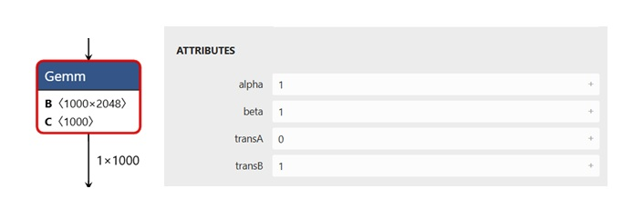

## Integration of KleidiAI to ONNX Runtime MLAS
ONNX Runtime builds with KleidiAI support:
1.	Detection: At runtime, MLAS checks the CPU capabilities for SME2 support.
2.	Dispatch: If SME2 is detected, MLAS overrides its default kernels. For example, a Gemm (General Matrix Multiplication) operation that would normally use standard vector instructions (such as NEON) dispatches to a KleidiAI SME2 micro-kernel.

Currently, KleidiAI in MLAS provides `ArmKleidiAI::MlasConv`, `ArmKleidiAI::MlasGemmBatch`, and `ArmKleidiAI::MlasDynamicQGemmBatch` kernels.

### The ArmKleidiAI::MlasConv kernel  
ORT dispatches 2D fp32 (32-bit floating point) convolution operators with batch_size=1 and multiple filters (filter kernel equal to or greater than (3,3)) to the `ArmKleidiAI::MlasConv` kernel. 

For example, the figure below shows a (7,7) Conv node.

 Conv node")

`ArmKleidiAI::MlasConv` kernel uses KleidiAI's indirect matrix multiplication (imatmul) micro kernel to accelerate the convolution.

The function calls are shown as below.
```text
onnxruntime::InferenceSession::Run
|--onnxruntime::utils::ExecuteGraph
|  |--onnxruntime::utils::ExecuteGraphImp
|  |  |--onnxruntime::ExecuteThePlan
|  |  |  |--onnxruntime::concurrency::ThreadPool::Schedule
|  |  |  |  |--onnxruntime::RunSince
|  |  |  |  |  |--onnxruntime::LaunchKernelStep::Execute
|  |  |  |  |  |  |--onnxruntime::ExecuteKernel
|  |  |  |  |  |  |  |--onnxruntime::Conv<float>::Compute
|  |  |  |  |  |  |  |  |--MlasConv
|  |  |  |  |  |  |  |  |  |--ArmKleidiAI::MlasConv
|  |  |  |  |  |  |  |  |  |  |--ConvolveSme
|  |  |  |  |  |  |  |  |  |  |  |--MlasTrySimpleParallel
|  |  |  |  |  |  |  |  |  |  |  |   |--kai_run_lhs_imatmul_pack_x32p2vlx1_x32p_sme
|  |  |  |  |  |  |  |  |  |  |  |   |  |--kai_kernel_lhs_imatmul_pack_x32p2vlx1_x32p_sme
|  |  |  |  |  |  |  |  |  |  |  |   |--kai_run_rhs_imatmul_pack_kxn_x32p2vlx1b_x32_x32_sme
|  |  |  |  |  |  |  |  |  |  |  |   |  |--kai_kernel_rhs_imatmul_pack_kxn_x32p2vlx1b_x32_x32_sme
|  |  |  |  |  |  |  |  |  |  |  |   |--kai_run_imatmul_clamp_f32_f32p2vlx1_f32p2vlx1b_2vlx2vl_sme2_mopa
|  |  |  |  |  |  |  |  |  |  |  |   |  |--kai_kernel_imatmul_clamp_f32_f32p2vlx1_f32p2vlx1b_2vlx2vl_sme2_mopa
```

### The ArmKleidiAI::MlasGemmBatch kernel
This kernel performs a batched fp32 matrix multiplication (GEMM or GemV) operation using KleidiAI matmul micro kernels. fp32 Conv operators with (1,1) filter kernels also use this kernel. 

For example, the figure below shows a (1,1) Conv node.

 FusedConv node")

The function calls of fp32 Conv operators with (1,1) filter kernels are shown below.

```text
onnxruntime::InferenceSession::Run
|--onnxruntime::utils::ExecuteGraph
|  |--onnxruntime::utils::ExecuteGraphImp
|  |  |--onnxruntime::ExecuteThePlan
|  |  |  |--onnxruntime::concurrency::ThreadPool::Schedule
|  |  |  |  |--onnxruntime::RunSince
|  |  |  |  |  |--onnxruntime::LaunchKernelStep::Execute
|  |  |  |  |  |  |--onnxruntime::ExecuteKernel
|  |  |  |  |  |  |  |--onnxruntime::Conv<float>::Compute
|  |  |  |  |  |  |  |  |--MlasConv
|  |  |  |  |  |  |  |  |  |--MlasGemmBatch
|  |  |  |  |  |  |  |  |  |  |--ArmKleidiAI::MlasGemmBatch
|  |  |  |  |  |  |  |  |  |  |  |--MlasTrySimpleParallel
|  |  |  |  |  |  |  |  |  |  |  |   |--kai_run_lhs_pack_f32p2vlx1_f32_sme
|  |  |  |  |  |  |  |  |  |  |  |   |  |--kai_kernel_lhs_pack_f32p2vlx1_f32_sme
|  |  |  |  |  |  |  |  |  |  |  |   |--ArmKleidiAI::MlasGemmPackB
|  |  |  |  |  |  |  |  |  |  |  |   |  |--kai_run_rhs_pack_kxn_f32p2vlx1biasf32_f32_f32_sme
|  |  |  |  |  |  |  |  |  |  |  |   |  |  |--kai_kernel_rhs_pack_kxn_f32p2vlx1biasf32_f32_f32_sme
|  |  |  |  |  |  |  |  |  |  |  |   |--kai_run_matmul_clamp_f32_f32p2vlx1_f32p2vlx1biasf32_sme2_mopa
|  |  |  |  |  |  |  |  |  |  |  |   |  |--kai_kernel_matmul_clamp_f32_f32p2vlx1_f32p2vlx1biasf32_sme2_mopa
```

For example, the figure below shows a Gemm node.



The function calls of fp32 Gemm operators are shown below.
```text
onnxruntime::InferenceSession::Run
|--onnxruntime::utils::ExecuteGraph
|  |--onnxruntime::utils::ExecuteGraphImp
|  |  |--onnxruntime::ExecuteThePlan
|  |  |  |--onnxruntime::concurrency::ThreadPool::Schedule
|  |  |  |  |--onnxruntime::RunSince
|  |  |  |  |  |--onnxruntime::LaunchKernelStep::Execute
|  |  |  |  |  |  |--onnxruntime::ExecuteKernel
|  |  |  |  |  |  |  |--onnxruntime::Gemm<float>::Compute
|  |  |  |  |  |  |  |  |--MlasGemm
|  |  |  |  |  |  |  |  |  |--MlasGemmBatch
|  |  |  |  |  |  |  |  |  |  |--ArmKleidiAI::MlasGemmBatch
|  |  |  |  |  |  |  |  |  |  |  |--MlasTrySimpleParallel
|  |  |  |  |  |  |  |  |  |  |  |   |--kai_run_matmul_clamp_f32_f32p2vlx1_f32p2vlx1biasf32_sme2_mopa
|  |  |  |  |  |  |  |  |  |  |  |   |  |--kai_kernel_matmul_clamp_f32_f32p2vlx1_f32p2vlx1biasf32_sme2_mopa
```

### The ArmKleidiAI::MlasDynamicQGemmBatch kernel
This kernel performs matrix multiplication with float output of dynamically quantized A and symmetrically quantized B. 
It uses the KleidiAI `kai_kernel_matmul_clamp_f32_qai8dxp1vlx4_qsi8cxp4vlx4_1vlx4vl_sme2_mopa` micro kernel.

## What you've accomplished and what's next

You now understand how KleidiAI integrates into ONNX Runtime's MLAS backend and which operators benefit from SME2 acceleration. You've learned about the three main kernel types: `MlasConv` for convolution operations, `MlasGemmBatch` for matrix multiplications and 1x1 convolutions, and `MlasDynamicQGemmBatch` for quantized operations. You've also seen the complete function call stacks showing how ONNX Runtime dispatches to KleidiAI kernels.

Next, you'll build ONNX Runtime with KleidiAI support enabled and prepare the benchmark tools for profiling on Android.
