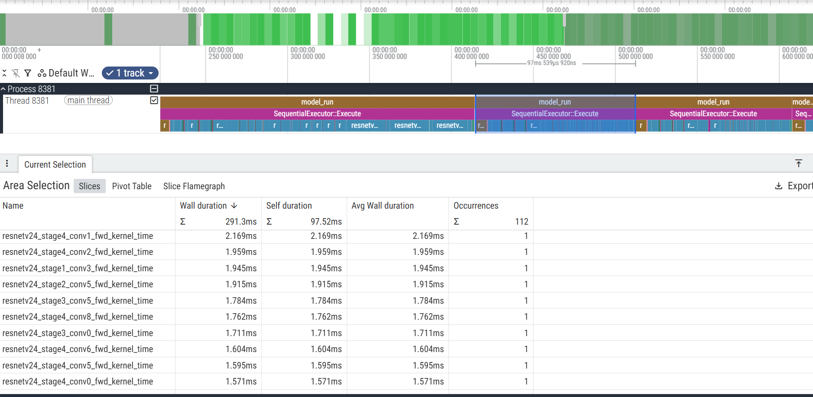
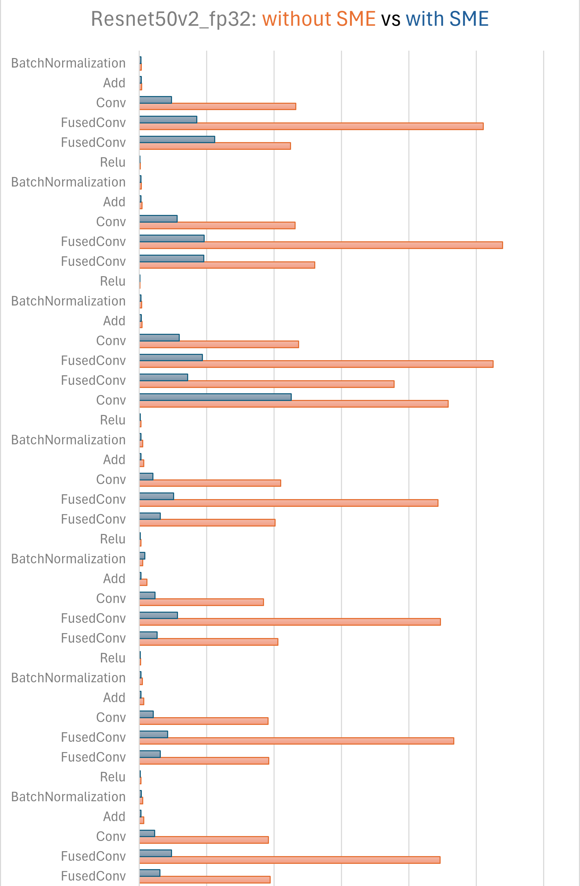
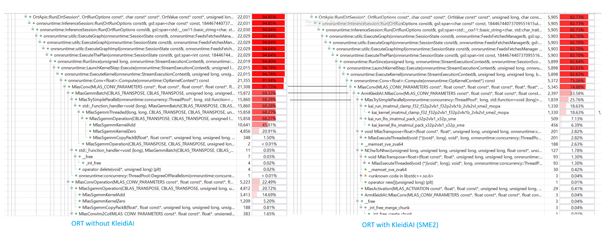

## Profile an ONNX model – Using Resnet50v2 as an example
Model Resnet50v2 will be used as an example in this learning path. Download and expand on the device the package that contains the onnx model as well as its input data from the [onnx repository](https://github.com/onnx/models/tree/main/validated/vision/classification/resnet/model):

```bash
wget https://github.com/onnx/models/raw/refs/heads/main/validated/vision/classification/resnet/model/resnet50-v2-7.tar.gz -O resnet50-v2-7.tar.gz
adb push resnet50-v2-7.tar.gz /data/local/tmp/
adb shell tar xfz /data/local/tmp/resnet50-v2-7.tar.gz -C /data/local/tmp/
```

The Android device that we used is a VIVO X300 phone with MTK D9500 processor, which has Arm C1-Ultra, C1-Premium and C1-Pro CPU cores with SME2 support on it. We chose a C1-Pro CPU core running at 2.0GHz to run the `onnxruntime_perf_test` benchmark application. You can use any other Android device with SME2 support.

To compare the performance of running Resnet50v2 on ORT with SME2 and without SME2 support, we built two versions of ORT, one with SME2 support (set `onnxruntime_USE_KLEIDIAI=ON` when building ORT), the other without SME2 support(`onnxruntime_USE_KLEIDIAI=OFF` when building ORT).

Run following command on the device,
```bash
adb shell "taskset 1 /data/local/tmp/onnxruntime_perf_test -e cpu -r 5 -m times -s -Z  -x 1 /data/local/tmp/resnet50-v2-7/resnet50-v2-7.onnx -p /data/local/tmp/resnet50v2.onnx_1xC1-Pro_profile"
```

The `taskset 1` in the command sets the CPU affinity of `onnxruntime_perf_test` benchmark to CPU core 0, which is a C1-Pro CPU core. 
`-x 1` in the command sets the number of threads used to parallelize the execution within nodes as 1 (single thread).

Here is output from running `onnxruntime_perf_test` with ORT with SME2 support as below.
```text
Setting intra_op_num_threads to 1
Disabling intra-op thread spinning between runs
Session creation time cost: 0.217932 s
First inference time cost: 196 ms
Total inference time cost: 0.49481 s
Total inference requests: 5
Average inference time cost total: 98.961997 ms
Total inference run time: 0.494854 s
Number of inferences per second: 10.104
Avg CPU usage: 11 %
Peak working set size: 271122432 bytes
Avg CPU usage:11
Peak working set size:271122432
Runs:5
Min Latency: 0.0958204 s
Max Latency: 0.101519 s
P50 Latency: 0.0995086 s
P90 Latency: 0.101519 s
P95 Latency: 0.101519 s
P99 Latency: 0.101519 s
P999 Latency: 0.101519 s
``` 

Here is output from running `onnxruntime_perf_test` with ORT without SME2 support as below.
```text
Setting intra_op_num_threads to 1
Disabling intra-op thread spinning between runs
Session creation time cost: 0.227282 s
First inference time cost: 343 ms
Total inference time cost: 1.69691 s
Total inference requests: 5
Average inference time cost total: 339.381120 ms
Total inference run time: 1.69697 s
Number of inferences per second: 2.94642
Avg CPU usage: 11 %
Peak working set size: 241426432 bytes
Avg CPU usage:11
Peak working set size:241426432
Runs:5
Min Latency: 0.333323 s
Max Latency: 0.34682 s
P50 Latency: 0.336476 s
P90 Latency: 0.34682 s
P95 Latency: 0.34682 s
P99 Latency: 0.34682 s
P999 Latency: 0.34682 s
```
## Performance analysis

### Using [perfetto tool](https://ui.perfetto.dev/)

We can use [perfetto tool](https://ui.perfetto.dev/) to view the two JSON profile files.

The figure below is a screenshot of the view of the Non-KleidiAI version of JSON profile file.  
The selected part(one `model_run/SequentialExecutor`) in the figure includes information of one inference execution.


The figure below is a screenshot of the view of the KleidiAI(with SME2) version of JSON profile file.  
The selected part (one model_run/SequentialExecutor) in the figure includes information of one inference execution.


We can also convert the two JSON profile files to CSV sheets with some external python script and combine the individual operator execution time of the Non-KleidiAI and KleidiAI(with SME2) version to a single chart. 


It shows that ORT with KleidiAI (with SME2) kernels uplifts the performance significantly, especially for convolution operators.

### Using Arm Streamline

Arm Streamline is a graphical performance analysis tool which enables you to transform sampling data, instruction trace, and system trace into reports that present the data in both visual and statistical forms. It uses hardware performance counters with kernel metrics to provide an accurate representation of system resources. You can learn more about Arm Streamline on [developer.arm.com](https://developer.arm.com/Tools%20and%20Software/Streamline%20Performance%20Analyzer/) and install it with the [Streamline Install Guide](https://learn.arm.com/install-guides/streamline/). This sections shows what this performance analysis looks like with Arm Streamline but does not dive into the details of actually using the tool.

If we use Arm Streamline tools and PMU counters for further investigation, in the timeline view of Streamline, we can see SME2 floating point Outer Product and Accumulate (MOPA) instruction is used intensively during the inference.


Then we can combine (with an external script) the function call views of ORT without / with KleidiAI (with SME2) into a single figure,



It shows that KleidiAI kernels provide a significant performance uplift for convolution operators compared to the default MLSA kernels (`MlasSgemmKernelAdd` and `MlasSgemmKernelZero`).

## Summary
By enabling KleidiAI (SME2) into ONNX Runtime, you unlock the massive parallel processing power of Arm SME2. This turns the Arm CPU from a "fallback" into a high-performance AI engine capable of running LLMs and complex vision models locally on devices.
