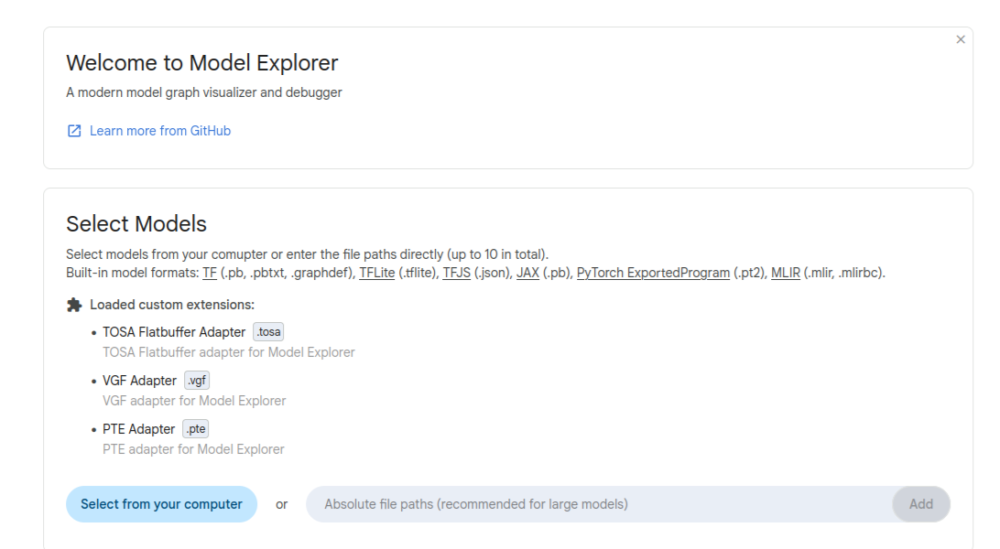

## Install Model Explorer and adapters

Use the following commands in your active virtual environment to make sure the Model Explorer and the adapters are installed:

```bash
pip install torch ai-edge-model-explorer
pip install pte-adapter-model-explorer
pip install tosa-adapter-model-explorer
pip install vgf-adapter-model-explorer
```

## Launch Model Explorer

Run Model Explorer with the PTE, TOSA, and VGF adapters:

```bash
model-explorer --extensions=pte_adapter_model_explorer,tosa_adapter_model_explorer,vgf_adapter_model_explorer
```

When the web UI opens, start with the `.vgf` artifacts in `executorch-model/` or the generated `as-vgf.pte` file. If you later inspect the optional TOSA artifacts, you can use the same Model Explorer flow to compare the intermediate representation with the deployable output.



## Inspect the exported graph

Start by confirming the graph contains the expected add and sigmoid flow. Then, check whether input/output tensor shapes match your exported model, and that no unexpected decompositions are introduced.


This same inspection approach is described in the [Model Gym](/learning-paths/mobile-graphics-and-gaming/model-training-gym/) and [quantization workflows](/learning-paths/mobile-graphics-and-gaming/quantize-neural-upscaling-models/). If you want to explore more, inspect the TOSA artifacts to understand the intermediate lowering step.

## What you've accomplished and what's next

You've now installed Model Explorer adapters, launched Model Explorer, and inspected the generated `.vgf` or `.pte` artifacts for the expected graph structure and tensor shapes.

Next, you'll extract TOSA artifacts to examine the intermediate representation between PyTorch export and backend-specific output.
