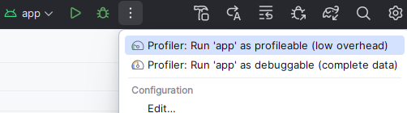
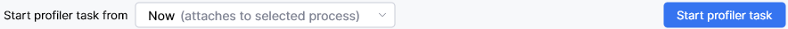
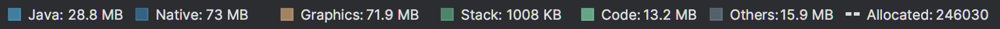

## Android Memory Profiling
Memory is a common problem in ML, with ever-increasing model parameters and datasets. For profiling an Android app's memory, Android Studio has a built-in profiler. You can use this to monitor the memory usage of your app, and to detect memory leaks.

### Set up the Profiler

* To find the Profiler, open your project in Android Studio, and select the **View** menu.

* Next, click  **Tool Windows**, and then **Profiler**. This opens the Profiler window. 

* Attach your device in Developer Mode with a USB cable, and then select your app's process. There are a number of different profiling tasks available.

Most likely with an Android ML app you will need to look at memory both from the Java/Kotlin side, and the native side: 

* The Java/Kotlin side is where the app runs, and might be where buffers are allocated for input and output if, for example, you are using LiteRT. 
* The native side is where the ML framework runs. 

{}
Before you start either task, you must build your app for profiling. The instructions for this, and for general profiling setup can be found at [Profile your app performance](https://developer.android.com/studio/profile) on the Android Studio website. You need to start the correct profiling version of the app depending on the task.
{}

Looking at the memory consumption for Java/Kotlin and native, there are two separate tasks in the Profiler: 

* **Track Memory Consumption (Java/Kotlin Allocations)**.
* **Track Memory Consumption (Native Allocations)**.

For the Java/Kotlin side, select **Profile 'app' with complete data**, which is based off the debug variant. For the native side, you want the **profileable** "Profile 'app' with low overhead", which is based off the release variant.

### Java/Kotlin

To investigate the Java/Kotlin side, see the notes on [Record Java/Kotlin allocations](https://developer.android.com/studio/profile/record-java-kotlin-allocations).

Select **Profiler: Run 'app' as debuggable**, and then select the **Track Memory Consumption (Java/Kotlin Allocations)** task. 

Navigate to the part of the app that you would like to profile, and then you can start profiling. 

The bottom of the profiling window should resemble Figure 4. 

Click **Start profiler task**.

When you're ready, select *Stop* to stop the profiling again. 

Now there will be a timeline graph of memory usage. While Android Studio has a more user-friendly interface for the Java/Kotlin side than the native side, the key to the timeline graph might be missing. This key is shown in Figure 3. 

If you prefer, you can adjust the default height of the profiling view, as well as the timeline graph within it, as they are usually too small. 

Now click on different points of the graph to see the memory allocations at each specific time. Using the key on the graph, you can see how much memory is allocated by different categories of consumption, such as Java, Native, Graphics, and Code.

If you look further down, you can see the **Table** of Java/Kotlin allocations for your selected time on the timeline. With ML, many of your allocations are likely to be scenarios such as byte[] for byte buffers, or possibly int[] for image data. Clicking on the data type opens up the particular allocations, showing their size and when they were allocated. This will help to quickly narrow down their use, and whether they are all needed.

### Native

For the [native side](https://developer.android.com/studio/profile/record-native-allocations), the process is similar but with different options. Select **Profiler: Run 'app' as profileable**, and then select the **Track Memory Consumption (Native Allocations)** task. Here you have to **Start profiler task from: Process Start**. Select **Stop** once you've captured enough data.

The Native view does not provide the same kind of timeline graph as the Java/Kotlin side, but it does have the **Table** and **Visualization** tabs. The **Table** tab no longer has a list of allocations, but options to **Arrange by allocation method** or **callstack**. Select **Arrange by callstack** and then you can trace down which functions allocate significant memory resource. There is also the **Remaining Size** tab, which is arguably more useful. 

In the **Visualization** tab, you can see the callstack as a graph, and once again you can look at total **Allocations Size** or **Remaining Size**. If you look at **Remaining Size**, you can see what remains allocated at the end of the profiling, and by looking a few steps up the stack, probably see which allocations are related to the ML model, by seeing functions that relate to the framework you are using. A lot of the memory may be allocated by that framework rather than in your code, and you may not have much control over it, but it is useful to know where the memory is going.

## Other platforms

On other platforms, you will need a different memory profiler. The objective is the same; to investigate memory consumption in terms of identifying whether there are issues with leaks or if there is too much memory being used. 

There are often trade-offs between memory and speed, and investigating memory consumption provides data that can help inform assessments of this balance.

