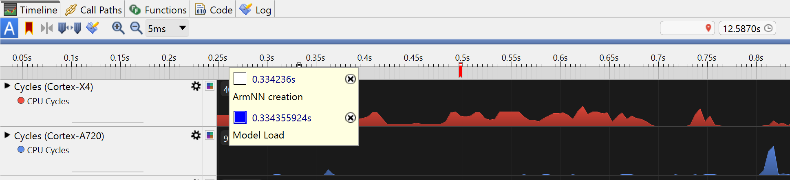

## Application Profiling
Application profiling can be split into two main types:

* Sampling.
* Instrumentation.

[Streamline](https://developer.arm.com/Tools%20and%20Software/Streamline%20Performance%20Analyzer)is an example of a sampling profiler that takes regular samples of various counters and registers in the system to provide a detailed view of the system's performance. 

Whilst sampling only provides a statistical view, it is less intrusive and has less processing overhead than instrumentation.

The profiler looks at performance metrics such as memory, CPU activity and cycles, cache misses, and many parts of the GPU. 

It can also provide a timeline-view of these counters to show any changes in the application's performance, which can reveal bottlenecks, and help you to identify where to focus your optimization efforts.


## Get started with an example Android Application 

In this Learning Path, you will profile [an example Android application](https://github.com/dawidborycki/Arm.PyTorch.MNIST.Inference) using Streamline.

Start by cloning the repository containing this example on your machine, then open it in a recent version of Android Studio. 

{}
It is generally safest to not update the Gradle version when prompted. 
{}

## Streamline
Now you can install Streamline and Arm Performance Studio on your host machine and connect to your target Arm device to capture the data. 

In this example, the target device is an Arm-powered Android phone. The data is captured over a USB connection, and then analyzed on your host machine.

For more information on Streamline usage, see [Tutorials and Training Videos](https://developer.arm.com/Tools%20and%20Software/Arm%20Performance%20Studio). 

While the example that you are running is based on Android, you can also run it on Linux. See [Setup and Capture Instructions for Linux](https://developer.arm.com/documentation/101816/0903/Getting-started-with-Streamline/Profile-your-Linux-application).

### Installation

Firstly, follow these [Setup Instructions](https://developer.arm.com/documentation/102477/0900/Setup-tasks?lang=en), to make sure you have `adb` (Android Debug Bridge) installed. If you have installed [Android Studio](https://developer.android.com/studio), you will have adb installed already. Otherwise, you can get it as part of the Android SDK platform tools which can be found on the [SDK Platform Tools Release Notes page](https://developer.android.com/studio/releases/platform-tools.html).

Make sure `adb` is in your path. You can check this by running `adb` in a terminal. If it is not in your path, you can add it by installing the SDK platform tools from the [SDK Platform Tools Release Notes Downloads page](https://developer.android.com/tools/releases/platform-tools#downloads). 

Next, install [Arm Performance Studio](https://developer.arm.com/Tools%20and%20Software/Arm%20Performance%20Studio#Downloads), which includes Streamline. 

Connect your Android phone to your host machine through USB. Ensure that your Android phone is set to developer mode. For more information on how to do this, see [Configure on-device developer options](https://developer.android.com/studio/debug/dev-options).

On your phone, navigate to **Settings**, then **Developer Options**. Enable **USB Debugging**. If your phone requests authorization for connection to your host machine, confirm authorization. Test the connection by running `adb devices` in a terminal. You will see your device ID listed.

Next, you need a debuggable build of the application that you want to profile. 
- In Android Studio, ensure your **Build Variant** is set to **debug**. You can then build the application, and install it on your device. 
- For a Unity app, select **Development Build** in the **Build Settings** menu under **File**, when building your application. 
- In Unreal Engine, expand the navigation menu **Project Settings** > **Project** > **Packaging** > **Project**, and ensure that the **For Distribution** checkbox is clear. 
- You can set `android:debuggable=true` in the application manifest file.

For the example application that you cloned earlier, the Build Variant is `debug` by default, but you can verify this by going to **Build** > **Select Build Variant** in Android Studio. 

Build and install this application on your device.

You are now able to run Streamline and capture a profile of your application by following the instructions [Capture a profile](https://developer.arm.com/documentation/102477/0900/Capture-a-profile?lang=en). But before you do, you can add some useful annotations to your code that enables specific performance analysis of your application.

## Custom Annotations

In Streamline, it is possible to add custom annotations to the timeline view. This can be useful to mark the start and end of parts of your application, or to mark when a specific event occurs. This then allows you to view the performance of your application in relation to these events. At the bottom of *Figure 1* there are custom annotations to show when inference, pre-processing, and post-processing occur.

To add annotations, you will need to add some files into your project from the **gator** daemon that Streamline uses. These files are named `streamline_annotate.c`, `streamline_annotate.h`, and `streamline_annotate_logging.h` and made available at [this GitHub repository](https://github.com/ARM-software/gator/tree/main/annotate). Using these annotations, you can see log strings, markers, counters, and Custom Activity Maps. Within your example project, create a `cpp` folder under the `app/src/main` folder, and add these three files there.

These files are written in C, so if your Android Studio project is in Java or Kotlin, you will need to add a C library to your project. This is slightly trickier than adding a Java or Kotlin file, but it is not difficult. You can find instructions on how to do this at a page called [Add C and C++ code to your project](https://developer.android.com/studio/projects/add-native-code).

Create a file in the `app/src/main/cpp/` folder under your project, and name it `annotate_jni_wrapper.c`. This will be a wrapper around the gator daemon's functions, and will be called from your Kotlin code. Copy the code below into this file. You can also create similar wrapper functions for other gator daemon functions.

```c
#include <jni.h>
#include "streamline_annotate.h"

JNIEXPORT void JNICALL Java_AnnotateStreamline_AnnotateSetup(JNIEnv* env, jobject obj) {
    gator_annotate_setup();
}

JNIEXPORT jlong JNICALL Java_AnnotateStreamline_GetTime(JNIEnv* env, jobject obj) {
    return gator_get_time();
}
```

Some functions have `unsigned int`, but this needs to be a `jint` in the wrapper, with some casting required in your Kotlin code to enforce type correctness at that end. Some functions have strings as arguments, and you will need to do a small conversion as shown below:

```c
JNIEXPORT void JNICALL Java_AnnotateStreamline_AnnotateMarkerColorStr(JNIEnv* env, jobject obj, jint color, jstring str) {
    const char* nativeStr = (*env)->GetStringUTFChars(env, str, 0);
    gator_annotate_marker_color(color, nativeStr);
    (*env)->ReleaseStringUTFChars(env, str, nativeStr);
}
```

In Android Studio, `cmake` is used to create your C library, so you will need a `CMakelists.txt` file in the same directory as the C files (`app/src/main/cpp/` in the example). Copy the contents shown below into `CMakelists.txt`:

```cmake
# Sets the minimum CMake version required for this project.
cmake_minimum_required(VERSION 3.22.1)

# Declare the project name. 
project("StreamlineAnnotationJNI")

# Create and name the library
add_library(${CMAKE_PROJECT_NAME} SHARED
    annotate_jni_wrapper.c
    streamline_annotate.c)

# Specifies libraries CMake should link to your target library. 
# Adding in the Android system log library pulls in the NDK path.
find_library( # Sets the path to the NDK library.
        log-lib
        log )

target_link_libraries( # Specifies the target library.
        ${CMAKE_PROJECT_NAME}
        ${log-lib} )
```

Now add the code below to the `build.gradle` file of the Module you wish to profile (`:app` in the example). You will be able to call the functions from your Kotlin code:

```gradle
    externalNativeBuild {
        cmake {
            path = file("src/main/cpp/CMakeLists.txt")
            version = "3.22.1"
        }
    }
```

This creates a `libStreamlineAnnotationJNI.so` library that you can load in your Kotlin code, and then you can call the functions. 

In this location you can now create a singleton `AnnotateStreamline.kt`. 

Place the file alongside `MainActivity.kt` in `app\src\main\java\com\arm\armpytorchmnistinference` for the example. 

Add the following code to `AnnotateStreamline.kt` to enable Kotlin calls to the gator daemon from the rest of your code:

```kotlin
// Kotlin wrapper class for integration into Android project
class AnnotateStreamline {
    init {
    // Load the native library
        System.loadLibrary("StreamlineAnnotationJNI")
    }

    companion object {
    // #defines for colors from the Streamline Annotation c code
        const val ANNOTATE_RED: UInt = 0x0000ff1bu
        const val ANNOTATE_BLUE: UInt = 0xff00001bu
        const val ANNOTATE_GREEN: UInt = 0x00ff001bu
        const val ANNOTATE_PURPLE: UInt = 0xff00ff1bu
        const val ANNOTATE_YELLOW: UInt = 0x00ffff1bu
        // any other constants you want from the included gator files

        // Create an instance of the AnnotateStreamline class
        private val annotations = AnnotateStreamline()

        // Function to setup the Streamline Annotation - call this first
        @JvmStatic
        fun setup() {
            annotations.AnnotateSetup()
        }

        // Function to get the current time from gator
        @JvmStatic
        fun getTime(): Long {
            return annotations.GetTime()
        }

        // more functions that you want, e.g. (note UInt conversion)
        @JvmStatic
        fun annotateMarkerColorStr(color: UInt, str: String) {
            annotations.AnnotateMarkerColorStr(color.toInt(), str)
        }
        // ...
    }

    // externals match the last part of function names in annotate_jni_wrapper.c
    external fun AnnotateSetup()
    external fun GetTime(): Long
    external fun AnnotateMarkerColorStr(color: Int, str: String)
    // ...
}
```

Fill in all the function calls to match the functions you added into `annotate_jni_wrapper.c`.

You can now use the `AnnotateStreamline` class in your Kotlin code to add annotations to the Streamline timeline view. 

Firstly, make sure that `AnnotateStreamline.setup()` is called before any other gator function. 

For the example project, add it into the `onCreate()` function of `MainActivity.kt`. Then you can add annotations like this:

```kotlin
      AnnotateStreamline.annotateMarkerColorStr(AnnotateStreamline.ANNOTATE_BLUE, "Model Load")
```

In the example app, you can add this in the `onCreate()` function of `MainActivity.kt` after the `Module.load()` call to load the `model.pth`.

This *colored marker with a string* annotation will add the string and time to Streamline's log view, and it appears like the image shown below in Streamline's timeline (in the example app, Arm NN is not used, so there are no white Arm NN markers):



## Custom Activity Maps (CAMs)

In addition to adding strings to the log and colored markers to the timeline, a particularly useful set of annotations is the Custom Activity Maps (CAMs). These are the named colored bands that you can see at the bottom of the Streamline timeline view, as shown in *Figure 1*. They can be used to show when specific parts of your application are running, such as the pre-processing or inference, and layered for functions within functions.

To add these, in the same way as the functions above, you need to import the functions that are prefixed with `gator_cam_` from `streamline_annotate.h`. You can then use CAMs, but first you need to set up the tracks the annotations will appear on, and an ID system for each annotation. The `baseId` code below is used to ensure that if you add annotations in multiple places in your code, the IDs are unique.

Here is an example setup in a class's companion object:

```kotlin
  companion object {
    const val camViewId = 1u
    const val trackRoot = 1u
    const val trackChild = 2u
    baseId = (0u..UInt.MAX_VALUE/2u-5000u).random()
    currentId = baseId

    init {
      AnnotateStreamline.camViewName(camViewId, "Inference")
      AnnotateStreamline.camTrack(camViewId, trackRoot,0xffffffffu, "Root") // root wants -1 for parent id
      AnnotateStreamline.camTrack(camViewId, trackChild, trackRoot, "Children")
    }
```

For the example app, add this to the `MainActivity` class.

Then you can use it in this way:

```kotlin
      val preprocess = currentId++
      AnnotateStreamline.camJobStart(camViewId, preprocess, "Preprocess", trackRoot, AnnotateStreamline.getTime(), AnnotateStreamline.ANNOTATE_YELLOW)
      val childjob = currentId++
      AnnotateStreamline.camJobStart(camViewId, childjob, "child job", trackChild, AnnotateStreamline.getTime(), AnnotateStreamline.ANNOTATE_CYAN)
      //child job code...
      AnnotateStreamline.camJobEnd(camViewId, childjob, AnnotateStreamline.getTime())
      //rest of preprocessing code...
      AnnotateStreamline.camJobEnd(camViewId, preprocess, AnnotateStreamline.getTime())
```

In the example app, the CAM annotations are added to the `runInference()` function, that looks like this:

```kotlin
    private fun runInference(bitmap: Bitmap) {
        val preprocess = currentId++
        AnnotateStreamline.camJobStart(camViewId, preprocess, "Preprocess", trackRoot, AnnotateStreamline.getTime(), AnnotateStreamline.ANNOTATE_YELLOW)
        // Convert bitmap to a float array and create a tensor with shape [1, 1, 28, 28]
        val inputTensor = createTensorFromBitmap(bitmap)   // could add a child CAM job inside function call, but probably too simple
        AnnotateStreamline.camJobEnd(camViewId, preprocess, AnnotateStreamline.getTime())

        // Run inference and measure time
        val inferenceTimeMicros = measureTimeMicros {
            // Forward pass through the model
            val inference = currentId++
            AnnotateStreamline.camJobStart(camViewId, inference, "Inference", trackRoot, AnnotateStreamline.getTime(), AnnotateStreamline.ANNOTATE_RED)
            val outputTensor = model.forward(IValue.from(inputTensor)).toTensor()
            AnnotateStreamline.camJobEnd(camViewId, inference, AnnotateStreamline.getTime())
            // and then post-processing is simplistic in this case, so not worth a CAM job
            val scores = outputTensor.dataAsFloatArray

            // Get the index of the class with the highest score
            val maxIndex = scores.indices.maxByOrNull { scores[it] } ?: -1
            predictedLabel.text = "Predicted Label: $maxIndex"
        }

        // Update inference time TextView in microseconds
        inferenceTime.text = "Inference Time: $inferenceTimeMicros µs"
    }
```

The example application is fast and simple, and the CAMs do not show a lot of information. In a more complex application, you can add further CAMs, including child-level ones, to give more detailed annotations to show where time is spent in your application. For this example app with its very fast inference, it is best to change the Streamline timeline view scale to 10µs in order to better see the CAM annotations.

Once you have added in useful CAM annotations, you can build and deploy a debug version of your application. You can run Streamline and see the annotations and CAMs in the timeline view. See the [Streamline documentation](https://developer.arm.com/documentation/101816/latest/) for information on how to make a capture for profiling. After the capture is made and analyzed, you will be able to see when your application is running the inference, performing ML pre-processing or ML post-processing, or other operations from parts of your application. From there you can see where the most time is spent, and how hard the CPU or GPU is working during different parts of the application. From this you can then decide if work is needed to improve performance and where that work needs doing.
