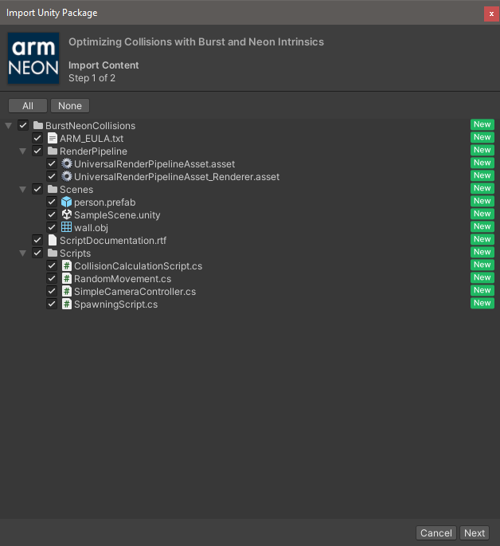
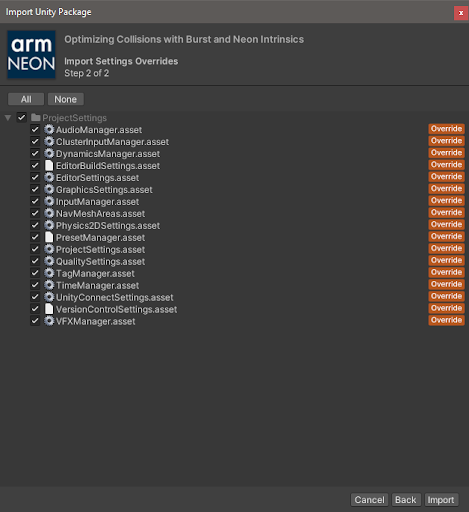
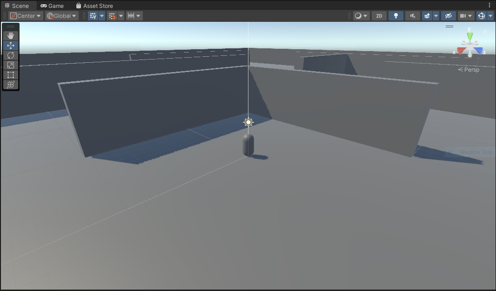
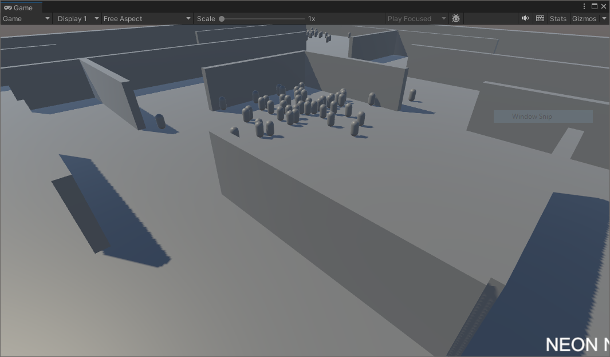
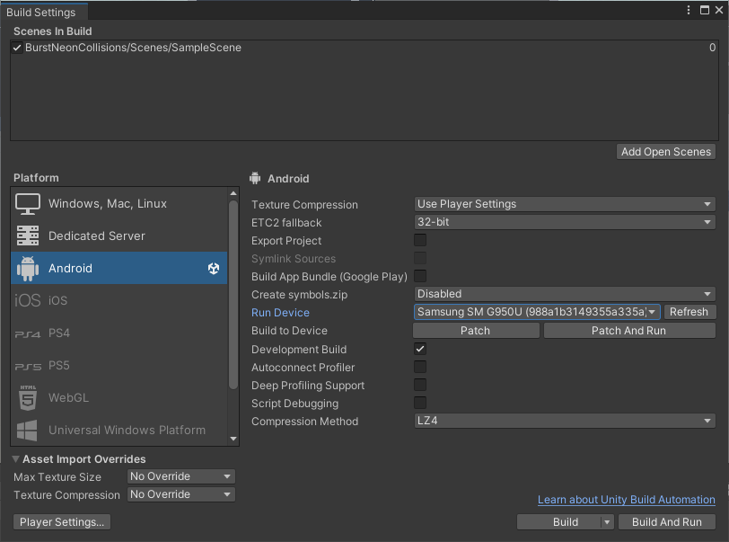

## Create a blank project
You'll need Unity installed with Android build support. Read [Get started with Unity on Android](/learning-paths/mobile-graphics-and-gaming/get-started-with-unity-on-android) for help installing Unity as well as building and deploying to an Android device.

Although the sample application is a project, you will still need to create a blank project to import it into.

1. Open the Unity Hub

1. Log in (if you are not already)

1. Select _New Project_

1. Select the _3D (URP) Core_ template

1. Enter project name (this will be used as the name of the project folder)

1. Enter location (path of your project on disk)

1. Select _Create Project_

Note that [Universal Render Pipeline](https://docs.unity3d.com/Packages/com.unity.render-pipelines.universal@17.0/manual/index.html) projects are recommended for mobile applications.

Unity will take a moment to create your new project and build the default assets.

## Download and install the sample application
Once Unity has loaded, you will be presented with a template project. You can ignore all of the assets provided by Unity. You will only need to concentrate on the files from the sample project.

1. Open a web browser

1. Open the  [sample project page](https://assetstore.unity.com/packages/essentials/tutorial-projects/optimizing-collisions-with-burst-and-neon-intrinsics-196303)

1. You will need to log in (if you haven’t already)

1. On the asset (Optimizing Collisions with Burst and Neon Intrinsics) page select _Add to my assets_ button

1. The button will change to _Open in Unity_. Select it.

1. A pop-up window will ask to open the asset in Unity. You can do this by selecting the _Open Unity Editor_ button

1. If Unity fails to open the asset or no pop-up appears, select _My Assets_ button in the top-right of the page:

    a. Your assets should appear in a list

    b. Find the entry for _Optimizing Collisions with Burst and Neon Intrinsics_

    c. Select _Open in Unity_ button

    d. A pop-up will appear as in step 6 above
    
    e. Select _Open Unity Editor_

1. The Unity Editor will bring itself to the front and show the _Package Manager_

1. You will see the sample project listed and highlighted. Select _Download_.

1. Select _Import_

1. A warning message will appear because the sample project will replace the project settings in your current project. Since we have only just created this new project, it is fine to overwrite. Select _Import_.

1. A further warning may appear as the sample project has additional dependencies which our blank project hasn’t activated yet. Select _Install/Upgrade_.

1. The Import Unity Package window will appear. It allows individual files and folders to be imported or ignored. You will need all of the files in the project. Leave all items ticked and select _Next_.

    

1. A second window will open that lists the project settings that will be overwritten. We want the settings from the sample code so leave all items ticked. Select _Import_.

    

## Set up the project
Once the sample project has been imported, you will see some errors and warnings.

1. Open _File_ menu and select _Build Settings_

1. Select _Android_ from the Platform list

1. Select _Switch Platform_

Unity will take a moment to build the assets for the Android platform.

The errors will disappear but some warnings regarding unreachable code will appear. These will be explained later but can be safely ignored for now.

Your scene view will look something like this:

## Run the project inside the editor

It is worth checking that everything has imported and been built correctly.

1. Close the _Build Settings_ window

1. In the Project tab (usually at the bottom in default configurations) you will see the list of asset files.

1. Open the _BurstNeonCollisions_ folder

1. Open _Scenes_ folder

1. Open the scene called _SampleScene_

1. Select the _Play_ (triangle) button to launch the program.

The game will launch and you will see an empty environment begin to fill with more and more characters (capsules) over time. It will look something like this:

## Deploy to Android
You will now deploy the sample to your Android device. Your device must already be set up for development. For detailed instructions, read the learning path [Get started with Unity on Android](/learning-paths/mobile-graphics-and-gaming/get-started-with-unity-on-android).

1. Open _Build Settings_ from the File menu

1. Tick the _Development Build_ option

1. Select _Add Open Scenes_ to add the demo scene to your _Scenes in Build_ list

1. Plug your Android device into your computer

1. Once recognized, your device will be listed in the drop-down menu next to _Run Device_

1. The screenshot below shows the settings with a _Samsung S8_ selected as the _Run Device_

1. Select _Build and Run_

    

1. Enter a name for the APK (the Android package) and select _Save_

Unity will take a moment to build the Android version and then automatically deploy it to your connected Android device. Depending on your setup, the build and deployment might take several minutes.

