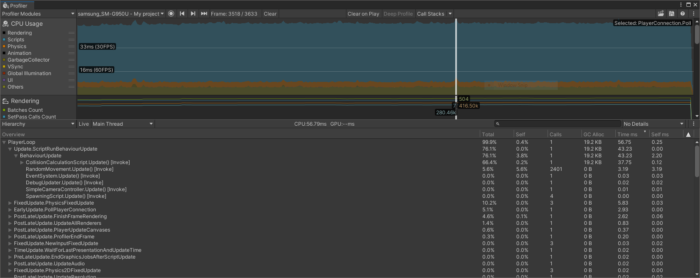

## Why use the Profiler tool?
The Profiler helps identify performance related issues in your apps and games. Not just to achieve solid frame rates but also to reduce energy usage. Reduced energy usage means a longer battery life on mobile devices; which in turn can mean more time spent in your app or game.

With the Profiler, you will collect data over a series of frames and then select some specific frames to drill further down into. You will also examine timings and how often specific functions or areas of code are executed.

Performance issues are not always easy to find. You might have intermittent issues causing an occasional drop in frame rate (or increased processing time) or you might have resource issues if your app is very resource intensive.

The Profiler will be able to help you in various ways:

- Monitor and measure CPU usage across various areas of the Unity engine and your app, e.g., graphics rendering, script processing, physics, animation, UI etc.

- Monitor and measure memory allocations

- Get a breakdown of how long specific functions are taking

- Help identifying where the bottlenecks are in your application

## Launch the Profiler

The Profiler can be used in the editor and with your connected Android device. It is always recommended to measure your actual target as your development environment may be very different. Using the Profiler when running your app in the editor can be useful, especially if your performance issues are general or simple to identify but, generally speaking, profiling on an actual target device will always provide more accurate results.

You can connect the Profiler to your device manually while the app is running or select auto-connect in the build settings. 

If the part of your app you want to profile occurs soon after launch, then auto-connecting the Profiler can save you a couple of steps.

On the other hand, if the performance issues happen later in the app’s lifetime, you might prefer to launch the app first, navigate to the problem area, and then connect the Profiler.

In our sample, the performance issues will be apparent soon after launch. To profile directly on an Android device:

1. Open the _Build Settings_

1. Ensure _Autoconnect Profiler_ is ticked

    

1. Select _Build and Run_

1. Choose your save path and name

1. Wait for Unity to launch the collision sample and auto-connect the Profiler

1. Once the Profiler is connected, the Profiler window will open and the _CPU Usage_ graph will start to fill

If you forget to tick the auto-connect option or you want to wait before you connect the Profiler, you can connect the Profiler while the app is running:

1. Select _Window_ menu, then _Analysis_, then _Profiler_

1. A round record button is present in the top-left

1. To the left of the record button is a drop-down menu identifying the connection mode and device. To profile the app running in the editor, you would set this to _Play Mode_.

1. Your Android device should appear in the list. Select it to connect the Profiler.

1. Press the record button to start profiling (the button will turn red)

You can stop the recording at any time by pressing the Record button. It will turn gray when recording is not in progress.

## Overview of the Profiler window
The Profiler window contains a lot of information spread over two main scrollable panels. The top panel _CPU Usage_ shows a graph of usage (in milliseconds) over time. It highlights key areas in different colors.

### CPU Usage graph and frame-rate labels
The CPU Usage graph captures profiling data every frame while it is active.


If you have a performance issue that worsens over time (as with the case of the collision sample), you will see the graph gradually (or quickly) fill over time. Watch the frame rate labels on the left of the graph. These labels mark the Y-axis at set intervals. They show you what CPU Usage would be required to achieve given frame rates. For example, if your CPU Usage remained under 16 milliseconds then as far as the CPU is concerned, a frame rate of 60 frames-per-second (FPS) would be achievable. If the CPU Usage is under 16ms but your frame rate is still lower than expected, that is an indication that the app has performance issues elsewhere, e.g., in the GPU.

The CPU Usage graph can be simplified by turning off areas of measurement that you are not interested in. For example, if you are confident the problem is not related to animation, you could click the Animation entry on the left. This can make the graph a little easier to read and allow you to focus on what matters. Be careful though, you don’t want to make assumptions too early and miss unexpected intermittent peaks.

### Examine a single frame of data

The CPU Usage graph provides a very high level view of what is happening in the app and can help us decide if the performance issue is CPU or GPU related. But where exactly is the problem? With the collision sample we can tell that something is wrong on the CPU but with what bit of code?

The peaks on the CPU Usage graph tell us where there are particularly high loads. Ensure that the drop-down menu in the lower panel is showing Timeline. Select a frame on your graph where there is a peak or any frame that looks as if it took more time than it should (in this case, all frames look suitable).


The lower panel will show activity from the selected frame. The rows show main thread, render thread, job worker threads (expand Job entry to see the workers and what tasks they performed) and several other areas and job types. The colors of the boxes match those of the categories listed in the CPU Usage panel.

You can expand or shrink the Timeline panel using the scroll-wheel. To pan around, click the scroll-wheel. Do this until you can see the Timeline rows more clearly. Each frame is being shown one after the other, left to right. Your selected frame is brighter than the surrounding frames. You will see in the panel header the amount of time taken by the selected frame (e.g., in Figure 3, CPU 56.79ms). The time axis below the header runs from 0ms (start of frame) for the duration of the frame.

For now, we are interested in the main thread because it seems to be very busy. The top row says that the PlayerLoop entry is taking 56.75ms. Even if nothing else was running, we would be limited to approximately 17 frames per second (1000 / 56.75 = 17.6). Our bottleneck seems to be CPU related.

The PlayerLoop entry on the main thread is an internal Unity engine function, the row below gives a breakdown of the PlayerLoop. If you zoom in close enough you will find many different functions being called related to polling and updating objects. The largest entry (the function that seems to take the most time) is `Update.ScriptRunBehaviourUpdate`. The label in the box says 43.24ms. Therefore, of the 56.75ms cost of PlayerLoop, the vast majority of that is somewhere in `Update.ScriptRunBehaviourUpdate`.

### The Hierarchy view

`Update.ScriptRunBehaviourUpdate` is another internal engine function. It controls all of the MonoBehaviour script components when they are updated. The collision sample uses custom MonoBehaviours to perform collision detection.

Staying in the lower panel, select the drop-down menu currently labeled Timeline. Change it to Hierarchy mode. You will now see a Hierarchy of functions and profiled areas. Expand the Hierarchy to show PlayerLoop/Update.ScriptRunBehaviourUpdate/BehaviourUpdate.



Under BehaviourUpdate, you will see the custom script `CollisionCalculationScript.Update`. If you look across to the right, you will see information about the calls to this function. Under the Total column below you will see that the `CollisionCalculationScript Update()` function took 66.4% of the total of PlayerLoop. Expand `CollisionCalculationScript` to drill down even further.

### Supporting features

There are a number of options available in the Profiling window. Let's explore some of them.

To clearly delineate captured data, you can toggle to Clear on Play to clear the data whenever you start playing your app.

The Deep Profile option tells the Profiler to collect much more performance data about your code. The extra information comes at the cost of additional start-up time of your app and an additional cost to data collection during runtime so it is usually easier without it, unless it's really needed. Data collection can be much slower with Deep Profile turned on (depending on the complexity of your app). Your app must be built with support for deep profiling; activate this by turning on Deep Profiling Support in Build Settings (before you select Build and Run).

In addition to performance timings, we can also see how often memory allocations are made. The Call Stacks option enables recording of such memory allocations. It is accompanied by a pull-down menu with three options, _GC.Alloc_ is the default. You can see when your code triggers a memory allocation. Click on the GC.Alloc block (in magenta) to see the call stack in the pop-up window.


### Mark your own code for profiling

To mark specific areas of code that you want to measure, you can add your own profiling tags by calling functions from the `UnityEngine.Profiling` namespace. See below for how to mark your code so that it appears in the Timeline and Hierarchy using the label of your choice:

```
using UnityEngine.Profiling;
	...
	Profiler.BeginSample(“My label”);
	...
	< code you want recorded by the Profiler >
	...
	Profiler.EndSample();
```

You may also nest tagged samples inside other samples in order to organize your profile data into a Hierarchy (as we have seen shown in the Timeline and Hierarchy views).
