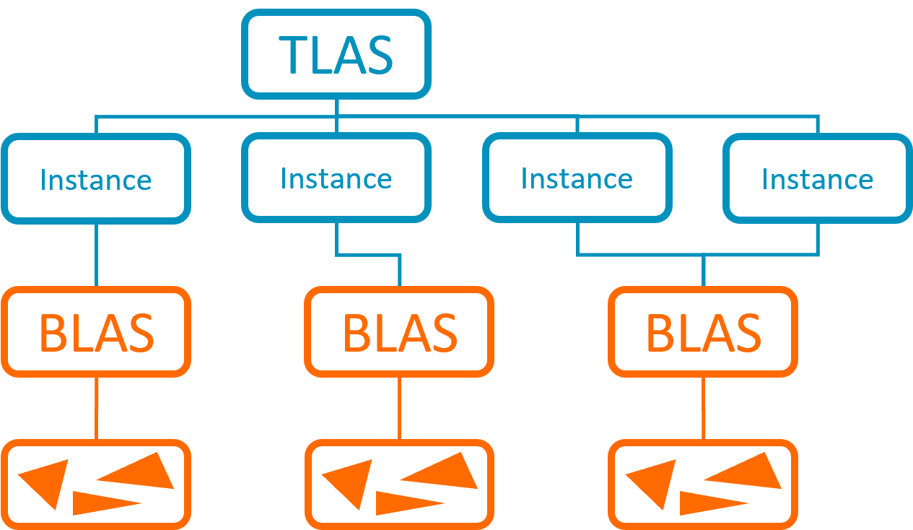

## Acceleration structure

For ray tracing, the first thing that you need is to create an acceleration structure to represent a scene.

An acceleration structure is an optimized data structure for fast ray intersection tests. It organizes the geometry so that you can efficiently narrow down what each ray intersects. Vulkan represents them using `VK_KHR_acceleration_structure`, and although the actual structure is opaque and defined by the implementation, it is usually implemented as a tree-like structure, and the API gives some options to control the topology and keep it balanced.

The API makes a distinction between *Bottom-Level Acceleration Structures* (BLAS) and *Top-Level Accelerations Structures* (TLAS).

*Bottom-Level Acceleration Structures* contain the actual geometry data, usually as triangles, but they can also be mathematically-defined models. The actual implementation of a BLAS is opaque to users, but the driver usually organizes this data in a Bounding Volume Hierarchy (BVH), so that when you cast a ray, you can minimize the number of triangle intersection checks.

*Top-Level Accelerations Structures* contain Bottom-Level Acceleration Structures. Top-Level Acceleration Structures use instances to group BLASes and link them with other properties. These properties include a custom ID, which you can use to define a material; or a transform matrix, which you can use to efficiently update animations.



### Acceleration structure best practice

As building BLASes and TLASes is relatively expensive, it is best to try to reduce the number of acceleration structures builds and updates.

Skinned animations are costly in ray tracing as they require you to continuously update the BLASes of the meshes. It is recommended that you limit the number of skinned objects in your scenes. Depending on your use case, you might consider not updating all the acceleration structures in every frame. It is usually possible to reuse the same old acceleration structure across a few frames, without noticeable artifacts. Similarly, you can implement some kind of heuristic to reduce the update frequency of objects too far from the camera, although this can be tricky since most effects still need to consider objects outside the view frustum.

When building a new BLAS, it is generally recommended to use `VK_BUILD_ACCELERATION_STRUCTURE_PREFER_FAST_TRACE_BIT_KHR` for static geometry. `VK_BUILD_ACCELERATION_STRUCTURE_PREFER_FAST_BUILD_BIT_KHR` can be faster in certain situations, such as dynamic geometry or streaming. If updating BLASes becomes problematic, you can consider testing alternative options.

When building new TLASes, it is recommended to use `PREFER_FAST_BUILD`. For TLASes, `PREFER_FAST_TRACE` can be useful for a static scene without updates; however, the build itself is more expensive. In general, BLASes are in use for a long time, but TLASes are only in use for a few frames. This means that it is usually not efficient to build your TLAS with `PREFER_FAST_TRACE`.

Similarly, building a new acceleration structure is significantly slower than updating or refitting an existing one. Try to avoid creating new acceleration structures from scratch, and if possible, set the `srcAccelerationStructure` field. Setting a previous version of the acceleration structure as a base for the new acceleration structure will be significantly faster since it triggers an update or refit instead of a build. Remember to also set `VK_BUILD_ACCELERATION_STRUCTURE_ALLOW_UPDATE_BIT_KHR` when creating the acceleration structure.

In [ray tracing best practices](https://developer.arm.com/documentation/101897/latest/Ray-tracing/Acceleration-structures) it is recommended that you use `PREFER_FAST_TRACE` for static BLASes. For TLASes and dynamic BLASes `PREFER_FAST_BUILD` is recommended, usually in combination with `ALLOW_UPDATE`.

``` cpp
void create_blas(bool allow_update, std::vector<VkAccelerationStructureGeometryKHR> &&geometries, std::vector<uint32_t> &&geometry_primitive_counts, VkAccelerationStructureKHR prev_as = VK_NULL_HANDLE)
{
    VkAccelerationStructureBuildGeometryInfoKHR blas_geom_info{};
    blas_geom_info.sType = VK_STRUCTURE_TYPE_ACCELERATION_STRUCTURE_BUILD_GEOMETRY_INFO_KHR;
    blas_geom_info.type = VK_ACCELERATION_STRUCTURE_TYPE_BOTTOM_LEVEL_KHR;
    if (prev_as != VK_NULL_HANDLE)
    {
        blas_geom_info.mode = VK_BUILD_ACCELERATION_STRUCTURE_MODE_UPDATE_KHR;
        blas_geom_info.srcAccelerationStructure = prev_as;
    }
    else
    {
        // No previous Acceleration structure. Creating a new AS
        blas_geom_info.mode = VK_BUILD_ACCELERATION_STRUCTURE_MODE_BUILD_KHR;
    }

    // BLASes almost never change. Prefer fast trace, it is generally faster for BLAS
    blas_geom_info.flags = VK_BUILD_ACCELERATION_STRUCTURE_PREFER_FAST_TRACE_BIT_KHR;

    if (allow_update)
    {
        // Probably skinned mesh
        blas_geom_info.flags |= VK_BUILD_ACCELERATION_STRUCTURE_ALLOW_UPDATE_BIT_KHR;
    }
    build_as(blas_geom_info, geometries, geometry_primitive_counts);
}

void create_tlas(bool allow_update, std::vector<VkAccelerationStructureGeometryKHR> &&geometries, std::vector<uint32_t> &&geometry_primitive_counts, VkAccelerationStructureKHR prev_as = VK_NULL_HANDLE)
{
    VkAccelerationStructureBuildGeometryInfoKHR tlas_geom_info{};
    tlas_geom_info.sType = VK_STRUCTURE_TYPE_ACCELERATION_STRUCTURE_BUILD_GEOMETRY_INFO_KHR;
    tlas_geom_info.type = VK_ACCELERATION_STRUCTURE_TYPE_TOP_LEVEL_KHR;
    if (prev_as != VK_NULL_HANDLE)
    {
        tlas_geom_info.mode = VK_BUILD_ACCELERATION_STRUCTURE_MODE_UPDATE_KHR;
        tlas_geom_info.srcAccelerationStructure = prev_as;
    }
    else
    {
        // No previous Acceleration Structure. Creating a new AS
        tlas_geom_info.mode = VK_BUILD_ACCELERATION_STRUCTURE_MODE_BUILD_KHR;
    }

    // TLASes can change each frame. Prefer fast build is generally faster for TLAS
    tlas_geom_info.flags = VK_BUILD_ACCELERATION_STRUCTURE_PREFER_FAST_BUILD_BIT_KHR;

    if (allow_update)
    {
        // Updating a TLAS is faster than creating a new one from scratch.
        tlas_geom_info.flags |= VK_BUILD_ACCELERATION_STRUCTURE_ALLOW_UPDATE_BIT_KHR;
    }
    build_as(tlas_geom_info, geometries, geometry_primitive_counts);
}

void build_as(VkAccelerationStructureBuildGeometryInfoKHR as_geom_info, std::vector<VkAccelerationStructureGeometryKHR> &&geometries, std::vector<uint32_t> &&geometry_primitive_counts)
{
    bool build_on_host = false;

    assert(geometries.size() == geometry_primitive_counts.size())
        as_geom_info.geometryCount = to_u32(geometries.size());
    as_geom_info.pGeometries = geometries.data();

    // Query size
    as_geom_info.dstAccelerationStructure = VK_NULL_HANDLE;
    as_geom_info.scratchData = {};
    VkAccelerationStructureBuildSizesInfoKHR build_sizes{};
    build_sizes.sType = VK_STRUCTURE_TYPE_ACCELERATION_STRUCTURE_BUILD_SIZES_INFO_KHR;
    vkGetAccelerationStructureBuildSizesKHR(device,
                                            build_on_host ? VK_ACCELERATION_STRUCTURE_BUILD_TYPE_HOST_KHR : VK_ACCELERATION_STRUCTURE_BUILD_TYPE_DEVICE_KHR,
                                            &as_geom_info,
                                            geometry_primitive_counts.data(),
                                            &build_sizes);

    auto buffer = create_buffer(device,
                                build_sizes.accelerationStructureSize,        // PREFER_FAST_BUILD can reduce this size
                                VK_BUFFER_USAGE_ACCELERATION_STRUCTURE_STORAGE_BIT_KHR);

    VkAccelerationStructureTypeKHR as_handle{VK_NULL_HANDLE};
    VkAccelerationStructureCreateInfoKHR create_info{};
    create_info.sType = VK_STRUCTURE_TYPE_ACCELERATION_STRUCTURE_CREATE_INFO_KHR;
    create_info.type = tlas_geom_info.type;
    create_info.buffer = buffer.get_handle();
    create_info.offset = buffer.get_offset();        // ensure buffer device address is aligned
    create_info.size = buffer.get_size();            // build_sizes.accelerationStructureSize;
    vkCreateAccelerationStructureKHR(device, &create_info, nullptr, &as_handle);

    // Create scratch buffer
    VkDeviceSize scratch_size = as_geom_info != VK_NULL_HANDLE ? build_sizes.updateScratchSize : build_sizes.buildScratchSize;
    auto scratch_buffer = create_buffer(device, scratch_size, VK_BUFFER_USAGE_STORAGE_BUFFER_BIT);
    if (build_on_host)
    {
        as_geom_info.scratchData.hostAddress = scratch_buffer.get_mapped_data();
    }
    else
    {
        VkBufferDeviceAddressInfoKHR buffer_device_address_info{VK_STRUCTURE_TYPE_BUFFER_DEVICE_ADDRESS_INFO};
        buffer_device_address_info.pNext = nullptr;
        buffer_device_address_info.buffer = scratch_buffer.get_handle();
        as_geom_info.scratchData.deviceAddress = vkGetBufferDeviceAddressKHR(device, &buffer_device_address_info);
    }
    as_geom_info.scratchData += scratch_buffer.get_offset();        // ensure it is aligned

    as_geom_info.dstAccelerationStructure = as_handle;

    std::vector<VkAccelerationStructureBuildRangeInfoKHR> build_range_infos{};
    build_range_infos.reserve(geometry_primitive_counts.size());
    for (uint32_t geom_primitive_count : geometry_primitive_counts)
    {
        VkAccelerationStructureBuildRangeInfoKHR geom_range_info{};
        geom_range_info.primitiveCount = geom_primitive_count;
        build_range_infos.emplace_back(geom_range_info);
    }

    if (build_on_host)
    {
        vkBuildAccelerationStructuresKHR(device, VK_NULL_HANDLE, 1, &as_geom_info, &build_range_infos.data());
    }
    else
    {
        vkCmdBuildAccelerationStructuresKHR(command_buffer, 1, &as_geom_info, &build_range_infos.data());
    }
}
```

Finally, the quality of your geometry can have a huge impact when building your acceleration structure. Try to reduce the number of vertices as much as possible. Grouping objects close together into the same BLAS can also have a positive impact. At the same time, try to reduce overlapping across BLASes and reduce empty space inside a BLAS as much as possible. Empty space will increase the size of a BLAS, which might cause extra AABB hits. Similarly, if BLASes overlap, you might need to evaluate triangles on multiples BLASes.


  
  


When tracing a scene, it is common to have opaque and non-opaque objects. Non-opaque objects will invoke the `Any-Hit` shader and require extra evaluation in ray query. Vulkan allows you to use the flags `VK_GEOMETRY_INSTANCE_FORCE_OPAQUE_BIT_KHR` and `VK_GEOMETRY_OPAQUE_BIT_KHR` to mark specific instances and geometries as opaque. It is recommended that you use the appropriate flags to mark relevant geometry as opaque.

Vulkan also offers shader flags. These affect all objects, but they offer better performance. You can use `gl_RayFlagsCullNoOpaqueEXT` to cull non-opaque geometries or `gl_RayFlagsOpaqueEXT`, to mark all objects as opaque. To enable compiler optimizations, you should also use `gl_RayFlagsSkipAABBEXT` and ensure the flags can be resolved statically. If possible, as a preference, use `gl_RayFlagsCullNoOpaqueEXT` as it might improve shader performance.

```glsl
// [GOOD] Compiler optimizations enabled
const uint ray_flags_1 = gl_RayFlagsSkipAABBEXT | gl_RayFlagsCullNoOpaqueEXT;

// [BAD] Compiler optimizations might not be enabled on older GPUs
const uint ray_flags_2 = gl_RayFlagsSkipAABBEXT | gl_RayFlagsOpaqueEXT;

// [BAD] Compiler optimizations not enabled, SkipAABB is needed
const uint ray_flags_3 = gl_RayFlagsCullNoOpaqueEXT;

// [GOOD] Compiler optimizations are still enabled, better case for shadows
const uint ray_flags_4 = gl_RayFlagsSkipAABBEXT | gl_RayFlagsCullNoOpaqueEXT | gl_RayFlagsTerminateOnFirstHitEXT;

// [BAD] Error, flags are incompatible
const uint ray_flags_5 = gl_RayFlagsOpaqueEXT | gl_RayFlagsCullNoOpaqueEXT;

// [BAD] Compiler optimizations are only enabled if the flags can be resolved statically at shader compilation time
const uint ray_flags_6 = get_condition() ? gl_RayFlagsSkipAABBEXT | gl_RayFlagsCullNoOpaqueEXT : gl_RayFlagsSkipAABBEXT;
```