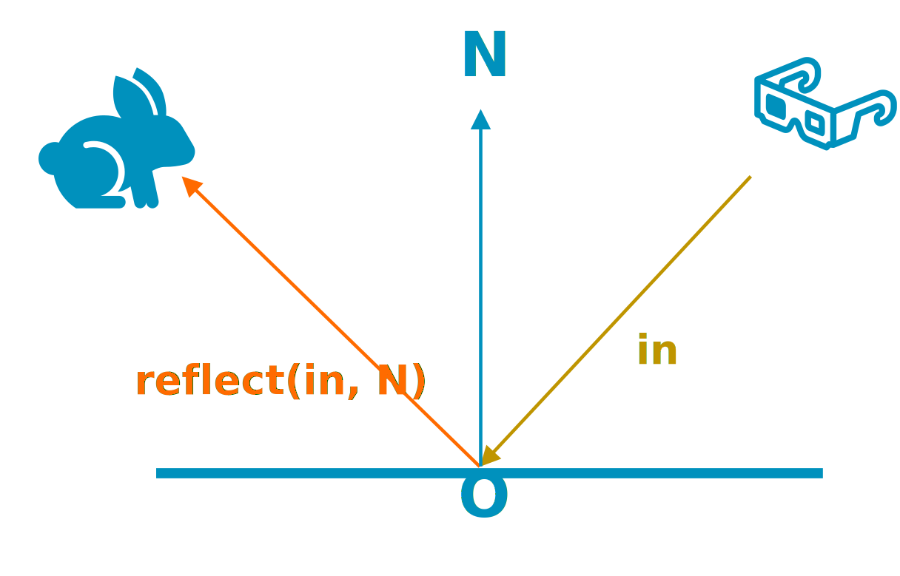

## Reflections

Illuminating and lighting a scene is a complex topic. When a light hits an object, part of that light is reflected; this is known as specular reflection.


   
   
   
   
   
   


The direction of the reflected ray depends on the surface and the direction of the incident ray. It is easy to compute as GLSL already offers the built-in function `reflect` to compute it.



As you can see, reflections are ideal for ray tracing. Other traditional techniques that do not implement ray tracing to simulate this ray in multiple ways, but they produce small artifacts. For example, most games use Screen Space Reflections (SSR).

It is common to find corner cases and bugs on Screen Space Reflection at the same time. This technique is more difficult to implement, requiring more magic numbers. The main limitation of Screen Space Reflections is that they depend on the G-buffer information, so occluded objects and objects outside the view frustum cannot be reflected, causing visible artifacts that are common in current games.


  
  
  
  
  
  
  
  


### Generating Reflection rays from the G-buffer

In this demo, there is a raster pass to compute the G-buffer, so you are already saving all the information you need to compute your reflection rays when producing the G-buffer. The first step is just to read this information from the G-Buffer, and use the normal, position and roughness to generate the reflection ray that you will launch.

``` glsl
vec3 get_g_buffer_depth(ivec2 depth_coord_texel)
{
    float depth = texelFetch(depth_sampler, depth_coord_texel, 0).r;
}

vec3 get_g_buffer_world_pos(ivec2 depth_coord_texel, float depth)
{
    vec2 depth_coord_uv = (vec2(depth_coord_texel) + vec2(0.5)) / vec2(texture_size);
    const vec4 clip = vec4(depth_coord_uv * 2.0 - 1.0, depth, 1.0);
    const vec4 world_w = reflections_uniform.inv_view_proj * clip;
    return world_w.xyz / world_w.w;
}

vec3 get_g_buffer_normal(vec2 g_buffer_uv)
{
    const vec4 normal = texture(normals_sampler, vec2 g_buffer_uv);
    // Map normals back to their original space ([0, 1] to [-1, 1])
    return normalize(normals.xyz * 2.0 - 1.0);
}

vec4 get_g_buffer_material_properties(vec2 g_buffer_uv)
{
    return texture(material_properties_sampler, vec2 g_buffer_uv);
}

bool get_material_is_reflective(vec4 material_properties)
{
    return material_properties.r > 0.0;
}

bool get_material_roughness(vec4 material_properties)
{
    return material_properties.b > 0.0;
}

vec4 main()
{
    o_color = vec4(0);
    // Get some data from the G-buffer
    vec2 g_buffer_uv = vec2(gl_FragCoord.xy) / current_resolution;

    ivec2 texture_size = textureSize(depth_sampler, 0);
    ivec2 depth_coord_texel = ivec2(g_buffer_uv * texture_size);
    float depth = get_g_buffer_depth(depth_coord_texel);
    if (depth <= 0)
        return;

    const vec3 pos = get_g_buffer_world_pos(g_buffer_uv);
    const vec4 material_properties = get_g_buffer_material_properties(g_buffer_uv);
    const vec3 normal = get_g_buffer_normal(g_buffer_uv);
    const bool is_reflective = get_material_is_reflective(material_properties);

    const vec3 incident_dir = normalize(pos - camera_position);
    const vec3 ray_dir = reflect(incident_dir, normal);
}
```

### Trace our reflection rays

Once you have created your rays, you can trace them, either using the ray tracing pipeline or ray query. As explained previously in [the ray traversal section](../rt03_ray_traversal), it is recommend using Ray Query from a `Fragment` shader.

``` glsl
bool trace_ray(vec3 ray_orig, vec3 ray_dir, rayQueryEXT rayQuery, uint flags, uint cull_mask, float ray_t_min, float ray_t_max)
{
    rayQueryInitializeEXT(rayQuery, top_level_acceleration_structure, flags, cull_mask, ray_origin, ray_t_min, ray_direction, ray_t_max);

    // The geometry is opaque so you do not need to check the return value
    rayQueryProceedEXT(rayQuery);

    const bool committed_intersection = true;
    return rayQueryGetIntersectionTypeEXT(rayQuery, committed_intersection) != gl_RayQueryCommittedIntersectionNoneEXT;
}

bool trace_ray(vec3 ray_orig, vec3 ray_dir, rayQueryEXT rayQuery)
{
    uint flags = gl_RayFlagsCullNoOpaqueEXT | gl_RayFlagsSkipAABBEXT;
    uint cull_mask = 0xFF;

    float ray_t_min = 0.001;        // Will reject candidates if the distance is less. Useful to avoid self-intersection.
    float ray_t_max = 1e24;         // Will reject candidates if the distance is greater. Useful for point lights with a radius.
    return trace_ray(ray_orig, ray_dir, rayQuery, flags, cull_mask, ray_t_min, ray_t_max);
}

void launch_reflection_ray(vec3 ray_orig, vec3 incident_dir, vec3 normal)
{
    const vec3 ray_dir = reflect(incident_dir, normal);
    rayQueryEXT rayQuery;
    trace_ray(ray_orig, ray_dir, rayQuery);
}

vec4 main()
{
    o_color = vec4(0);
    // Get some data from the G-buffer
    vec2 g_buffer_uv = vec2(gl_FragCoord.xy) / current_resolution;

    ivec2 texture_size = textureSize(depth_sampler, 0);
    ivec2 depth_coord_texel = ivec2(g_buffer_uv * texture_size);
    float depth = get_g_buffer_depth(depth_coord_texel);
    if (depth <= 0)
        return;

    const vec3 pos = get_g_buffer_world_pos(g_buffer_uv);
    const vec4 material_properties = get_g_buffer_material_properties(g_buffer_uv);
    const vec3 normal = get_g_buffer_normal(g_buffer_uv);
    const bool is_reflective = get_material_is_reflective(material_properties);

    // Reflection ray
    bool is_valid_ray = is_reflective;
    if (is_valid_ray)
    {
        const vec3 incident_dir = normalize(pos - camera_position);
        launch_reflection_ray(pos, incident_dir, normal);
    }
}
```

### Solving reflections hits

If the ray hits a valid object, you need to retrieve some material information to illuminate the hit. In the [bindless material section](../rt05_bindless) it was demonstrated that obtaining this information is easy thanks to descriptor indexing, which allows you to access the material information necessary to illuminate the ray. If the ray fails to hit anything, you can sample the environment map of the skybox to reflect the sky.

``` glsl
void obtain_rq_hit_data(rayQueryEXT rayQuery, out vec4 hit_material_properties, out vec3 hit_pos, out vec3 hit_normal, out vec2 hit_uv, out uint material_id)
{
    // Resolve committed hit
    const bool committed_intersection = true;
    vec2 barycentrics = rayQueryGetIntersectionBarycentricsEXT(rayQuery, committed_intersection);
    uint custom_instance_id = rayQueryGetIntersectionInstanceCustomIndexEXT(rayQuery, committed_intersection);
    uint geometry_id = rayQueryGetIntersectionGeometryIndexEXT(rayQuery, committed_intersection);
    uint primitive_id = rayQueryGetIntersectionPrimitiveIndexEXT(rayQuery, committed_intersection);

    uint bindless_key = bindless_keys.per_geometry[geometry_global_index];

    // Use descriptor indexing to resolve materials
    // See bindless for more information
    uint texture_mip = 0;
    hit_uv = get_intersection_uv(bindless_key, barycentrics, primitive_id);
    uint mesh_id = (bindless_key >> 8) & 0xFFF;
    material_id = bindless_key & 0xFF;
    hit_material_properties = get_bindless_material_properties(material_id, hit_uv, texture_mip);
    hit_normal = get_bindless_normal(material_id, mesh_id, primitive_id, hit_uv, texture_mip);
    hit_pos = get_bindless_position(material_id, mesh_id, primitive_id);
    vec4 hit_emissive = get_bindless_emissive_color(material_id, hit_uv, texture_mip);
    vec4 hit_base_color = get_bindless_base_color(material_id, hit_uv, texture_mip);

    illuminated_hit_color = get_pbr_color(hit_pos, hit_normal, ray_orig, hit_base_color, hit_emissive, hit_material_properties);
}

void illuminate_hit_data(vec4 hit_material_properties, vec3 hit_pos, vec3 hit_normal, vec2 hit_uv, uint material_id, out vec4 illuminated_hit_color)
{
    uint texture_mip = 0;
    vec4 hit_emissive = get_bindless_emissive_color(material_id, hit_uv, texture_mip);
    vec4 hit_base_color = get_bindless_base_color(material_id, hit_uv, texture_mip);

    illuminated_hit_color = get_pbr_color(hit_pos, hit_normal, ray_orig, hit_base_color, hit_emissive, hit_material_properties);
}

void process_reflection_rq_hit(rayQueryEXT rayQuery, out vec4 illuminated_hit_color)
{
    vec2 hit_uv;
    uint material_id;
    vec4 hit_material_properties;
    vec3 hit_pos;
    vec3 hit_normal;
    obtain_rq_hit_data(rayQuery, hit_material_properties, hit_pos, hit_normal, hit_uv, material_id);
    illuminate_hit_data(hit_material_properties, hit_pos, hit_normal, hit_uv, material_id, illuminated_hit_color);
}

void launch_reflection_ray(vec3 ray_orig, vec3 incident_dir, vec3 normal, out vec4 reflection_color)
{
    const vec3 ray_dir = reflect(incident_dir, normal);
    rayQueryEXT rayQuery;
    bool valid_hit = trace_ray(ray_orig, ray_dir, rayQuery);
    if (valid_hit)
    {
        // Illuminate hit using PBR
        process_reflection_rq_hit(rayQuery, reflection_color);
    }
    else
    {
        // Ray miss: Sample the sky
        reflection_color.rgb = textureLod(environment_map, ray_dir, 0).rgb;
        reflection_color.a = 1.0;
    }
}

vec4 main()
{
    o_color = vec4(0);
    // Retrieve some data from the G-buffer
    vec2 g_buffer_uv = vec2(gl_FragCoord.xy) / current_resolution;

    ivec2 texture_size = textureSize(depth_sampler, 0);
    ivec2 depth_coord_texel = ivec2(g_buffer_uv * texture_size);
    float depth = get_g_buffer_depth(depth_coord_texel);
    if (depth <= 0)
        return;

    const vec3 pos = get_g_buffer_world_pos(g_buffer_uv);
    const vec4 material_properties = get_g_buffer_material_properties(g_buffer_uv);
    const vec3 normal = get_g_buffer_normal(g_buffer_uv);
    const bool is_reflective = get_material_is_reflective(material_properties);

    bool is_valid_ray = is_reflective;
    // Reflection ray
    if (is_valid_ray)
    {
        const vec3 incident_dir = normalize(pos - camera_position);
        vec4 reflection_color = vec4(0);
        launch_reflection_ray(pos, incident_dir, normal, reflection_color);

        o_color += reflection_color;
    }
}
```

### Glossy and Rough reflections

When creating rays, you can use the roughness to decide how many reflection rays you need to launch.

When one thinks of reflections, one usually thinks of mirror-like reflections, however non-mirror objects also reflect part of their incident light producing glossy or rough reflections. In a PBR render, you can use the material roughness to decide the reflected light dispersion. A roughness of 0 indicates that the material is a mirror, so you will need a single ray to solve it. On the other hand, objects with a higher roughness will reflect the incident ray in multiple directions, producing rough reflections. A render will need to launch multiple rays to solve the color of rough reflections.

``` glsl
vec4 main()
{
    o_color = vec4(0);
    // Retrieve some data from the G-buffer
    vec2 g_buffer_uv = vec2(gl_FragCoord.xy) / current_resolution;

    ivec2 texture_size = textureSize(depth_sampler, 0);
    ivec2 depth_coord_texel = ivec2(g_buffer_uv * texture_size);
    float depth = get_g_buffer_depth(depth_coord_texel);
    if (depth <= 0)
        return;

    const vec3 pos = get_g_buffer_world_pos(g_buffer_uv);
    const vec4 material_properties = get_g_buffer_material_properties(g_buffer_uv);
    const vec3 normal = get_g_buffer_normal(g_buffer_uv);
    const bool is_reflective = get_material_is_reflective(material_properties);
    const float roughness = get_material_roughness(material_properties);

    // Reflection ray
    const int MAX_REFLECTIONS_SAMPLES = 1;
    bool is_valid_ray = is_reflective;
    if (is_valid_ray)
    {
        const bool is_mirror_reflections = MAX_REFLECTIONS_SAMPLES <= 1 || roughness < 0.001;

        const vec3 incident_dir = normalize(pos - camera_position);
        vec4 reflection_color = vec4(0);
        if (is_mirror_reflections)
        {
            launch_reflection_ray(pos, incident_dir, normal, reflection_color);
        }
        else
        {
            for (uint i = 0; i < MAX_REFLECTIONS_SAMPLES; i++)
            {
                vec2 epsilon = get_blue_noise(i);
                vec4 ggx_sampled_half = get_ggx_sampled_half(roughness, epsilon, normal);

                launch_reflection_ray(pos, incident_dir, ggx_sampled_half, reflection_color);
            }
            reflection_color /= float(MAX_REFLECTIONS_SAMPLES);
        }
        o_color += reflection_color;
    }
}
```

Launching multiple rays can be expensive, so it is better to limit the number of rays in your shaders. At the same time, rough reflections will launch rays with more divergence, being more expensive than pure mirror reflections. It is more efficient to traverse the acceleration structure if all rays in the same warp follow a similar path, so try to minimize ray divergence. If you want glossy and rough reflections, you might need to add a denoising pass to deal with the noise. This further increases the cost of reflections. Do consider the performance impact before adding non-mirror reflections.


  
  
  
  
  
  


### Reflections with multiple bounces

In the real world, ray lights usually have multiple bounces. You can simulate this behavior by launching additional reflection rays if you hit a reflective surface. However, this will be expensive, and you should evaluate to see if the extra complexity is worth it.


  
  
  
  
  
  
  


``` glsl
void process_reflection_rq_hit(rayQueryEXT rayQuery, out vec4 illuminated_hit_color, out vec4 hit_material_properties, out vec3 hit_pos, out vec3 hit_normal)
{
    vec2 hit_uv;
    uint material_id;
    obtain_rq_hit_data(rayQuery, hit_material_properties, hit_pos, hit_normal, hit_uv, material_id);
    illuminate_hit_data(hit_material_properties, hit_pos, hit_normal, hit_uv, material_id, illuminated_hit_color);
}

void launch_reflection_ray(vec3 ray_orig, vec3 incident_dir, vec3 normal, out vec4 reflection_color, out vec4 hit_material_properties, out vec3 hit_pos, out vec3 hit_normal, out bool valid_hit)
{
    const vec3 ray_dir = reflect(incident_dir, normal);
    rayQueryEXT rayQuery;
    valid_hit = trace_ray(ray_orig, ray_dir, rayQuery);
    if (valid_hit)
    {
        // Illuminate hit using PBR
        process_reflection_rq_hit(rayQuery, reflection_color, hit_material_properties, hit_pos, hit_normal);
    }
    else
    {
        // Ray miss: Sample the sky
        reflection_color.rgb = textureLod(environment_map, ray_dir, 0).rgb;
        reflection_color.a = 1.0;
    }
}

vec4 main()
{
    o_color = vec4(0);
    // Retrieve some data from the G-buffer
    vec2 g_buffer_uv = vec2(gl_FragCoord.xy) / current_resolution;

    ivec2 texture_size = textureSize(depth_sampler, 0);
    ivec2 depth_coord_texel = ivec2(g_buffer_uv * texture_size);
    float depth = get_g_buffer_depth(depth_coord_texel);
    if (depth <= 0)
        return;

    const vec3 pos = get_g_buffer_world_pos(g_buffer_uv);
    const vec4 material_properties = get_g_buffer_material_properties(g_buffer_uv);
    const vec3 normal = get_g_buffer_normal(g_buffer_uv);
    const bool is_reflective = get_material_is_reflective(material_properties);
    const float roughness = get_material_roughness(material_properties);

    const int MAX_REFLECTIONS_SAMPLES = 1;
    const int MAX_BOUNCES = 1;

    int remaining_ray_bounces = MAX_BOUNCES;

    bool is_valid_ray = remaining_ray_bounces > 0 && is_reflective;

    vec3 current_pos = pos;
    vec3 prev_pos = camera_pos;
    vec3 current_normal = normal;
    float current_roughness = roughness;

    // Reflection ray
    while (is_valid_ray)
    {
        const vec3 incident_dir = normalize(current_pos - prev_pos);
        vec4 reflection_color = vec4(0);
        vec4 hit_material_properties = vec4(0);
        vec3 hit_pos = vec3(0);
        vec3 hit_normal = vec3(0);

        const bool is_mirror_reflections = MAX_REFLECTIONS_SAMPLES <= 1 || current_roughness < 0.001;
        if (is_mirror_reflections)
        {
            launch_reflection_ray(current_pos, incident_dir, current_normal, reflection_color, hit_material_properties, hit_pos, hit_normal, is_valid_hit);
        }
        else
        {
            for (uint i = 0; i < MAX_REFLECTIONS_SAMPLES; i++)
            {
                vec2 epsilon = get_blue_noise(i);
                vec4 ggx_sampled_half = get_ggx_sampled_half(current_roughness, epsilon, current_normal);

                // Only allow bounces in last ray
                launch_reflection_ray(current_pos, incident_dir, ggx_sampled_half, reflection_color, hit_material_properties, hit_pos, hit_normal, is_valid_hit);
            }
            reflection_color /= float(MAX_REFLECTIONS_SAMPLES);
        }
        o_color += reflection_color;

        prev_pos = current_pos;
        current_pos = hit_pos;
        current_normal = hit_normal;
        current_roughness = get_material_roughness(hit_material_properties);
        is_reflective = get_material_is_reflective(hit_material_properties);
        remaining_ray_bounces -= 1;
        is_valid_ray = is_valid_ray && remaining_ray_bounces > 0 && is_reflective;
    }
}
```

Finally, you can see how your reflection algorithm looks:

