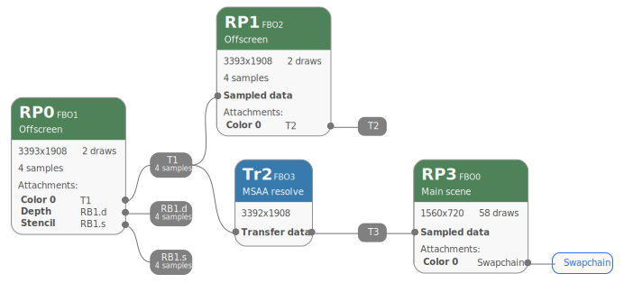

## Finding GPU-heavy parts of your application

Your first step is to identify which parts of your application are limited by GPU performance.

[Arm Streamline](https://developer.arm.com/Tools%20and%20Software/Streamline%20Performance%20Analyzer) is a good place to start. This is included as another part of Arm Performance Studio.

### Setting up Streamline

Before starting a capture in Streamline, you'll need to ask it to gather GPU data. This is done in the Configure Capture section of the Start view.

If you have an Arm GPU, basic configuration is simple:
- Deselect the “Use advanced mode” checkbox.
- Select the “Capture Arm GPU” checkbox.

If you have some other GPU, or want more control over the data collected, you'll need to select GPU counters manually:
- Select the “Use advanced mode” checkbox.
- Click the “Select counters” button to open the Counters window.
- Inside the Counters window, select the counters you wish to analyze. (The Arm website has [details of counters available on Arm GPUs](https://developer.arm.com/documentation#numberOfResults=48&q=Performance%20Counters&sort=relevancy&f:@navigationhierarchiesproducts=[IP%20Products,Graphics%20and%20Multimedia%20Processors,Mali%20GPUs]).)
- Close the Counters window.

For more details, refer to the [“Get Started with Streamline” tutorial](https://developer.arm.com/documentation/102477/0900/Overview), or [“Starting a capture”](https://developer.arm.com/documentation/101816/0905/Capture-a-Streamline-profile/Starting-a-capture) in the Arm Streamline user guide.

### Capturing GPU data in Streamline

Once you have chosen GPU counters, click the “Start capture” button to begin your capture.

Streamline will produce a graph showing the most GPU-heavy parts of your application (see [“Timeline overview”](https://developer.arm.com/documentation/101816/0905/Analyze-your-capture/Timeline-overview?lang=en) in the Arm Streamline user guide).

## Capturing a render graph

Now that you have identified areas of your application that you want to optimize, you can turn from Streamline to Frame Advisor.

To ask Frame Advisor to capture data relating to the problem areas you have seen:

- Click “Capture new trace” in Frame Advisor's launch screen
- Connect to your application
- In the Capture screen, select the number of frames you wish to capture
- When you've reached the GPU-heavy part of the application run, click “Capture”, then “Analyze” to advance to the Analysis screen

For more details, refer to [the “Frame Advisor” section](../../ams/fa) of “Get started with Arm Performance Studio for mobile”.

## Viewing the render graph

Observe that part of the Frame Advisor window is labelled “Render Graph”. This contains the render graph relating to the frames you asked Frame Advisor to analyze.

For the purpose of this Learning Path, we will assume that you've captured the following render graph:

In the next section, we will use this graph to illustrate some common application faults.
