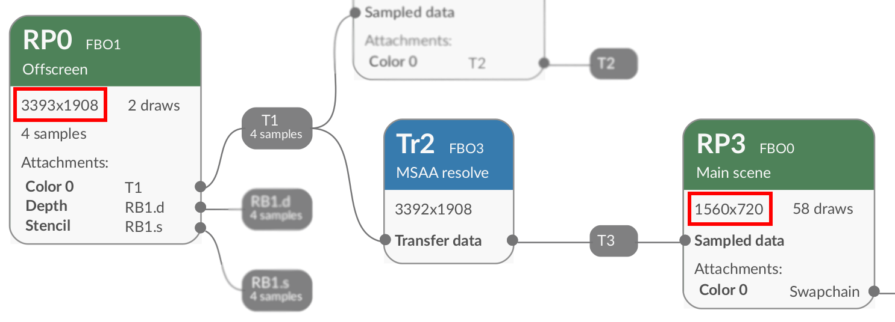

## Problem

Some textures used in your application may be unnecessarily large.

Frame Advisor provides an easy way to detect this situation. It shows the resolution of the image being rendered in each execution node.

There is an example of this in the render graph we looked at in a previous section:

This graph shows three execution nodes, through which data flows from left to right. These are:

- Render Pass 0 (`RP0`)
- Transfer node 2 (`Tr2`), discussed in the next section
- Render Pass 3 (`RP3`)

The resolution given in the top left-hand corner of the execution nodes reduces from 3393×1908 (`RP0`) to 1560×720 (`RP3`). The pixels discarded at each step represent wasted bandwidth and power.

## Solution

Make the computation shown in the graph produce the smaller final texture from smaller input textures. In this example, try to reduce the resolution of the inputs to Render Pass 0 (`RP0`).

