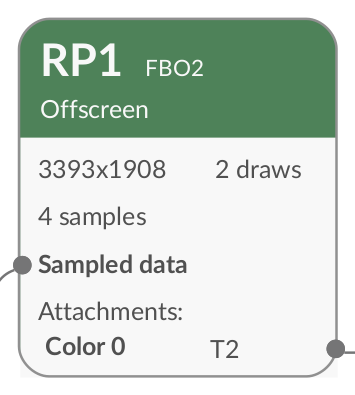
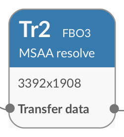
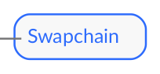
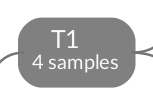
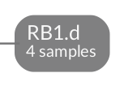

## Components of a render graph

Here's the graph from the previous section:

At a basic level, render graphs consist of _boxes_ and _arrows_:

* Boxes, formally called _nodes_, represent rendering operations and resources. Nodes for rendering operations are formally called  _execution nodes_.
* Arrows, formally called _edges_, show the movement of data between rendering operations.

Render graphs describe rendering performed by the GPU while it is constructing a single frame. This rendering starts and ends with resources. As a result of graphs being read from left to right:
- The leftmost nodes represent the rendering of input resources, such as one or more textures.
- The rightmost nodes represent the final outputs of the rendering.

{}
To keep the graph as simple as possible, Frame Advisor omits read-only resources.
{}

In an efficiently-generated frame, all workloads and generated resources contribute to the creation of the final [swapchain](https://en.wikipedia.org/wiki/Swap_chain) output image shown on the right of the diagram. Notice in the graph above that the swapchain is shown in a different color.

In a suboptimally-generated frame, there may be other outputs which are not sent to the swapchain and consequently are not shown to a user. These represent unwanted data movement.

## Graph nodes in detail

Take a closer look at what can be represented in a node on the render graph.

### Render passes

Most of the execution nodes in the sample graph above are colored green and labeled “RP…” These are [render passes](https://developer.arm.com/documentation/102479/0100/How-Render-Passes-Work).

Render passes transform sets of input images into sets of output images using a rendering pipeline. The way this is declared varies across APIs. In OpenGL ES, [a number of different API calls](https://developer.arm.com/documentation/102479/0100/How-Render-Passes-Work/Render-Passes-in-OpenGL) can indicate the boundaries of a render pass. In Vulkan, [render passes are declared explicitly](https://docs.vulkan.org/spec/latest/chapters/renderpass.html).

Within each execution node representing a render pass, Frame Advisor gives information such as:

- The resolution of the texture being rendered
- A list of the attachments provided to the render pass and the name of each of these attachments.
- The number of API draw calls within the render pass.

{}
When you click an execution node, such as a render pass, Frame Advisor navigates to the associated API call.
{}

### Other types of execution node

The graph also shows a transfer node, colored blue, and labeled ”Tr…”.

Transfer nodes represent data movement between resource locations in memory. 

You may also see other types of execution node. For example, you may see compute nodes if your application uses compute shaders.

### Resource nodes

Resource nodes show inputs and outputs of the execution nodes. They are shown as small grey rectangles with rounded edges.

There are different types of resource node:

- The swapchain: this represents the output of the computation. There is one swapchain on every graph. 
- [Textures](https://www.khronos.org/opengl/wiki/Texture): these are marked with a leading letter `T`. 
- [Render buffers](https://www.khronos.org/opengl/wiki/Renderbuffer_Object): Like textures, these represent images. The title of render buffer nodes begins with letters `RB`. The title ends with a code indicating the class of render buffer – for example, `.s` for stencil and `.d` for depth.  

The original render graph also contains a render buffer node representing a stencil.

