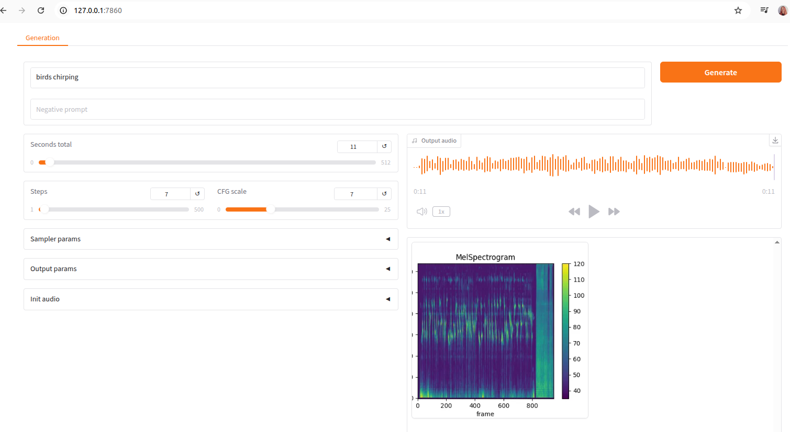

## Stable Audio Open Model 

Stable Audio Open is an open-source model optimized for generating short audio samples, sound effects, and production elements using text prompts.

Download the model weights from [HuggingFace](https://huggingface.co/stabilityai/stable-audio-open-1.0/tree/main)
TODO - point to new location on huggingFace stable-audio-open-2.0 when available.

## Test the model output

Training and inference code for audio generation models can be accessed [here](https://github.com/Stability-AI/stable-audio-tools)

To test out trained model, you can clone the stable audio tools repository and install from source:

TODO: check if this page is still needed and useful, if not it will be deleted and weights updated for other pages to keep ordering.

```bash
git clone https://github.com/Stability-AI/stable-audio-tools

cd stable-audio-tools/

pip install -e .

```

You can now run the basic Gradio interface to test out the model:
```bash

python3 ./run_gradio.py --model-config sao_small_distilled_1_0_config.json --ckpt-path sao_small_distilled_1_0.ckpt

```

{}
PyTorch 2.0 or later is required for Flash Attention support. This can be installed as follows:
```bash
pip install torch safetensors huggingface_hub numpy gradio torchaudio einops \
matplotlib k_diffusion pytorch_lightning einops_exts wheel flash_attn \
alias_free_torch transformers

```
{}


Once model is successfully loaded, a local URL is listed in the script output:

```
Loading model checkpoint from ../sao_small_distilled_1_0.ckpt
Done loading model
* Running on local URL:  http://127.0.0.1:7860

```
This can be used to test out the model, navigate to [http://127.0.0.1:7860](http://127.0.0.1:7860)

and generate using:

Steps = 7, CFG scale = 1



{}
Here are a few ways to structure a text prompt for your audio file.
A prompt can include mustical parameters:
* music genre and subgenre
* musical elements - texture, rhythm and articulation
* musical atmosphere - mood and emotion
* tempo using beats per minute (BPM)

The order of prompt parameters matters, for more information check [prompt structure user guide](https://stableaudio.com/user-guide/prompt-structure)
{}


