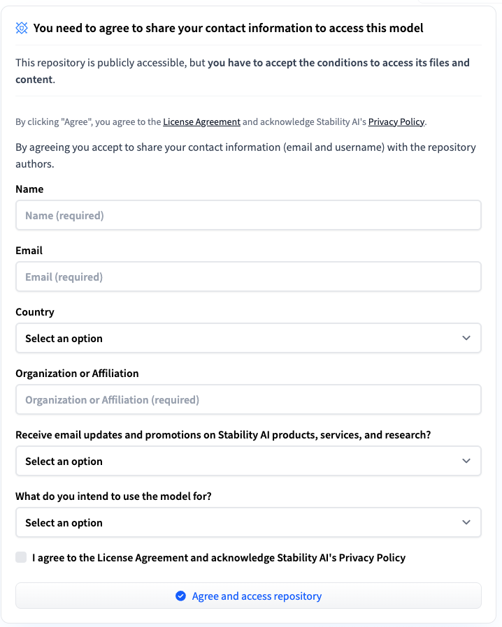

## Download the model

Stable Audio Open is an open-source model optimized for generating short audio samples, sound effects, and production elements using text prompts.

[Log in](https://huggingface.co/login) to HuggingFace and navigate to the model landing page:

```bash
https://huggingface.co/stabilityai/stable-audio-open-small
```

You may need to fill out a form with your contact information to use the model:



Download and copy the configuration file `model_config.json` and the model itself, `model.ckpt`, to your workspace directory, and verify they exist by running the command:

```bash
ls $WORKSPACE/model_config.json $WORKSPACE/model.ckpt
```

## Test the model

To test the model, use the Stable Audio demo site, which lets you experiment directly through a web-based interface:

```bash
https://stableaudio.com/
```

Use the UI to enter a prompt. A good prompt can include:

* Music genre and subgenre.
* Musical elements (texture, rhythm and articulation).
* Musical atmosphere (mood and emotion).
* Tempo, using beats per minute (BPM).

The order of prompt parameters matters. For more information, see the [Prompt structure user guide](https://stableaudio.com/user-guide/prompt-structure).

You can explore training and inference code for audio generation models in the [Stable Audio Tools repository](https://github.com/Stability-AI/stable-audio-tools).

Now that you've downloaded and tested the model, continue to the next section to convert the model to LiteRT.

