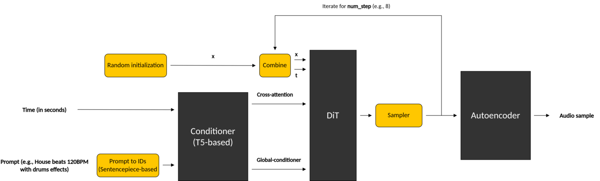

In this section, you will learn about the audio generation model. You will then clone a repository that contains the scripts required to convert the model submodules into LiteRT format and generate the inference application.

## Stable Audio Open Small

The open-source model consists of three main submodules. They are described in the table below, and come together through the pipeline shown in the image.

|Submodule|Description|
|------|------|
|Conditioners| Includes a T5-based text encoder for the input prompt and a numerical duration encoder. These components convert the inputs into embeddings passed to the DiT model. |
|Diffusion Transformer (DiT)| Denoises random noise over multiple steps to produce structured latent audio, guided by conditioner embeddings. |
|AutoEncoder| Compresses audio waveforms into a latent representation for processing by the DiT model, and decompresses the output back into audio. |




In this section, you will explore two different conversion routes, to convert the submodules to [LiteRT](https://ai.google.dev/edge/litert) format. Both methods will be run using Python wrapper scripts from the examples repository.

1. **ONNX to LiteRT**: using the `onnx2tf` tool. This is the traditional two-step approach (PyTorch -> ONNX -> LiteRT). You will use it to convert the Conditioners submodule.

2. **PyTorch to LiteRT**: using the [Google AI Edge Torch](https://developers.googleblog.com/en/ai-edge-torch-high-performance-inference-of-pytorch-models-on-mobile-devices/) tool. You will use this tool to convert the DiT and AutoEncoder submodules.


## Create a virtual environment

To avoid dependency issues, create a virtual environment. For example, you can use the following command:

```bash
cd $WORKSPACE
python3.10 -m venv .venv
source .venv/bin/activate
export PYTHON_BIN_PATH=$WORKSPACE/.venv/bin/python3
export PYTHON_LIB_PATH=$WORKSPACE/.venv/lib/python3.10/site-packages
```

## Clone the examples repository

```bash
cd $WORKSPACE
git clone https://github.com/ARM-software/ML-examples.git
cd ML-examples/kleidiai-examples/audiogen/
```

## Install the required dependencies

```bash
bash install_requirements.sh
```

{}

If you are using GPU on your machine, you may notice the following error:
```text
Traceback (most recent call last):
  File "$WORKSPACE/.venv/lib/python3.10/site-packages/torch/_inductor/runtime/hints.py",
  line 46, in <module> from triton.backends.compiler import AttrsDescriptor
ImportError: cannot import name 'AttrsDescriptor' from 'triton.backends.compiler'
($WORKSPACE/.venv/lib/python3.10/site-packages/triton/backends/compiler.py)
.
ImportError: cannot import name 'AttrsDescriptor' from 'triton.compiler.compiler'
($WORKSPACE/.venv/lib/python3.10/site-packages/triton/compiler/compiler.py)
```

Reinstall the following dependency:
```bash
pip install triton==3.2.0
```

{}

### Convert Conditioners Submodule

The Conditioners submodule is based on the T5Encoder model. First, convert it to ONNX, then to LiteRT.

For this conversion, the following steps are required:
1. Load the Conditioners submodule from the Stable Audio Open Small model configuration and checkpoint.
2. Export the Conditioners submodule to ONNX via *torch.onnx.export()*.
3. Convert the resulting ONNX file to LiteRT using *onnx2tf*.

You can use the provided script to convert the Conditioners submodule:

```bash
python3 ./scripts/export_conditioners.py --model_config "$WORKSPACE/model_config.json" --ckpt_path "$WORKSPACE/model.ckpt"
```


After successful conversion, you now have a `conditioners_tflite` directory containing models with different precision (e.g., float16, float32).

You will be using the float32.tflite model for on-device inference.

### Convert DiT and AutoEncoder Submodules

To convert the DiT and AutoEncoder submodules, use the [Generative API](https://github.com/google-ai-edge/ai-edge-torch/tree/main/ai_edge_torch/generative/) provided by the `ai-edge-torch` tools. This enables you to export a generative PyTorch model directly to `.tflite` using three main steps:

1. Model re-authoring.
2. Quantization.
3. Conversion.

Convert the DiT and AutoEncoder submodules using the provided Python script:

```bash
python3 ./scripts/export_dit_autoencoder.py --model_config "$WORKSPACE/model_config.json" --ckpt_path "$WORKSPACE/model.ckpt"
```

After successful conversion, you now have `dit_model.tflite` and `autoencoder_model.tflite` models in your current directory.

A more detailed explanation of the above scripts is available [here](https://github.com/ARM-software/ML-examples/blob/main/kleidiai-examples/audiogen/scripts/README.md).

For easy access, add all the required models to one directory:

```bash
export LITERT_MODELS_PATH=$WORKSPACE/litert-models
mkdir $LITERT_MODELS_PATH
cp conditioners_tflite/conditioners_float32.tflite $LITERT_MODELS_PATH
cp dit_model.tflite $LITERT_MODELS_PATH
cp autoencoder_model.tflite $LITERT_MODELS_PATH
```

With all three submodules now converted to LiteRT format, you're ready to build the runtime and run Stable Audio Open Small directly on an Android device in the next step.


