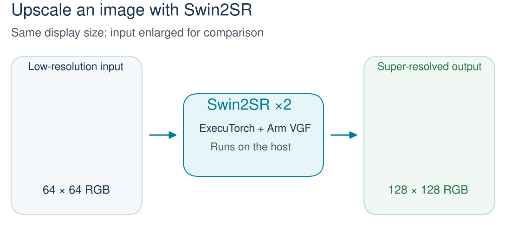

## What you'll build

You will upscale a low-resolution image using Swin2SR, a pretrained image super-resolution model. It predicts finer detail as it doubles the image's width and height.

You export the model with ExecuTorch, then run it through the Arm Vulkan Graph Format (VGF) backend. The result is a PNG image you can open and compare with a high-resolution reference.



This workflow runs on your Linux host using the Arm ML SDK's Vulkan emulation layer. It introduces the model execution flow used by Arm neural graphics; it doesn't deploy an application to a phone or measure Mali GPU performance.

## Install the example

Use a 64-bit Linux system (AArch64 or x86_64) with a working Vulkan 1.3 GPU driver. The packaged ML SDK checks for the `shaderFloat64` feature, even though you export a floating-point 32-bit model. The setup script stops if your GPU doesn't support it. Apple Silicon with MoltenVK needs a separate source-built SDK, which isn't covered here.

Have Python 3.12 with development headers and virtual environment support, Git, `curl`, `xz-utils`, a C++17 compiler, and [CMake 3.24–3.x](/install-guides/cmake/) available before continuing. On Ubuntu 24.04, the Python packages are `python3.12`, `python3.12-dev`, and `python3.12-venv`.

From a directory without an existing `executorch` folder, clone upstream ExecuTorch and select the revision containing this example. Keep the checkout folder named `executorch`; the build requires this exact name:

```bash
git clone https://github.com/pytorch/executorch.git
cd executorch
git checkout 32a86b69388b5a5208e367a96b0f5b7cb39df8e2
```

Create a Python environment and install ExecuTorch and the example's dependencies:

```bash
python3.12 -m venv .venv
source .venv/bin/activate
python -m pip install --upgrade pip
./install_executorch.sh --minimal
python -m pip install -r examples/arm/super_resolution_example_vgf/requirements.txt
```

Confirm that the installation succeeded before continuing:

```bash
python -c "import executorch.exir; from executorch.extension.pybindings import portable_lib; print('ExecuTorch is ready')"
```

Install the Arm ML SDK dependencies and activate their paths:

```bash
./examples/arm/setup.sh \
  --disable-ethos-u-deps \
  --disable-cortex-m-deps \
  --enable-mlsdk-deps
source examples/arm/arm-scratch/setup_path.sh
```

The setup script installs the Vulkan SDK and the tools that compile and execute VGF graphs. Keep this terminal open and run the remaining commands from the `executorch` directory.

## Prepare the input image

Create the example images from a screenshot included in ExecuTorch:

```bash
python examples/arm/super_resolution_example_vgf/model_export/prepare_demo_assets.py \
  --output-dir swin2sr-work
```

The script creates a 128 × 128 crop and downsizes a copy to 64 × 64. You use these two files:

| File in `swin2sr-work/runtime/` | What it is |
| --- | --- |
| `demo_lr_64.png` | Small image you give to the model |
| `demo_hr_128.png` | High-resolution reference: the original crop before downsampling |

The helper also prepares calibration and evaluation folders. You don't need them for this floating-point walkthrough.

## What you've accomplished and what's next

You have the example, its tools, and a small input image with a high-resolution reference. Next, export Swin2SR as an ExecuTorch program.
