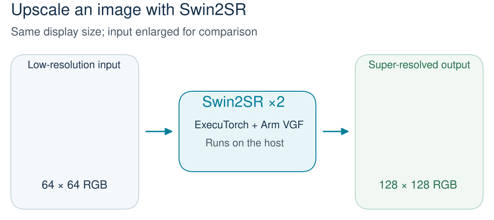

## What Swin2SR is

[Swin2SR](https://github.com/mv-lab/swin2sr) is a neural network for image super-resolution and restoration, built on the Swin Transformer V2 architecture. Super-resolution means estimating a higher-resolution image from a lower-resolution input. The model uses patterns learned during training to reconstruct details such as edges and textures.

The Swin2SR transformer processes image features in small regions called windows and shifts those windows between layers to share information across regions. You'll use a pretrained model, so that you can run it without training it yourself.

## What you'll build

You'll use the ×2 version of Swin2SR to turn a 64 × 64 image into a 128 × 128 image. It doubles the width and height, predicting finer detail. These predictions can differ from the original image, which is why you compare the result with a high-resolution reference.

You'll export the model with ExecuTorch to create a `.pte` program, then build a host runner to execute it through the Arm Vulkan Graph Format (VGF) backend. An image helper connects your input image to the runner and saves the result as a PNG. You then check its dimensions and compare it with a high-resolution reference.



You'll run the workflow on your Linux host using the Arm ML SDK's Vulkan emulation layer. The emulation layer introduces the model execution flow used by Arm neural graphics. It doesn't deploy an application to a phone or measure Mali GPU performance.

## Prepare the Linux host

Use a 64-bit Linux system (AArch64 or x86_64) with a working Vulkan 1.3 GPU driver. The packaged ML SDK checks for the `shaderFloat64` feature, even though you'll export a floating-point 32-bit model. The setup script stops if your GPU doesn't support it. Apple silicon with MoltenVK needs a separate source-built SDK.

On Ubuntu 24.04, install Python 3.12, the build tools, and the Vulkan development files:

```bash
sudo apt-get update
sudo apt-get install -y \
  ca-certificates curl git build-essential pkg-config \
  python3.12 python3.12-venv python3.12-dev \
  libvulkan1 libvulkan-dev vulkan-tools unzip xz-utils
```

## Get the ExecuTorch release

Use [ExecuTorch 1.5.1](https://github.com/pytorch/executorch/releases/tag/v1.5.1) for both the Python package and native source. From a path without spaces or an existing `executorch` folder, clone the matching release. Keep the checkout folder named `executorch` as the build requires this exact name:

```bash
git clone --branch v1.5.1 --single-branch --depth 1 \
  https://github.com/pytorch/executorch.git executorch
cd executorch
test "$(git rev-parse HEAD)" = 3b60683923245cf472b7323426920e15623ba361
git submodule sync --recursive
git submodule update --init --recursive
```

The `test` command checks that the checkout matches the expected commit. Success produces no output. The recursive submodule commands synchronize and download the source dependencies, including nested submodules.

Run the remaining commands from this repository root, in the same terminal.

## Configure the Arm ML SDK

Create a fresh Python environment to keep this example's packages separate from your system Python. Activate the environment so that subsequent `python` and `pip` commands use it:

```bash
python3.12 -m venv .venv
source .venv/bin/activate
python -m pip install --upgrade pip
```

Review the [ML SDK license terms](https://github.com/arm/ai-ml-sdk-for-vulkan/tree/main/LICENSES) and the Vulkan SDK terms. Use the release's setup script to install the SDK tools. `--enable-mlsdk-deps` selects the ML SDK dependencies for VGF, and `--disable-ethos-u-deps` skips the Ethos-U dependencies:

```bash
bash examples/arm/setup.sh --disable-ethos-u-deps --enable-mlsdk-deps
```

Remove three developer packages installed by setup that you don't need for the Learning Path:

```bash
python -m pip uninstall -y \
  tosa-adapter-model-explorer ai-edge-model-explorer pytest-timeout
```

## Install ExecuTorch

Install ExecuTorch and the example dependencies after SDK setup to resolve its older FlatBuffers dependency:

```bash
python -m pip install \
  --index-url https://pypi.org/simple \
  --extra-index-url https://download.pytorch.org/whl/cpu \
  'executorch[vgf]==1.5.1' \
  'torch==2.14.0+cpu' 'torchvision==0.29.0+cpu' 'torchao==0.18.0+cpu' \
  'cmake==3.31.10' 'zstd==1.5.7.2' \
  -r examples/arm/super_resolution_example_vgf/requirements.txt \
  -r backends/arm/requirements-arm-vgf-runtime.txt
python -m pip check
```

After a successful installation, `pip check` should report `No broken requirements found.` The CPU wheels are for export. The host runner still uses Vulkan.

These commands replace `install_executorch.sh`, which uses nightly and test indexes. If you rerun SDK setup, repeat the package removal and installation.

## Check the tools

Source `setup_path.sh` to make the SDK tools and libraries available in this terminal. The `--aot` check verifies the ahead-of-time export dependencies. The import check tests ExecuTorch's export module and runtime bindings, while `vulkaninfo` checks the GPU feature required by the SDK:

```bash
source examples/arm/arm-scratch/setup_path.sh
python -m executorch.backends.arm.vgf.check_env --aot
python -c "import executorch.exir; from executorch.extension.pybindings import portable_lib; print('ExecuTorch is ready')"
vulkaninfo | grep shaderFloat64
```

The output contains a snippet that's similar to:

```output
[PASS] Python version
  Python 3.12 meets the recommended VGF minimum (3.12).

[PASS] TOSA serializer
  Imported tosa_serializer from /home/ubuntu/executorch/.venv/lib/python3.12/site-packages/tosa_serializer/__init__.py (version=1.1).

[PASS] MLSDK model converter
  /home/ubuntu/executorch/.venv/bin/model-converter --version succeeded (version=0.10.0):
{
  "version": "19d1d0f",
  "dependencies": [
    "argparse=v3.1-0-g68fd027",

[PASS] MODEL_CONVERTER_LIB_DIR
  MODEL_CONVERTER_LIB_DIR is not set; relying on the process loader paths. This is OK when model-converter --version succeeds.
ExecuTorch is ready
shaderFloat64                           = true
```
Your paths might vary depending on your checkout location.

The `[PASS]` entries report successful export dependency checks. `ExecuTorch is ready` confirms that the imports succeeded. Confirm `shaderFloat64 = true` for your device, and keep this terminal open for the remaining steps.

## Prepare the input image

Create the example images from a screenshot included in ExecuTorch:

```bash
python examples/arm/super_resolution_example_vgf/model_export/prepare_demo_assets.py \
  --output-dir swin2sr-work
```

The output is similar to:

```output
Prepared demo assets under /home/ubuntu/executorch/swin2sr-work
Runtime input: /home/ubuntu/executorch/swin2sr-work/runtime/demo_lr_64.png
Runtime reference: /home/ubuntu/executorch/swin2sr-work/runtime/demo_hr_128.png
```
The paths reflect your checkout location and might vary.

The script creates a 128 × 128 crop and downsizes a copy to 64 × 64. You'll use the following files:

| File in `swin2sr-work/runtime/` | What the image is |
| --- | --- |
| `demo_lr_64.png` | Small image that you'll pass to the model |
| `demo_hr_128.png` | A high-resolution reference: the original crop before downsampling |

The helper also prepares calibration and evaluation folders that you don't need for this workflow.

## What you've accomplished and what's next

You've set up the example, its tools, and a small input image with a high-resolution reference. 

Next, you'll export Swin2SR as an ExecuTorch program.
