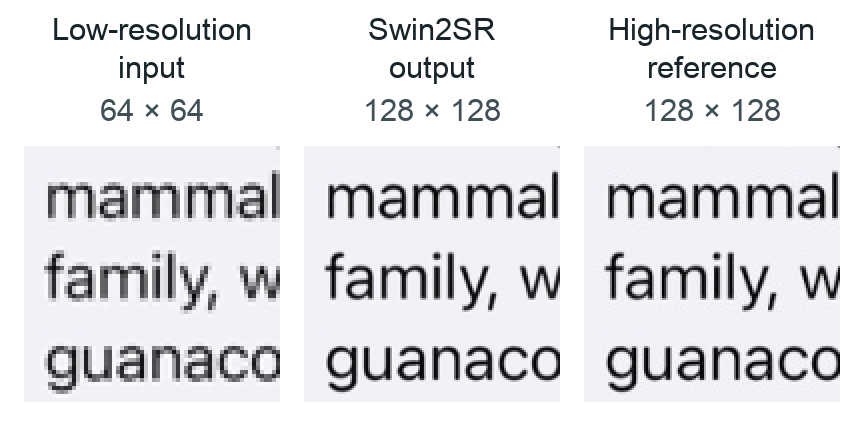

## Check the image dimensions

Confirm that the input is 64 × 64 and that the model created a 128 × 128 RGB image:

```bash
python - <<'PY'
from PIL import Image

for name in ("demo_lr_64.png", "demo_sr_128.png", "demo_hr_128.png"):
    with Image.open(f"swin2sr-work/runtime/{name}") as image:
        print(f"{name}: {image.width} x {image.height}, {image.mode}")
PY
```

The expected output is:

```output
demo_lr_64.png: 64 x 64, RGB
demo_sr_128.png: 128 x 128, RGB
demo_hr_128.png: 128 x 128, RGB
```

Twice the width and twice the height give you four times as many pixels.

## Compare the images

Open `swin2sr-work/runtime/` in your image viewer. Compare the low-resolution input, the Swin2SR output, and the high-resolution reference. Enlarge the input to the same display size so you can compare the same text and edges.

The high-resolution reference is the original 128 × 128 crop, before downsampling creates the 64 × 64 input. You keep it for comparison; the model receives only the low-resolution input.



The example output shown here comes from an earlier run with the same checkpoint and demo image. It illustrates the comparison; it isn't a new measurement on your host.

Look at the edges of the letters. The output estimates detail that was lost when the original was reduced to 64 × 64. It won't reproduce every detail of the original, and a larger image doesn't automatically mean a more accurate one.

Your end-to-end flow succeeds when the runner finishes, the generated image has the expected dimensions, and it shows the same scene without obvious corruption. This visual check doesn't establish a quality benchmark or a performance result.

## Try another image

Use another 64 × 64 RGB image with the same program. Replace `my-image.png` with its path and choose a new output name:

```bash
python examples/arm/super_resolution_example_vgf/runtime/run_super_resolution.py \
  --model-path swin2sr-work/swin2sr.pte \
  --runner swin2sr-work/build/executor_runner \
  --input-image my-image.png \
  --output-image swin2sr-work/runtime/my-image-sr.png
```

For a different input size, export a matching program first. The helper doesn't resize or tile images automatically.

## What you've accomplished

You have prepared an image, exported a pretrained Swin2SR model, run it through Arm VGF with ExecuTorch, and inspected the upscaled output. You can now repeat the same flow with your own 64 × 64 images.
