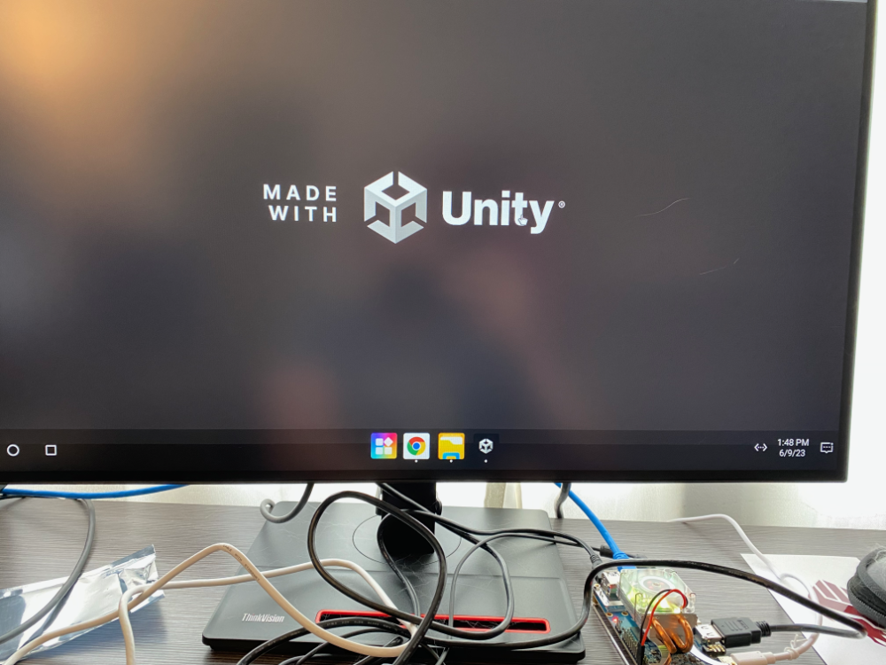

---
# User change
title: "How do I install my Unity game onto the Orange Pi 5?"

weight: 4

layout: "learningpathall"
---

In this section you will install the APK of your Unity game onto the Orange Pi 5 running Droid OS.

## How do I load my Unity game APK to the Orange Pi?

You need a way to load the APK file onto the Orange Pi, and there are several options on how you can do so. You could load it onto a USB thumb drive as long as the file systems are compatible and plug it directly into the Pi, but none of mine were so I didn't go this route. You could load the file directly onto the microSD card, again, as long as the formats are compatible.

You can load it onto a cloud drive (Dropbox in my case) and just download it using Chrome on the Orange Pi.

1. Upload the APK to a cloud drive and make the folder viewable to anyone with the link.

2. Paste the link into a [URL shortener](https://www.shorturl.at/), and then manually type the shortened URL into Chrome on the Orange Pi.

3. Download the APK (the location doesn't matter, the default Download folder is fine).

4. Open the File Manager app, go to Download, and double click the APK file.

5. You will probably be prompted that you need to turn on a developer setting in order to install unknown apps, but it should automatically pop up, so just turn it on.

6. Install when prompted.

## Have Fun!

The game will now be included alongside all the other installed apps, so just find the icon in your app drawer and click to run.

