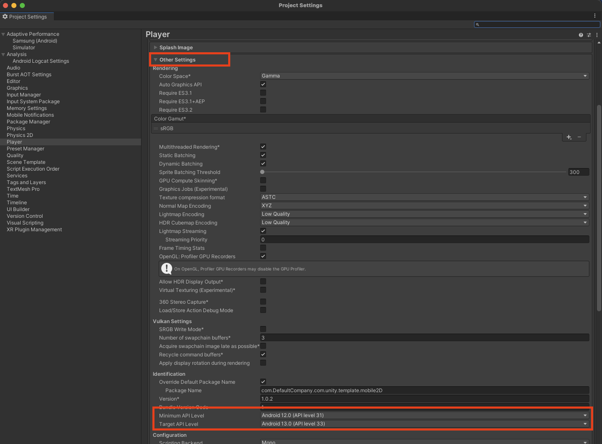

---
# User change
title: "How do I build my game in Unity to run on the Orange Pi 5"

weight: 3

layout: "learningpathall"
---

In this section you will create a build of your Unity game that can be installed and run on an Orange Pi 5 running Droid OS

## How do I adjust my Unity Build Settings?

Open up your game in Unity

1. Click on File > Build Settings.

2. Select Android if it isn't already selected(will require you to restart Unity).

    1. If you don't have the Android module installed, go to your Unity Hub.

    2. Select Installs on the left.

    3. Find the version your project is in and click the three vertical dots on the top right.

    4. Select Add Modules.

    5. Check Android Build Support. Expand the item and make sure all sub-items are checked.

3. Click the Player Settings button on the bottom left

    1. Select the Android Tab

    2. Go to Other Settings, and change the Minimum API Level and Target API level to 31 and 33 respectively (feel free to experiment with what versions work).

4. In the Build Settings window, click Build.

5. The first time you build you will get prompted to update the Android SDK. Click Yes or Okay to do so.

6. Choose a folder location to put the APK file.
