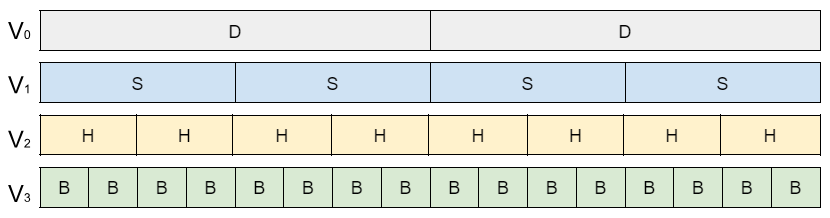

In 2021 Unity released version 1.5 of the Burst compiler. The headline feature of this version was new support for Neon intrinsics. Since then there have been various improvements in both Burst and Neon support. This learning path was written using Unity 2022.3 and [Burst 1.8.12](https://docs.unity3d.com/Packages/com.unity.burst@1.8/manual/index.html).

## Unity Burst compiler
Burst is an advanced compiler that compiles specific parts of your code. It translates .NET byte code into CPU native instructions. It is part of Unity's [DOTS (Data Oriented Technology Stack](https://unity.com/dots). Your project and code need some minimal setup in order to use the Burst compiler.

## Arm Neon SIMD

[Arm Neon](https://developer.arm.com/Architectures/Neon) is an advanced Single Instruction Multiple Data (SIMD) extension to the Arm architecture instruction set.

SIMD is a paradigm that refers to processing multiple data items using a single native CPU instruction. The process of converting code such that it uses specific SIMD instructions to process more data in parallel is called vectorization. If the conversion is done automatically by a compiler, it is called auto-vectorization.

If done manually, developers are usually free to write their SIMD code directly in the native CPU assembly language or they can choose to use function-like statements that are known to the compiler. These function-like statements are called intrinsics. The compiler is able to translate intrinsics to native CPU instructions. Used correctly they can increase the performance of your code.

## How does Arm Neon work?

Each Neon instruction processes multiple data items at once by using vector registers that are split into “lanes”. The number of lanes that fit into a vector register varies according to the size of the data that you want to use.

For example, applications compiled for the AArch64 architecture (64-bit Arm microprocessors) have access to 32 vector registers with 128-bits each. That is 16 bytes per register.

Each 128-bit register (Vn), depicted in the above diagram, shows how a vector register can be used to hold:

- 2 64-bit (or double precision) floating point or integer values

- 4 32-bit (or single precision) floating point or integer values

- 8 16-bit (or half precision) floating point or integer values

- 16 8-bit integer values

## How do we use Neon intrinsics in Unity?
Neon intrinsics have traditionally been used from C and C++ but, by using the Unity Burst compiler, you can leverage Neon intrinsics directly in your own C# scripts.

Developers can use Arm Neon in multiple ways:

- Import Neon-enabled libraries

- Burst compiler auto-vectorization

- Handwritten Neon intrinsics

You can also use a mixture of these methods, if needed.

### Using Neon by importing libraries
If you’d like to try using a Neon-supported library, an easy start would be the [Unity.Mathematics](https://docs.unity3d.com/Packages/com.unity.mathematics@1.3/manual/index.html) package from Unity. Neon-supported libraries will give you the increased speed that Neon gives on the library functions you call, without the need to write any Neon code.

### Using Neon through Burst auto-vectorization
In order to take advantage of the burst compiler, you must write your Neon code in Burst-compatible static functions or Jobs.

### Hand-written Neon code
While the Burst compiler can do a great job of using Neon, if your app needs to squeeze every ounce of performance from devices, it can be well worth the investment to learn and hand-write Neon code. We will look at doing this using Neon intrinsics.

In Unity, Neon intrinsics are available in the C# namespace [Unity.Burst.Intrinsics.Arm.Neon](https://docs.unity3d.com/Packages/com.unity.burst@1.8/api/Unity.Burst.Intrinsics.Arm.Neon.html)

Keep in mind that it is not easy to vectorize your code better than the Burst compiler. Therefore, remember to profile your application before and after Neon optimizations. If your app is showing no improvement, then the Burst compiler is likely to be producing better optimized code than your own.

## Next step

We will first look at auto-vectorization by the Burst compiler and then look at optimizing further by hand-writing Neon intrinsics. In both cases you can provide hints to the compiler to help it auto-vectorize. You can follow [best practices](/learning-paths/mobile-graphics-and-gaming/using-neon-intrinsics-to-optimize-unity-on-android/5-the-optimizations#best-practices) to organize your code and data to make them optimal for Neon.
