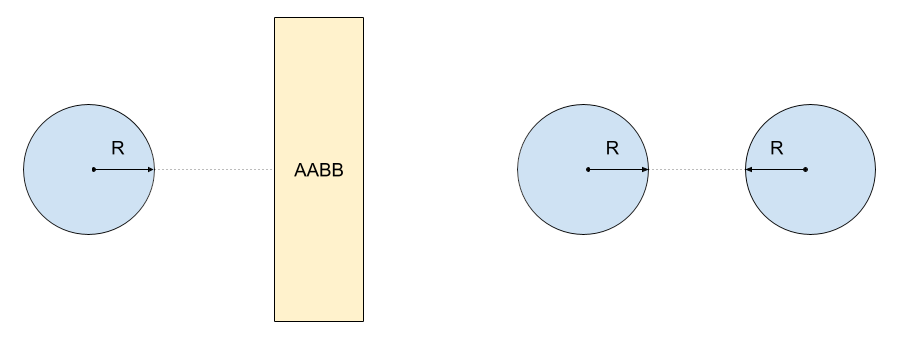

Assuming you went through the process of building and profiling the sample project on Android (as explained in [Profiling Unity Apps on Android](/learning-paths/mobile-graphics-and-gaming/profiling-unity-apps-on-android)), open Unity and the project you created.

## Quick preparation
First we need to set the project to unoptimized mode. Please edit Assets/BurstNeonCollisions/Scripts/CollisionCalculationScript.cs. Change line 66 to the following:

```
public const Mode codeMode = Mode.Plain;
```

This will set the project to unoptimized mode which we will explain first.

Note that the Neon version will not function correctly on computers without Neon support.

## The sample project
To recap from [Profiling Unity apps on Android](/learning-paths/mobile-graphics-and-gaming/profiling-unity-apps-on-android), the sample project [Optimizing Collisions with Burst and Neon Intrinsics](https://assetstore.unity.com/packages/essentials/tutorial-projects/optimizing-collisions-with-burst-and-neon-intrinsics-196303) creates a simple environment with 4 areas. Each area comprises an enclosed set of walls. Characters (modeled as capsules) walk around the arena in which they are spawned. Characters can collide with each other or with the walls. When a character collides with something, it changes direction.

### Collision detection
Walls are modeled as axis-aligned bounding boxes and simple box meshes. Collisions between characters (capsules) and walls are calculated using Axis-Aligned Bounding Box (AABB) collision detection functions (both the characters and the walls are treated as AABBs). Collisions between characters are calculated using radius-radius functions.



### Runtime modes
The sample runs in one of three modes: Plain, Burst and Neon. Plain mode uses a simple unoptimized implementation. Burst mode makes use of the auto-vectorization provided by the Burst compiler. The code and data are structured sensibly to give Burst the best chance of producing high performance code. Finally, in Neon mode, the code uses dedicated functions that contain hand-written code and calls to Neon intrinsics.

Press the Play button now to run the sample in the Unity Editor. You will see the environment gradually fill with more and more characters (capsules). Performance will degrade over time. Keep an eye on the frames per second by toggling on _Stats_ in the top right of the _Game_ window.

### The code
All of the important functions can be found in BurstNeonCalculationScript.cs. This is a Monobehaviour component. It is attached to a single game object in the scene called ScriptHolder.

The ScriptHolder object also contains four instances of SpawningScript. Each instance spawns characters at a specific point; effectively each spawner is creating characters in one of the areas. Each spawner creates 5 new characters at regular intervals until a preset maximum has been reached.

Characters are spawned at the root of the scene - these are called _person(Clone)_. They are positioned in one of the corners or in the center (of an area).

There are some incidental game objects such as _Main Camera_ and _Directional Light_ which we can ignore.

### Useful structures and components
`StaticCollisionObject` is a struct with min/max position of a collision and `Intersect(..)` function for checking collision with another StaticCollisionObject. The min/max positions are only two-dimensional as there is no variation in Y position (the ‘game’ effectively plays out in two dimensions on the XZ plane).

Note that characters are treated as StaticCollisionObjects when checking collision between characters and walls. Collision between walls is never checked because the walls never move.

`DynamicCollisionObject` is a struct for storing the position and radius of a character. It contains a function `Intersects(..)` for checking collisions with another DynamicCollisionObject (or character).

Each character is instantiated from the same prefab called _person_. The sub-object _capsule_ contains a component called _RandomMovement_ which moves the character in random directions but also contains functions for collision response.

### Scene setup code

Some code is shared between all three optimization levels. CollisionCalculationScript uses MonoBehaviour functions `Start()` and `Update()`.

`Start()` traverses all of the walls in the scene. It creates and fills arrays for the walls (which don't change) and creates arrays for data that changes every frame. There is an array for each of:

1. X positions of characters

1. Y positions of characters (note that in reality, Y actually comes from the character's Z position because characters are only moving in the XZ plane)

1. Radii of characters

1. Single array containing axis-aligned min/max values for all characters

1. Boolean array with values to denote collision between characters and walls

1. Boolean array with values to denote collision between all characters

`Start()` also builds arrays of structs StaticCollisionObject and DynamicCollisionObject.

A StaticCollisionObject exists for every wall in the game. These are the axis-aligned bounding boxes (AABB) and they are stored in an array called staticObjects.

Each character could potentially collide with up to two walls simultaneously. The code allows for up to four characters to collide at once; additional characters colliding with the same character will be ignored.

### Scene update code

`Update()` controls which version of the code runs based on the value in `codeMode`. Each optimization level has a key function that is called every frame (`DoWallsPlain`, `DoWallsBurst` and `DoWallsNeon`).

Every frame, `Update()` does some common setup via `DoSetup()`. This updates all of the dynamic positions and bounding boxes of the characters. Part of `DoSetup()` is optimized for Burst and Neon.

`Update()` then triggers the correct optimization level functions for the character-wall collision detection and then the character-character collision detection. Collision results are placed in the boolean arrays described above.

Still inside `Update()`, the `CollisionMovement()` function is called to process the reactions of the characters. For each character, the boolean arrays are processed to produce lists of characters and walls that are being collided with. The actual collision response is done from `MoveClearFromCharacters(..)` and `MoveClearFromWalls(..)` in _RandomMovement.cs_.

Some cleanup management of the temporary arrays is done and then information is displayed on the screen.

#### The update algorithm in summary:

1. Updates bounds for characters

1. Performs collision detection using Plain, Burst or Neon code

1. Processes collision responses

1. Does some cleanup (maintenance of temporary arrays)

1. Display information on screen
