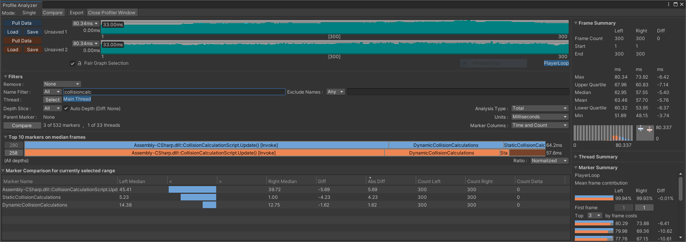
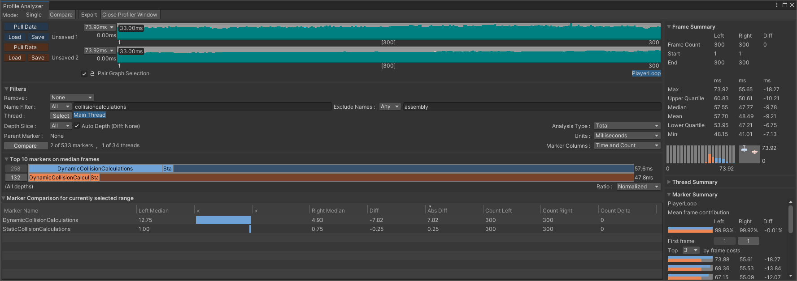

If you need a refresh on the Unity Analyzer, read [Profiling Unity apps on Android](/learning-paths/mobile-graphics-and-gaming/profiling-unity-apps-on-android) before you continue.

## Pull data into the Analyzer

To compare the results you will use the Analyzer to import all three datasets but we will only compare two at a time:

1. Open the Profiler window

1. Select _Clear_ to clear the results

1. Select the folder icon in the top right to load the binary recording _plain.data_

1. Open the Profile Analyzer from _Window/Analysis_ menu

1. Set the Analyzer to mode Compare (in the top-left)

1. Slots for two datasets will appear (both with _Pull Data_, _Load_ and _Save_ buttons)

1. Select the _Pull Data_ button from the top. The data will import from the Profiler.

1. Click back to the Profiler window and _Clear_ the data

1. Select folder icon to load the binary data for _burst.data_

1. Click back to the Analyzer and select the second _Pull Data_.

You now have two datasets loaded, one from the unoptimized mode and one from the Burst mode. This is what the data looks like collected from a Samsung S8.

Focus on the collision-related markers by searching for _collisioncalc_ in the _Name Filter_. Select a representative frame by clicking on a later frame where both seem relatively settled (and with no odd spikes).

We will ignore _CollisionMovement_ because it has not been optimized and the times will vary depending on exactly how many collisions are occurring in any one frame.

The functions that have been optimized are the collision detection calculations. All characters are compared against all characters and walls. The character-wall collision detection times are collected under the sample name _StaticCollisionCalculations_ while the character-character collisions are collected under the name _DynamicCollisionCalculations_.

In the top 10 markers, the unoptimized data is in blue. The Burst data is in orange. _StaticCollisionCalculations_ is showing the biggest improvement. The data shown above is based on all frames selected. You can see individual frames if you click on the graph.

Follow the same process again but this time we will compare Burst against Neon.

Again, we can see an improvement, mostly with the dynamic (character-character) collision detection but together it still makes a meaningful improvement.
