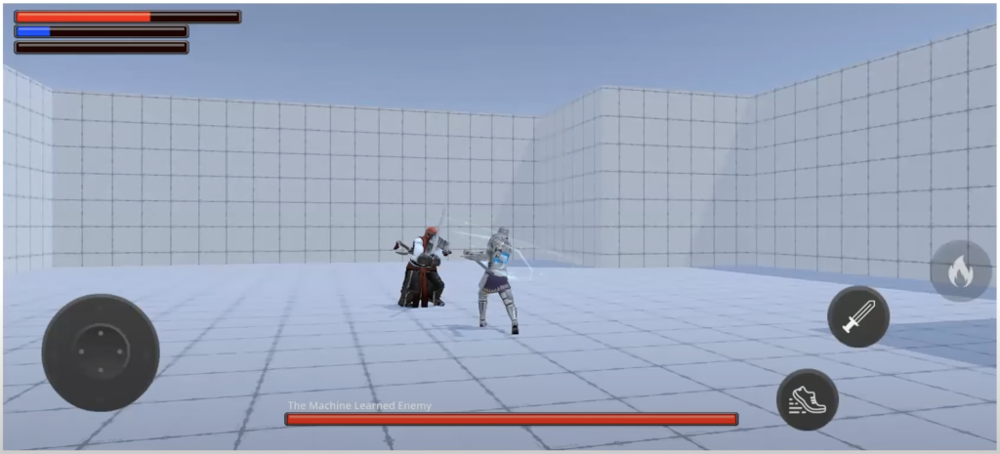

### The problem

Machine Learning has many potential applications across various platforms. One use case is implementing realistic behavior for non-player characters (NPCs) in video games. In this learning path, we will utilize the Unity Machine Learning Agents toolkit to build an "AI brain" for NPCs in a game.

Creating rich, realistic AI for games is challenging, especially as project complexity increases. Traditional solutions often require extensive specialized coding and tools. Machine learning avoids the need for specialized code and instead leverages a generic approach to building smart AI-powered opponents with varying levels of difficulty.

### The project

This learning path uses a Unity game template to implement AI for a fighting game with two characters. The characters battle in a 3D arena. One fighter is controlled by the human player, while the other is controlled by the AI brain we are creating.

### How does this game template and its AI work?

Machine learning applications are built in two stages:

First, a _model_ (neural network) is trained in the _training_ stage.

Next, this trained model is used at runtime in the final application (the game) to make smart decisions and actions. This is the _inference_ stage.

Inference usually runs on a different platform than the one used for training the model. The system and hardware requirements for these stages are very different.

The Unity game template in this learning path uses the Unity Machine Learning (ML) Agents toolkit. This toolkit provides tools for both training and inference. It also supports two types of machine learning: _Imitation Learning_ and _Reinforcement Learning_.

Imitation Learning uses an "expert" for the AI to learn from, while Reinforcement Learning uses rewards and punishments. This learning path focuses on Reinforcement Learning.

Click on the next step for information about installing the necessary tools.
