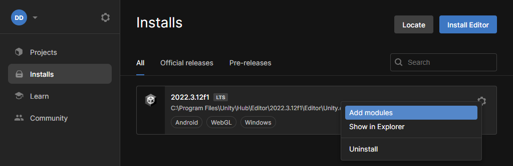
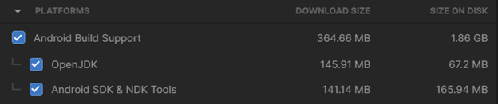
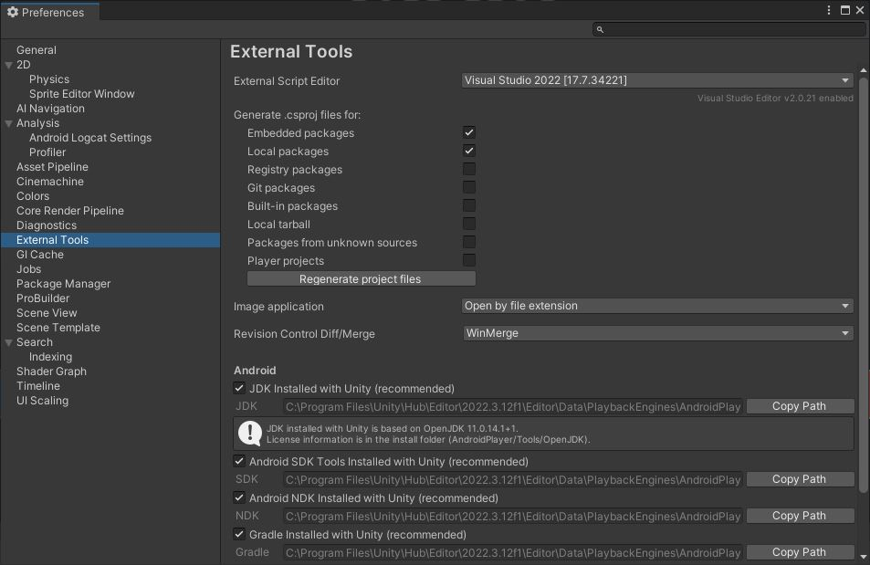

## Getting started

The Unity ML Agents toolkit provides a C# API for use in your project and Python scripts to run outside of Unity. You will need Python itself and a few extra libraries.

You will need the Python tools before the training stage, but to get started quickly just install Unity to begin.

## Tools

Install Unity via the Unity Hub. The Unity Hub provides an easy way to manage multiple installations of Unity. It also provides a straightforward way of adding the required support modules. You will need the following:

* Unity Hub
* Unity
* Visual Studio Community Edition (Unity support module)
* Dr Arm Unity project files (the accompanying zip file)
* [_only for deploying to an Android device_] Android build support (Unity support module)

The installation instructions in the next section go through the steps shown above, starting with the Unity Hub.

## Installing Unity Hub, Unity and support modules

1. Download and install the [Unity Hub](https://unity3d.com/get-unity/download?ref=personal)

    Note that Personal licenses are free, and if running on Windows you will need Windows 10 or 11 and a GPU with DirectX 10 capabilities. If running Unity on a Mac or Linux, please follow the instructions for your platform.

1. In Unity Hub, download and install Unity. The latest LTS (Long Term Support) release should work but this project has been tested on 2022.3.12f1.

    1. In Unity Hub go to **Installs** and click **Install Editor**

    1. Go to the _Archive_ page and find version 2022.3.12f1. Select the "Unity Hub" download button rather than downloading the Unity Editor directly

    1. The install will require several gigabytes (including Android deployment options) so check your available disk space first

1. Add Android Build support

    1. Click the _Settings_ icon and choose _Add Modules_

        

    1. Under **Dev Tools**, choose _Microsoft Visual Studio Community 2022_ if you wish to install it. This integrates well with Unity as a code editor, but any editor will do for editing scripts

    1. Under **Platforms**, choose _Android Build Support_. Also make sure to choose _OpenJDK_ and _Android SDK & NDK Tools_ as well

        

    1. Press _Continue_, and then agree to the Android SDK and NDK License Terms to install everything

    1. If you prefer to use an alternative script editor, you might want to check your editor is active; see section below _Check active script editor in Unity_

## Download and open the Dr Arm Unity project

1. Download and extract the accompanying Unity project from the [supporting zip file](/learning-paths/mobile-graphics-and-gaming/using_unity_machine_learning_agents/files/MLAgentsWorkshopSupportingFiles.zip).

1. Open Unity Hub

1. From the Unity Hub, under the Projects tab, click the down-arrow next to Open and select "Add project from disk".

1. Choose the location of your workshop files (the directory that contains the _Assets_ folder)

1. The project will appear in the list. Click it to open the project in Unity.

1. It may take a few minutes for Unity to process the asset files.

## Check active script editor in Unity

Depending on your setup, it's possible that the default script editor is not set to your preferred editor:

1. In Unity select _Edit_ menu and then _Preferences_

1. In the _Preferences_ window, select _External Tools_ on the left

1. Select your desired editor from the drop-down menu next to _External Script Editor_

    
